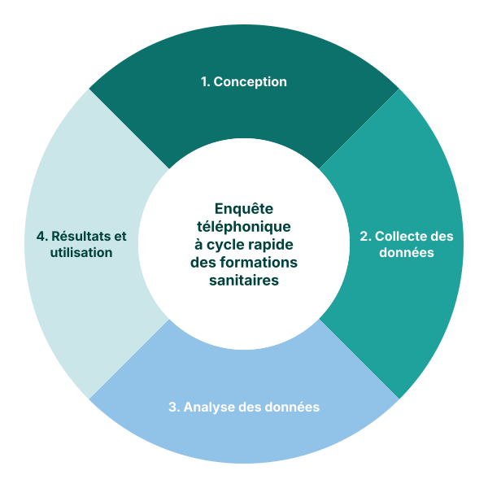

<!-- _class: two-panel -->

## L'approche FASTR pour l'évaluation rapide des formations sanitaires

Nous concevons et mettons en œuvre des **enquêtes téléphoniques trimestrielles** auprès des formations sanitaires primaires.

Ces enquêtes produisent des analyses régulières de la performance, de la disponibilité et de la capacité opérationnelle des services — centrées sur les indicateurs prioritaires liés au plan stratégique SRMNIA-N.

Les résultats informent la prise de décisions et les actions concrètes pour renforcer le système de santé.

