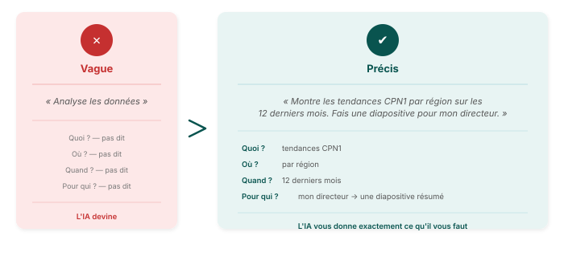

## Du vague au précis — construire un meilleur prompt

---

## Essayez vous-même — construisez un prompt

Pensez à une tâche que vous faites régulièrement. Avant d'écrire quoi que ce soit, demandez-vous :

1. **De quoi ai-je besoin ?** Un graphique ? Un résumé ? Une diapositive pour une réunion ?
2. **C'est pour qui ?** Mon directeur ? Un bailleur ? Mon équipe ?
3. **Ça doit couvrir quoi ?** Quels indicateurs ? Quelles régions ? Quelle période ?
4. **À quoi ressemble un bon résultat ?** Est-ce que je saurais si la réponse était fausse ?

Maintenant écrivez votre prompt. N'oubliez pas — vous pouvez toujours l'affiner dans le message suivant.
