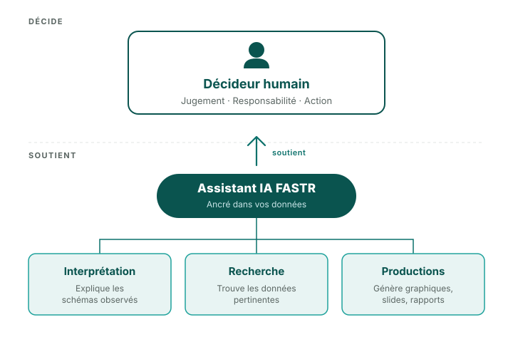

<!-- _class: compact -->

## L'IA est un accélérateur, pas un décideur

**Vous gardez le contrôle sur :**

- **Le jugement** — décider de ce qui compte
- **L'interprétation** — comprendre le contexte de votre pays
- **L'action** — prendre des décisions et présenter les résultats

**Les chiffres proviennent de méthodes testées**

Tous les calculs de la plateforme (trouver les valeurs inhabituelles, estimer la couverture, évaluer la qualité des données) utilisent des formules testées — pas l'IA.

L'IA vous aide à comprendre et à expliquer. Vous décidez et agissez.

<!--
PRESENTER NOTES:
- Le message clé : l'IA soutient, l'humain décide
- Le diagramme montre la séparation claire — l'humain en haut (DÉCIDE), l'IA en dessous (SOUTIENT)
- Trois capacités de l'IA : Interprétation (explique les tendances), Interrogation (trouve l'information), Sorties (génère des ébauches)
- Tous les chiffres proviennent de méthodes statistiques validées, pas de génération par l'IA
- L'IA vous aide à travailler plus vite, mais le jugement, la responsabilité et l'action restent entre vos mains
-->
