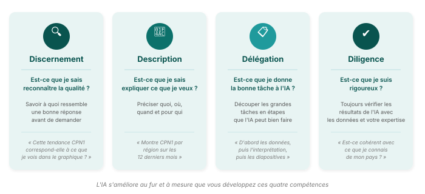

## Bien travailler avec l'IA : quatre habitudes

Vous n'avez pas besoin d'être expert en technologie pour bien utiliser l'assistant IA. Il vous suffit de quatre bonnes habitudes — les mêmes qui font de vous un bon coéquipier.

