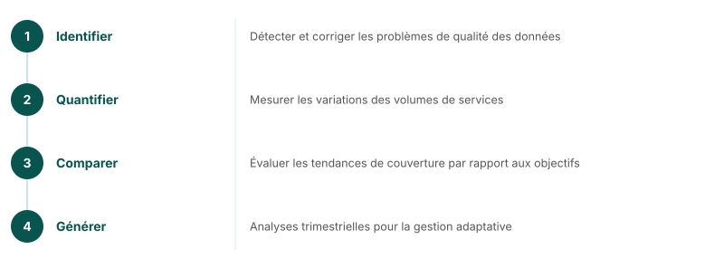

## Analyse de l'utilisation des services RMNCAH-N

### Indicateurs de base FASTR

| Continuum de soins | Indicateurs |
|---|---|
| **Santé maternelle** | CPN1, CPN4, accouchement institutionnel, SPN1 |
| **Santé infantile** | BCG, Penta1, Penta3 |
| **Suivi général** | Consultations externes |

<!--
L'analyse des données HMIS des pays permet de :
1. Identifier et corriger les problèmes de qualité des données
2. Quantifier les variations des volumes de services prioritaires
3. Comparer les tendances de la couverture aux objectifs
4. Générer des analyses trimestrielles pour la gestion adaptative
Les pays ajoutent des indicateurs adaptés à leur contexte.
-->

---
