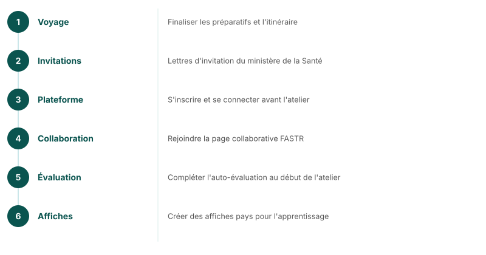

## Conclusion et prochaines étapes

<!--
Avant l'atelier au/en {{COUNTRY}} :
- Finaliser les préparatifs de voyage
- Lettres d'invitation du ministère de la Santé
- Plateforme FASTR — Email avec informations d'inscription
- Page collaborative — Email avec les détails d'inscription
- Évaluation des compétences — Auto-évaluation au début de l'atelier
- Affiches pays — Création pour l'apprentissage transfrontalier
-->

---
