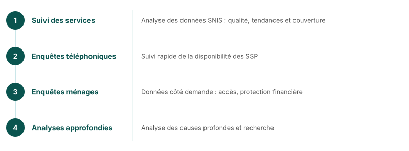

## FASTR en un coup d'œil

**Frequent Assessments and System Tools for Resilience**
*L'approche du GFF pour l'analyse rapide et l'utilisation des données — pour des systèmes de SSP plus solides et de meilleurs résultats SRMNIA-N*

Cycle continu : **analyser** → **apprendre** → **renforcer** → **agir**

<!--
Quatre approches techniques :
- Suivi de l'utilisation des services — Analyse des données SNIS de routine
- Enquêtes téléphoniques des établissements de santé — Suivi rapide de la disponibilité des SSP
- Enquêtes ménages et clients — Données haute fréquence côté demande
- Analyses approfondies — Analyse des causes profondes et recherche
-->

---
