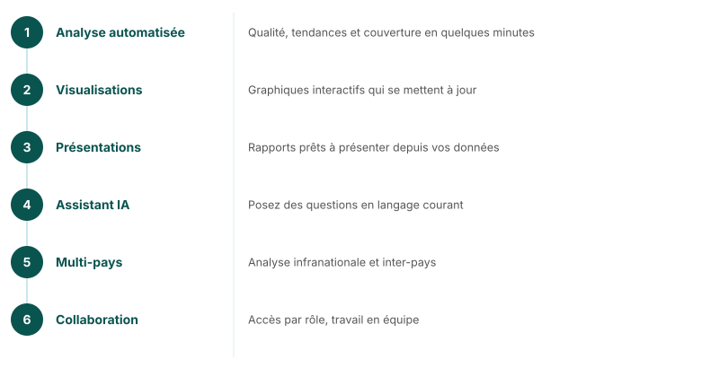

## Plateforme analytique FASTR

<!--
- Analyse automatisée — Qualité, tendances et couverture en quelques minutes
- Visualisations interactives — Graphiques qui se mettent à jour
- Présentations — Rapports prêts à présenter générés à partir de vos données
- Assistant IA — Posez des questions sur vos données en langage courant
- Multi-pays — Analyse infranationale et inter-pays depuis une seule plateforme
- Sécurisé et collaboratif — Accès par rôle, travaillez avec votre équipe
Une seule plateforme pour l'ensemble du flux analytique.
-->

---
