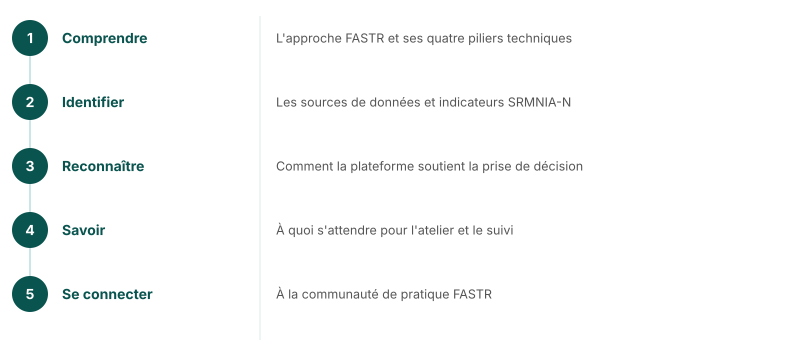

## Objectifs du webinaire

<!--
À l'issue de ce webinaire, les participants seront capables de :
1. Comprendre l'approche FASTR et ses quatre piliers techniques
2. Identifier les sources de données et indicateurs SRMNIA-N
3. Reconnaître comment la plateforme soutient la prise de décision
4. Savoir à quoi s'attendre pour l'atelier et le suivi
5. Se connecter à la communauté de pratique FASTR
-->

---
