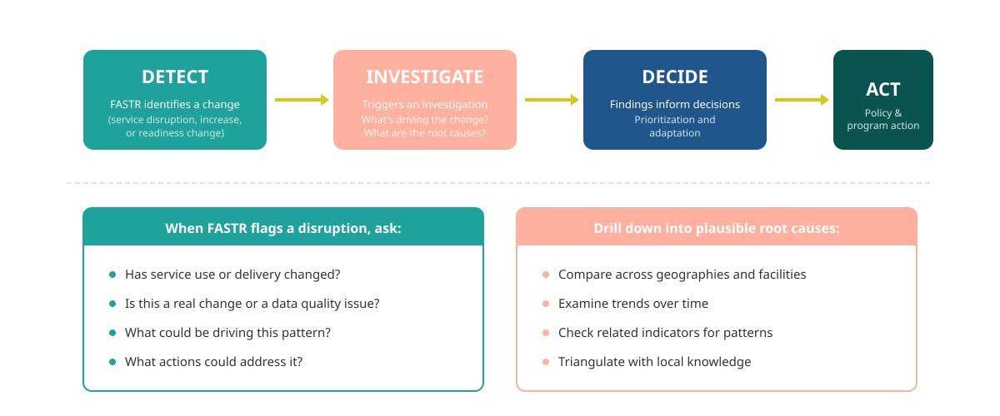

## De l'analyse à l'action

Les résultats FASTR — qu'il s'agisse de scores EQD, de tendances d'utilisation ou d'estimations de couverture — sont des points de départ, pas des conclusions. Ils déclenchent l'investigation et informent les décisions.

<!--
PRESENTER NOTES:
- Ce cycle s'applique à TOUS les résultats FASTR, pas seulement aux perturbations
- Résultats EQD → investiguer les systèmes de données → améliorer le rapportage
- Changements d'utilisation → investiguer la prestation de services → traiter les goulots d'étranglement
- Lacunes de couverture → investiguer les obstacles à l'accès → cibler les interventions
- FASTR fournit les preuves ; les parties prenantes fournissent le contexte, le jugement et l'action
-->
