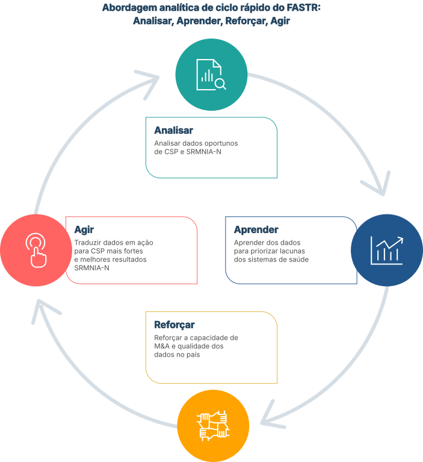

## Uma abordagem: analisar, aprender, reforçar, agir

O FASTR catalisa ciclos contínuos de análise, aprendizagem, fortalecimento do sistema e ação, para que os dados oportunos orientem a tomada de decisões a todos os níveis.

<!--
NOTAS DO APRESENTADOR:
- Percorra o ciclo em voz alta: analise os dados, aprenda o que eles lhe dizem, fortaleça o sistema com base no que você aprendeu, aja de acordo com as prioridades e, em seguida, volte a analisar novamente.
- Sublinhe que isto é contínuo, não é uma coisa só. Cada volta do ciclo deve deixar tanto o sistema de dados como as decisões um pouco melhor do que a anterior.
- Um único relatório FASTR não faz a diferença. O ciclo sim. É por isso que "sistemático" é tão importante como "atempado".
- Se me perguntarem qual é a etapa mais importante: as quatro. Saltar o "reforço" é o modo de fracasso mais comum; a análise é feita mas o sistema nunca melhora.
-->
