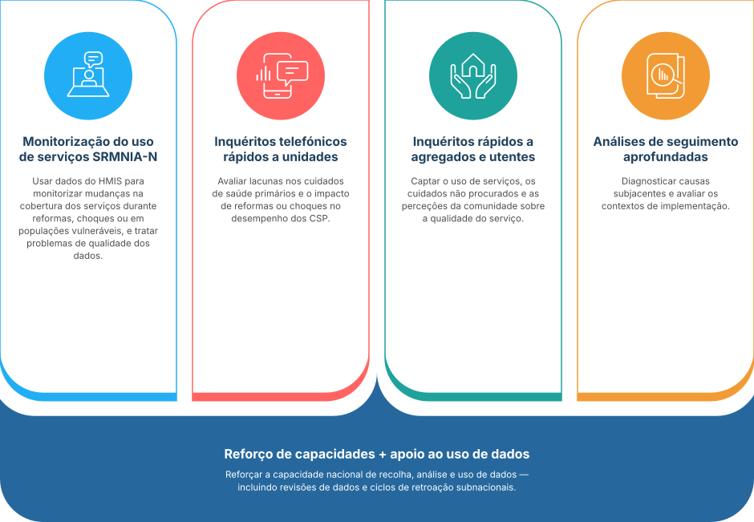

## Quatro pilares complementares

O FASTR é uma abordagem integrada baseada em quatro métodos rigorosos, rápidos e de baixo custo para monitorizar os sistemas de cuidados de saúde primários, sustentados pelo reforço de capacidades e apoio à utilização de dados adaptados às necessidades do país.

<!--
NOTAS DO APRESENTADOR:
- Cada pilar é um método. Foram concebidos para se complementarem uns aos outros, não para se duplicarem.
- A monitorização da utilização de serviços do HMIS é o cavalo de batalha. Funciona de forma rotineira e abrange todos os locais com instalações de informação. Este é o pilar em que o workshop se concentra.
- Os outros três acrescentam profundidade onde o HMIS não consegue chegar: inquéritos telefónicos aos estabelecimentos para acompanhamento da preparação e da reforma, inquéritos aos agregados familiares e aos clientes para o lado da procura (procura de cuidados, cuidados abandonados, experiência) e análises de acompanhamento para as causas profundas.
- O reforço das capacidades e o apoio à utilização dos dados são a banda subjacente a todos os quatro. Sem ele, os resultados analíticos não são utilizados.
- Tornar explícito: este seminário ensina o primeiro pilar. Os outros três são introduzidos no contexto para que os participantes saibam qual é a oferta mais alargada do FASTR.
-->
