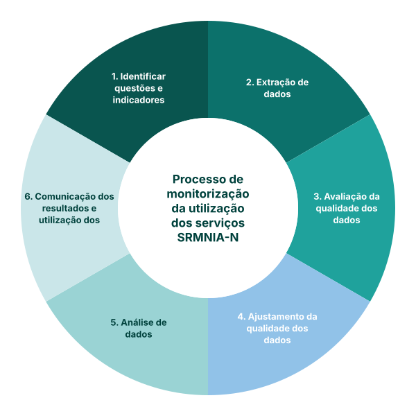

## Qual é a abordagem do FASTR à monitorização da utilização dos serviços da RMNCAH-N?

Análises trimestrais dos dados do DHIS2, com foco em indicadores nacionais priorizados.

Construir ferramentas sustentáveis para que as partes interessadas que precisam de usar os dados possam gerar as análises e visualizações corretas, no momento certo, sobre os seus indicadores de interesse.

Combinar a análise e a visualização com o reforço de capacidades e o apoio à utilização de dados para a sustentabilidade e a institucionalização.

<!--
NOTAS DO APRESENTADOR:
- Esta é a metodologia que este workshop ensina. Os outros três pilares no slide anterior são introduzidos para o contexto; este é a essência dos próximos seis módulos.
- Cadência trimestral, indicadores prioritários, ferramentas sustentáveis: esses três pontos são o modelo operacional.
- O diagrama à direita é o percurso para o resto do workshop. Identificar questões, extrair dados, avaliar a qualidade, ajustar os problemas de qualidade, analisar, comunicar. Cada etapa tem o seu próprio módulo.
- Evite aprofundar-se aqui. Aponte para o diagrama e diga "este é o resto da oficina".
- Se lhe perguntarem porquê trimestral: corresponde ao ciclo de decisão típico dos distritos e ministérios. É possível ser mais rápido, mas raramente é útil; ser mais lento não serve para nada.
-->
