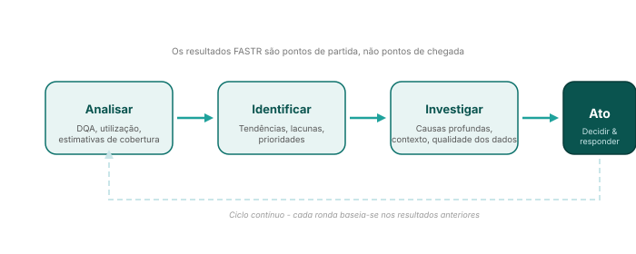

## Da análise à ação

Os resultados do FASTR, quer sejam pontuações DQA, tendências de utilização de serviços ou estimativas de cobertura, são **pontos de partida, não pontos finais**. Desencadeiam a investigação e informam as decisões.

<!--
NOTAS DO APRESENTADOR:
- Este ciclo aplica-se a todos os resultados do FASTR, não apenas às interrupções.
- As conclusões do DQA levam a uma investigação dos sistemas de dados e a melhorias nos relatórios.
- As mudanças na utilização levam à investigação da prestação de serviços e à resolução de estrangulamentos.
- As lacunas de cobertura levam a uma investigação das barreiras de acesso e a intervenções direcionadas.
- O FASTR fornece as provas; as partes interessadas fornecem o contexto, a avaliação e a ação.
-->
