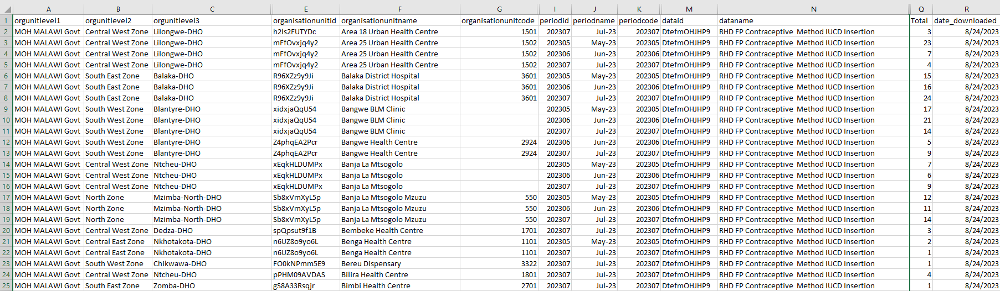

<!-- _class: columns-image-right -->

## Formato e granularidade dos dados

- Os dados devem ser descarregados para cada **indicador de interesse**, ao nível das **instalações**, e **mensalmente** para o **período de interesse**
- Os dados devem ser guardados em formato longo, o que significa que cada linha representa uma única observação ou medição (ver exemplo)
- Os dados devem ser guardados em formato .csv e podem ser guardados num único ficheiro .csv ou em vários ficheiros .csv que serão combinados quando forem carregados para a plataforma de análise

<!--
NOTAS DO APRESENTADOR:
- Queremos usar os dados mais granulares a que temos acesso para fazer avaliações mais precisas da qualidade e dos ajustes dos dados
- Também queremos poder analisar as tendências ao longo do tempo, tendo em conta factores como a sazonalidade
- A utilização de dados mensais a nível dos estabelecimentos permite-nos efetuar uma análise mais sólida
-->
