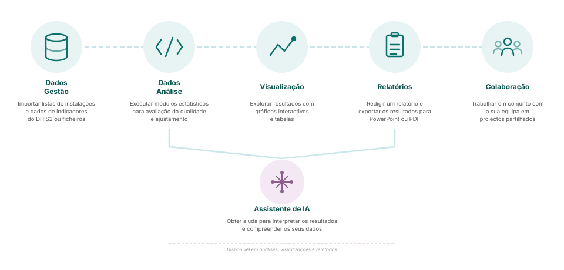

## Capacidades da plataforma

**Gestão de dados** - Importar listas de estabelecimentos e dados de indicadores do DHIS2 ou de ficheiros

**Análise de dados** - Executar módulos estatísticos para avaliação e ajuste da qualidade

**Visualização** - Explore os resultados com gráficos e tabelas interactivos

**Relatórios** - Exportar resultados para PowerPoint ou PDF para as partes interessadas

**Colaboração** - Trabalhe em conjunto com a sua equipa em projectos partilhados

**Assistente de IA** - Obtenha ajuda para interpretar resultados e compreender os seus dados

