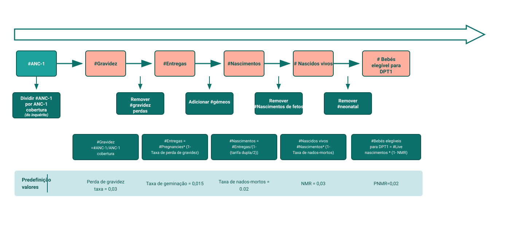

## O que é cobertura?

Em linguagem simples, a **cobertura** diz-lhe que percentagem das pessoas que precisavam de um serviço o receberam efetivamente. É uma percentagem: serviços prestados divididos pela população-alvo, vezes 100.

Uma cobertura elevada significa que o sistema está a chegar à maioria das pessoas que deveria. Uma cobertura baixa significa que as pessoas que precisavam do serviço não o obtiveram - ou não estava disponível, não era acessível ou não foi utilizado.

---

## Cobertura: o problema do denominador

O numerador é fácil - é o que os estabelecimentos reportam no DHIS2. Mas o **denominador** (quantas pessoas precisaram do serviço) não está no DHIS2. Sem ele, é possível contar os serviços prestados, mas não se pode dizer que percentagem da população isso representa.

---

## Denominadores por tipo de serviço

O denominador não é um número único - é um grupo diferente para cada serviço. ANC mede em relação a gravidezes, BCG em relação a nados vivos, Penta em relação a bebés sobreviventes.

| Serviço | População-alvo (denominador) |
|---|---|
| **ANC1, ANC4** | Mulheres grávidas no período |
| **Parto qualificado** | Mulheres grávidas (partos previstos) |
| Cuidados pós-natais - mãe** | Nados vivos recentes / mulheres no pós-parto |
| **BCG (no nascimento)** | Nascidos vivos |
| PENTA1, PENTA3** | Bebés sobreviventes na coorte elegível por idade
**Sarampo 1 (9 meses)** | Bebés sobreviventes com 9-12 meses de idade |
**PNC1 - recém-nascido** | Nascidos vivos |

---

## Como o FASTR deduz o denominador

O FASTR trabalha para trás na cadeia para estimar a população-alvo a partir do que os estabelecimentos já reportam.

**Exemplo: Um inquérito diz que 80% das mulheres grávidas recebem ANC1. O HMIS regista 10.000 visitas ANC1. Portanto, há aproximadamente **10.000 ÷ 0,80 = 12.500 gravidezes** nesse período.

A partir da contagem de gravidezes, a cascata demográfica fornece partos, nados-vivos e crianças sobreviventes - utilizando taxas específicas do país para perdas de gravidez, nados-mortos, gémeos e mortalidade infantil.

