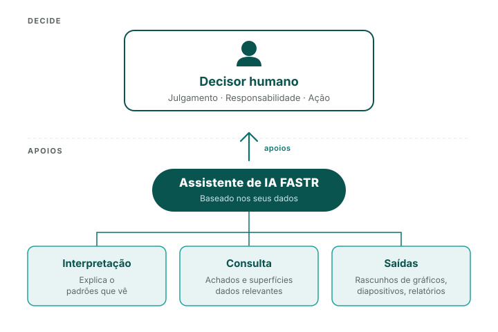

## A IA é um acelerador, não um tomador de decisões

**Mantém o controlo de:**

- Julgamento - decidir o que é importante
- Interpretação - compreender o contexto
- Ação - tomar decisões

**Os números provêm de métodos validados

Todos os cálculos (deteção de anomalias, estimativas de cobertura, pontuações de qualidade dos dados) utilizam fórmulas estatísticas comprovadas - não IA.

A IA interpreta e explica. O utilizador decide e actua.

