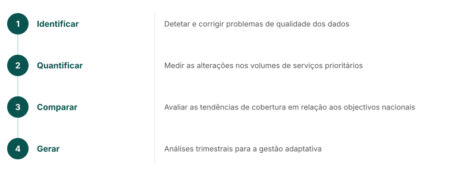

<!-- AUTO-TRANSLATED from core_content/mw_webinar/mw_17_analysis_pipeline.md -->
<!-- Add REVIEWED marker after human review to protect from overwrite -->

---
marp: true
theme: fastr
paginate: true
---

## Análise da utilização dos serviços RMNCAH-N

### Indicadores principais do FASTR

| Continuidade dos cuidados de saúde | Indicadores |
|---|---|
| Saúde materna** | ANC1, ANC4, parto institucional, PNC1 |
| Saúde da criança** | BCG, Penta1, Penta3
| Monitorização geral** | Consultas externas

<!--
A análise dos dados do HMIS do país permite:
1. Identificar e corrigir problemas de qualidade dos dados
2. Quantificar as alterações nos volumes de serviços prioritários
3. Comparar as tendências da cobertura dos serviços com os objectivos nacionais
4. Gerar análises trimestrais para a gestão adaptativa
Os países acrescentam indicadores adaptados ao seu contexto e às suas prioridades nacionais.
-->

---
