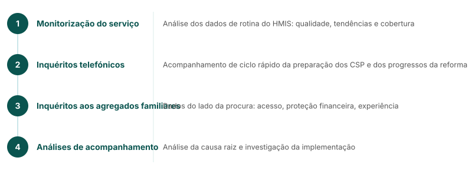

<!-- AUTO-TRANSLATED from core_content/mw_webinar/mw_1_fastr_at_a_glance.md -->
<!-- Add REVIEWED marker after human review to protect from overwrite -->

---
marp: true
theme: fastr
paginate: true
---

## FASTR num relance

**Avaliações Frequentes e Ferramentas de Sistema para a Resiliência
*A abordagem do GFF à análise de ciclo rápido e à utilização de dados para sistemas de CSP mais fortes e melhores resultados da RMNCAH-N*

Ciclo contínuo: **analisar** → **aprender** → **fortalecer** → **agir**

<!--
Quatro abordagens técnicas:
- Monitorização da utilização dos serviços - Análise dos dados de rotina do HMIS: qualidade, tendências e cobertura dos dados
- Inquéritos telefónicos às unidades de saúde - Monitorização de ciclo rápido da preparação dos CSP e do progresso da reforma
- Inquéritos aos agregados familiares e aos clientes - Dados de alta frequência do lado da procura: acesso, proteção financeira
- Análises subsequentes - Análise das causas profundas e investigação sobre a implementação
-->

---
