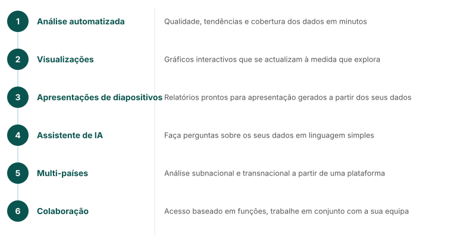

<!-- AUTO-TRANSLATED from core_content/mw_webinar/mw_5_platform_highlights.md -->
<!-- Add REVIEWED marker after human review to protect from overwrite -->

---
marp: true
theme: fastr
paginate: true
---

## Plataforma de análise FASTR

<!--
- Análise automatizada - Qualidade dos dados, tendências e cobertura em minutos
- Visualizações interactivas - Gráficos que se actualizam à medida que explora
- Diapositivos - Relatórios prontos para apresentação gerados a partir dos seus dados
- Assistente de IA - Faça perguntas sobre seus dados em linguagem simples
- Multi-países - Análises subnacionais e entre países a partir de uma única plataforma
- Seguro e colaborativo - Acesso baseado em funções, trabalhe em conjunto com a sua equipa
Uma plataforma para todo o fluxo de trabalho analítico.
-->

---
