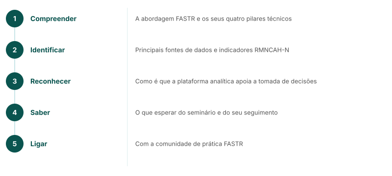

<!-- AUTO-TRANSLATED from core_content/mw_webinar/mw_8_webinar_objectives.md -->
<!-- Add REVIEWED marker after human review to protect from overwrite -->

---
marp: true
theme: fastr
paginate: true
---

## Objectivos do webinar

<!--
No final deste webinar, os participantes serão capazes de:
1. Compreender a abordagem FASTR e os seus quatro pilares técnicos
2. Identificar as principais fontes de dados e indicadores RMNCAH-N
3. Reconhecer como a plataforma analítica apoia a tomada de decisões
4. Saber o que esperar do workshop e do acompanhamento
5. Ligar-se à comunidade de prática FASTR
-->

---
