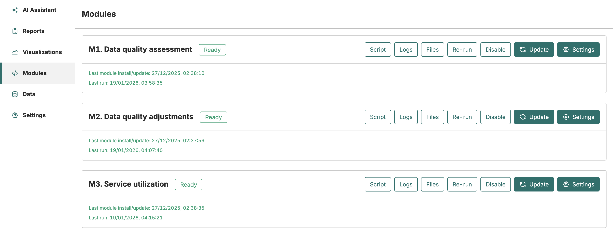
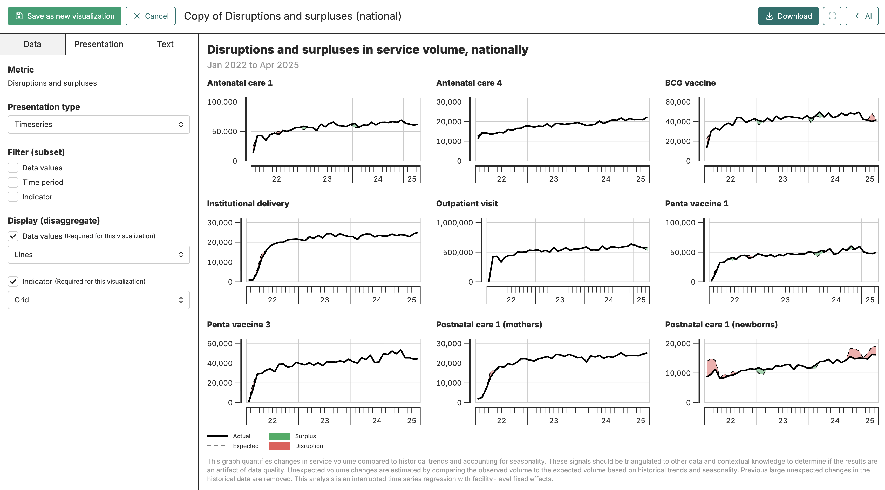
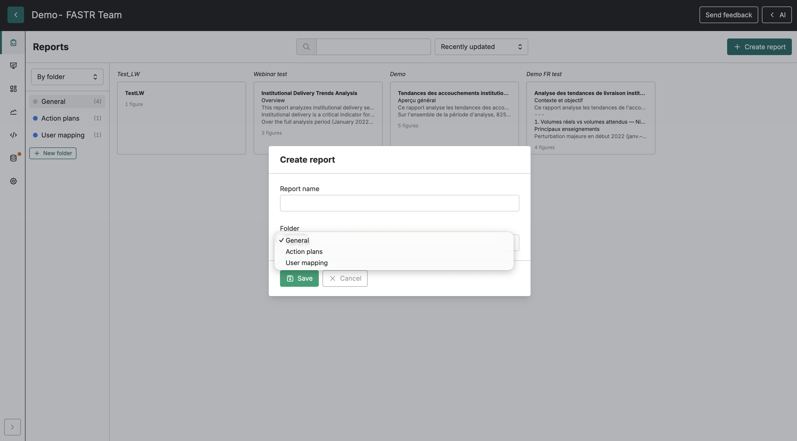

<!--
  Deck-scoped design override (does NOT touch the shared fastr-theme.css):
  swap the theme's vertical accent bar beside titles for a modern horizontal
  rule underneath them. Covers/sections/lead keep their own title treatment.
-->

<!-- _class: title-cover -->

  

  
  

# The FASTR analytics platform

**One place to bring together, analyze, and share a country's health data**

---

<!-- _class: spacious -->

## Where we start

Health data already exists. Every month, facilities enter it into DHIS2. Facility assessments produce more. Household surveys, more still.

The problem isn't a shortage of data. It's that it stays **scattered, hard to reconcile, and slow to turn into analysis**.

Between the moment data is entered and the moment it informs a decision, weeks of manual work often pass.

---

<!-- _class: centered -->

## What if a country's data lived — and worked — in one place?

Brought together, kept current, ready to analyze and share, without starting from scratch every time.

---

<!-- _class: section-cover -->

# What is FASTR?

---

<!-- _class: spacious -->

## An online platform, two roles

FASTR is an online tool. Nothing to install: a browser is enough, and the interface comes in **French, English, and Portuguese**.

It brings together two things usually found in separate tools:

- **A central repository** where a country's health data lives
- **An analysis engine** that processes it automatically, with no code to write

It's this combination that sets FASTR apart from a plain data warehouse.

---

## A simple architecture: the instance and projects

The **instance** is the country's space. It holds the health structure, the indicator definitions, and every data source — once. It is the shared source of truth.

**Projects** are focused analysis spaces. Each takes a slice of the instance — a period, some regions, some indicators — to answer one specific question.

One shared base, many analyses. Everyone starts from the same data.

---

<!-- _class: section-cover -->

# It connects to your data sources

---

<!-- _class: compact -->

## Three kinds of source, one platform

Routine data

### HMIS / DHIS2

Facilities' monthly statistics: consultations, vaccinations, deliveries.

DHIS2

Facilities

### Facility surveys (HFA)

The health facility assessment: service availability, equipment, staffing.

HFA

Equity

### Household surveys

Coverage estimates by wealth quintile, drawn from DHS and MICS surveys.

ICEH

Sources that complement each other: the routine, the structural, and the equity view, side by side.

---

<!-- _class: spacious -->

## Connecting to DHIS2, without re-keying

FASTR connects directly to DHIS2. You pick the indicators and the period, and the data flows into the platform.

That import can run three ways:

- **Immediately**, on demand
- **At a scheduled time**, for a one-off load
- **On a recurring schedule**, weekly or every two weeks

Once the connection is saved, updates take no further handling. The data stays aligned with DHIS2.

---

## A central repository, a single version of the facts

A country's data stops being scattered across files, machines, and differing versions.

It is imported once, at the instance level, and becomes available to every analysis.

When a correction is made at the source, everyone benefits — not one isolated copy.

**One base**
shared by every team

**One history**
tracked over time

**One reference**
everyone relies on

---

<!-- _class: section-cover -->

# Not just storage — analysis

---

<!-- _class: output -->

## A built-in analysis engine

Storing data answers no question. FASTR goes further: it **analyzes**.

**Modules** process the data automatically — quality, adjustment, service utilization, coverage. Each runs proven methods and produces results ready to visualize.

The user **writes no code**. They enable a module, and the results compute.

---

<!-- _class: two-panel -->

## Recognized methods, built into the tool

### What the modules produce

- **Data quality** assessment
- **Adjustment** of incomplete data
- **Service utilization** and disruption analysis
- **Coverage** and denominator estimation

### What makes them reliable

- **Standardized** methods, the same from one country to the next
- **Tracked** versions, so you know which computation produced which result
- **Automatic recomputation** whenever the data changes

The method no longer depends on the person who knows it. It's in the tool.

---

<!-- _class: centered -->

## The powerful part: nothing gets frozen

Analyses stay tied to the data, not frozen in a file.

When the data is updated, the results recompute and the charts follow. No copy-paste to redo, no forgotten figure.

---

<!-- _class: section-cover -->

# Seeing the results

---

<!-- _class: two-panel -->

## Visualizations suited to each question

### Four forms

- **Charts** to compare across categories
- **Time series** to follow a trend
- **Maps** to see regional gaps
- **Tables** for the exact figures

### That you control

- **Filter** and **disaggregate** by region, facility type, period
- **Customize** the appearance
- **Export** as an image or data for outside use

Form follows the question: "how do our regions compare?" doesn't call for the same chart as "what's the exact number?".

---

<!-- _class: output -->

## An analysis, not just a chart

Every visualization builds on a module. Here, the **service disruption** analysis compares observed volume to expected volume, across a dozen indicators at once.

The shaded areas flag the gaps. That's a signal to triangulate with the field, not a conclusion on its own.

---

<!-- _class: section-cover -->

# Sharing — the right format for each audience

---

<!-- _class: compact -->

## Three ways to share the results

Live

### Dashboards

Several visualizations on one page, always current. Publishable via a public link: partners open them in a browser, with no FASTR account.

In the room

### Presentations

Slide decks assembled in the platform, with title and section pages. Export to PowerPoint or PDF for an in-person talk.

In writing

### Reports

Narrative documents blending prose and live figures. Export to Word or PDF for a full read.

One dataset feeds all three. You don't redo the work for each format.

---

<!-- _class: output -->

## The through-line: figures always current

In a FASTR dashboard or report, the charts aren't pasted-in pictures that go stale.

They are **live figures**, tied to the project's data. When the data changes, the document reflects the new reality.

---

<!-- _class: spacious -->

## An AI assistant to interpret

A built-in assistant helps read and interpret the results. It understands the project's modules, indicators, and visualizations.

You ask questions in plain language — "what does the ANC1 trend show?", "which regions have the lowest coverage?" — and it answers from the **project's real data**, not guesses.

It also helps draft report text, from a prompt library the team can extend and share.

---

<!-- _class: section-cover -->

# A tool for teams

---

## Built to work together

Work is organized into projects, and each person gets a fitting role.

Permissions are fine-grained: view, edit, administer. A finished project can be **locked** to preserve its state while staying viewable.

Everyone sees the same data, in the language of their choice.

**View**
read and export

**Edit**
create visualizations and reports

**Administer**
settings and access

---

<!-- _class: compact -->

## End to end, a single flow

Import

<h3 class="rc-title">Bring together</h3>

Sources arrive in the instance

DHIS2 · HFA · ICEH

→

Analyze

<h3 class="rc-title">Process</h3>

Modules compute automatically

Quality · Coverage

→

Visualize

<h3 class="rc-title">See</h3>

Charts, maps, tables

Explore

→

Share

<h3 class="rc-title">Deliver</h3>

Dashboards, presentations, reports

Decide

Each step follows in the same tool. The data never leaves the platform on its way to a decision.

---

<!-- _class: spacious -->

## What this changes

Without FASTR, data is scattered, reworked by hand, and quickly out of date.

With FASTR, it is **brought together** in one place, **analyzed** with recognized methods, and **shared** in the format each audience needs.

A country moves from a collection of files to a shared resource — current and trustworthy — in the service of decisions.

---

<!-- _class: bg-green -->

# FASTR

## From routine data to decisions, without leaving the platform

  
  

