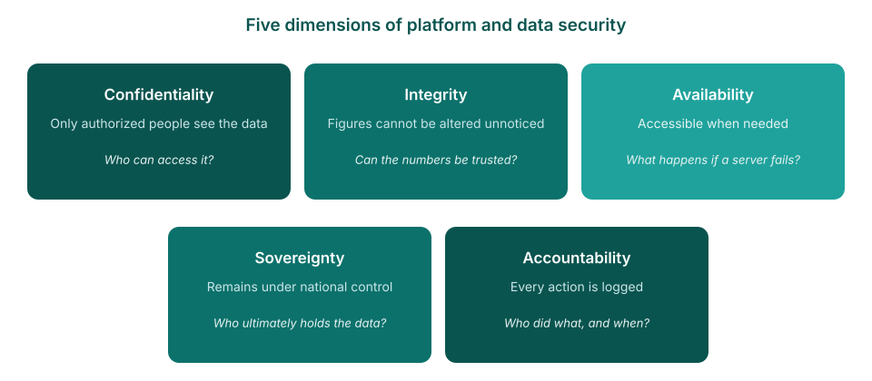

<!-- _class: title-cover -->

  

  
  

# Security, costs, and ownership

**How the FASTR platform protects a country's data — and what it takes to run it**

---

<!-- _class: section-cover -->

# Data security

---

## What "secure" means for a platform like this

Data security for a hosted platform spans five distinct dimensions. The following slides address each in turn: the risk, and the measures in place.

<!--
- Sourcing, if asked: confidentiality / integrity / availability is the definition of information security in ISO/IEC 27000 — the same triad the HIPAA Security Rule is built on for health data. Accountability is listed in the same standard (and NIST's Audit & Accountability controls). Sovereignty comes from the data-governance side: the African Union Data Policy Framework (2022) treats citizens' data as a sovereign national asset under state control.
- One-liner: "the international security standard, plus accountability from that standard, plus sovereignty from the AU's own data policy framework."
- Invite the room to add concerns — anything not covered goes to the technical annex or follow-up.
-->

---

<!-- _class: spacious -->

## The starting point: what the platform holds

- **Monthly service totals per facility** — for example, 45 first antenatal visits at one clinic in March
- The **same figures as the DHIS2 reports** the ministry already produces
- **No patient records** — no names, no addresses, nothing individual
- **Current scope, by design**: hosting individual-level records remains possible in future, subject to the additional safeguards set out in the technical annex

<!--
- Data minimization is the first security measure: the exposure of a system is bounded by what it contains.
- The platform imports aggregated numerators from DHIS2 (facility-month counts). Nothing more granular exists in it today.
- If the scope grows to individual-level data, the security bar grows with it — the annex lists that bar.
-->

---

## Confidentiality — who can access the data

The risk: unauthorized access, from outside or inside. The measures: named accounts and roles, identity re-checked on every request, encryption in transit.

<!--
- The ministry decides who gets an account and each person's role: view, edit, or administer — per project.
- Sign-in runs through a specialist identity service (Clerk); the platform never stores passwords. No back doors in production.
- Everything travels encrypted; the server itself is reachable by two named engineers with cryptographic keys only.
-->

---

<!-- _class: spacious -->

## Integrity — can the figures be trusted

The risk: figures altered without record, or analyses that cannot be reproduced. The measures: one source of truth, recorded imports, versioned results.

- **DHIS2 remains the source of truth** — the platform imports from it, and re-imported months are refreshed to match it
- **Every import is recorded**: an indicator-by-indicator ledger shows the months loaded, when, and any failures
- **Results come in versioned, dated packages** — the same package gives the same numbers to everyone; new numbers require a new package
- Analysis methods and parameters are **documented and logged with each package**

<!--
- The trust argument for analysts and directors alike: any figure in a report traces back to a dated package, its module parameters, and the DHIS2 import behind it.
- Nobody edits a figure in place — change flows through a new import and a new package, both recorded.
-->

---

<!-- _class: spacious -->

## Availability — what if a server fails

The risk: hardware failure, accidental deletion, or a corrupted import. The measures: layered automatic backups and a tested recovery path.

- The **database is backed up every 30 minutes**, with a three-day rolling window
- **Full installation snapshots** are kept on a daily, weekly, and monthly cycle
- An **entire country instance can be rebuilt** from these snapshots
- Creating or restoring a backup requires **explicit permission** in addition to a valid login

<!--
- Two independent layers: application-level database snapshots for fine-grained recovery, infrastructure-level volume snapshots for full disaster recovery.
- The restore process validates paths and fully resets the target database before loading — backups are a recovery path, not an attack surface.
-->

---

## Sovereignty — the data remains the country's

The risk: data flowing into a shared pool, or visible to another country. The measures: fully isolated installations, and full export at any time.

<!--
- Each country: its own application, database, and storage — no shared components, so cross-country access is technically impossible.
- All of a country's data and results can be exported in full at any time, regardless of hosting arrangement.
-->

---

<!-- _class: spacious -->

## Accountability — every action attributable

The risk: changes or access nobody can trace. The measures: every request tied to a named account, and operational logs across the platform.

- Every request runs under a **named, verified account** — there are no anonymous actions
- **Imports are recorded** per indicator and month; **results packages are dated and versioned**
- **Backup and restore actions are permission-gated** and attributable
- **Every AI question is logged**: who asked, on which project, with what usage

<!--
- Overlaps deliberately with integrity: the same ledgers that protect the figures also answer "who did what, when".
- AI usage limits (daily per user, weekly per instance) ride on the same logs.
-->

---

## Applied to the AI assistant

The AI can only see what the signed-in user is permitted to see, and every question is logged. Today that means aggregated results; as facility-level analysis is introduced, **the same permission boundary applies**.

<!--
- The AI is Claude, by Anthropic; the access key stays on the server; the AI holds no permissions of its own.
- The platform computes the answer first and sends only that; identifier lists are collapsed to counts.
- Server-side web search is available for general questions — do not claim "no internet".
-->

---

<!-- _class: section-cover -->

# Costs and ownership

---

## Running costs

Running costs fall into three lines: a **fixed hosting fee** for the country's server, **metered AI use** (the Anthropic API), and **shared platform maintenance**, which also covers external services such as the **Clerk login service**. The software itself is open source — there are no license or per-user fees.

<!--
- The next slide carries the actual figures. This one sets the structure.
- AI spend is logged per request, so it can be monitored and capped. Driver = active users, not data volume.
- Adding accounts costs nothing.
-->

---

<!-- _class: spacious -->

## The figures — planning estimates

These are planning estimates at 2026 prices and current usage levels — **not a quote**.

- **Hosting** a country's instance: about **USD 500–800 per year** — larger countries toward the top
- **AI use** (the Anthropic API): about **USD 350 per month** (~USD 4,000 per year) for a typical country; the largest countries several times this, growing with use
- **Shared platform maintenance** (engineering, monitoring, backups, the Clerk login service): roughly **USD 7,000–10,000 per country per year**, falling as more countries join — an economy of scale forgone under self-hosting
- **Optional support** (data refresh, quality checks, analysis): about **USD 5,000–15,000 per year**, depending on level
- **Total: about USD 12,000 per year** — up to USD 20,000–30,000 with support; no other subscriptions

<!--
- Frame clearly: planning estimates, not a quote — and the maintenance line is financed centrally today.
- The AI line is the one that moves: metered, follows usage, will grow as AI features are used more.
-->

---

<!-- _class: spacious -->

## Hosting — and what moving really takes

- Hosted **centrally today**, while the platform is in active development — every country receives fixes and new features the same day
- Built **portable**: the same software runs unchanged on a ministry's own servers — no rebuild needed
- **Migration is a structured project**: readiness assessment, server procurement, team training, a parallel-run period, then cutover — a **timeline of months, planned jointly**
- **Self-hosting transfers the shared functions to the ministry**: maintenance, monitoring, and applying each update — deployed centrally to all countries at once today — become the ministry team's responsibility, and one-by-one support carries additional cost
- **All of a country's data can be exported in full at any time**, now or later, regardless of hosting

<!--
- "Portable" = Docker containerization. The platform's own technical documentation: deploying a country instance on other infrastructure, including on-premise, is relatively straightforward.
- Central hosting is a development-phase choice, not a permanent dependency.
- Self-hosting takes real ministry effort: a team for servers, backups, and upgrades, plus procurement for hosting and for AI services (bought from a commercial provider such as Anthropic).
-->

---

## The path to country ownership

For countries who do want to host themselves, there will be effort required from the Ministry of Health. A team will need to run servers, backups, and upgrades; and procurement in place for hosting and for AI services, which are bought from a commercial provider (e.g. Anthropic, OpenAI).

<!--
- Stage 2 is already partly real: country admins manage users and data imports today.
- The 2030 goal (end of the current GFF strategy period) is proposed messaging — confirm before presenting as a commitment.
- End on the needs box: server, IT capacity, budget line.
-->

---

<!-- _class: spacious -->

## The essentials

- **Aggregated totals today** — no patient records; future individual-level hosting is conditional on added safeguards
- **Security on five dimensions** — isolated installations per country, role-based access, recorded imports and versioned results, layered backups, full audit trails
- **About USD 12,000 per year** to run — hosting, metered AI, shared maintenance; no license or per-user fees
- **Country hosting by 2030** — the stated goal; a structured migration that shifts updates and maintenance to the ministry, with likely additional per-country cost

<!--
- One-slide recap for the official who reads only one slide.
- If one fact is remembered: zero patient records in the platform.
- Next steps to offer: agree the cost figures; draw up the country readiness checklist.
-->

---

<!-- _class: section-cover -->

# Technical annex — for IT and DHIS2 teams

---

<!-- _class: spacious -->

## Architecture and isolation

- Each country instance is a **separate Docker deployment**: its own application container, its own **PostgreSQL** database, its own **Valkey** cache, its own storage volume, on a private network
- Within an instance, each project has its **own database** (`project_{uuid}`) for authoring content
- Computed results live in **versioned results packages** (parquet files, queried via DuckDB) — projects read the package attached to them, never each other's

<!--
- Cross-country and cross-project isolation is structural: no shared database, cache, or filesystem path.
- Source: the platform's technical documentation and codebase (github.com/FASTR-Analytics/platform).
-->

---

<!-- _class: spacious -->

## Authentication and access control

- Identity is managed by **Clerk** (managed identity provider); session claims are **verified by middleware on every request** — auth bypass exists only for local development and is disabled in production
- **Two-tier RBAC**: instance-level permissions plus per-project roles resolved from the database on each request
- Server access: **SSH by cryptographic key only**, restricted to two named engineers — no password login

<!--
- The platform never stores passwords; Clerk handles credentials, MFA and session management.
- Project scoping is enforced server-side via a Project-Id header checked against per-project user roles.
-->

---

<!-- _class: spacious -->

## Data protection and operations

- **TLS terminates at nginx**, certificates provisioned and auto-renewed via certbot; secrets are injected as environment variables at runtime — never in images, never sent to the browser
- **R analysis modules run in ephemeral containers** (removed on completion) that mount only their own run's sandbox directory
- Backups: **pg_dump every 30 minutes** (3-day rolling window) plus **volume snapshots daily / weekly / monthly**; restores are permission-gated (`can_restore_backups`) and require a server-held key on top of a valid session

<!--
- The restore flow validates paths against traversal and fully resets the target database before loading — backups are a recovery path, not an attack surface.
-->

---

<!-- _class: spacious -->

## AI integration, precisely

- Claude (Anthropic) is reached through a **server-side proxy**; the API key never leaves the server
- Tool calls run **inside the user's authenticated session** — the AI holds no permissions of its own
- Data tools currently return **aggregated metric outputs** (no facility-identifier dimension as of v1.67; long dimensions summarized as counts); planned facility-level access will operate under the **same session-permission model**
- **Server-side web search/fetch (Anthropic-hosted) is enabled** in the project chat for general questions
- Every request is logged (user, project, model, tokens); **daily per-user and weekly per-instance limits** are enforced

<!--
- These statements were verified directly against the platform source code, not only the documentation.
- If asked about the web tools: searches run on Anthropic's infrastructure as part of the AI request; they are not initiated from the platform server or the user's browser.
-->

---

<!-- _class: spacious -->

## Data and interoperability

- Source data: **aggregated DHIS2 numerators** (facility-month service counts) — imported server-side, with per-(indicator, month) replace semantics and a per-indicator import ledger
- **Full export at any time**: a country's data and results can be exported regardless of hosting arrangement
- The codebase is **open source**: github.com/FASTR-Analytics/platform

<!--
- The import ledger (By indicator tab) shows months of data, last import, and failed months per indicator — auditable data lineage for the DHIS2 team.
-->

---

<!-- _class: spacious -->

## If patient-level data were hosted: the requirements

The aggregated scope is a design decision, not a technical limit. Hosting individual-level data would be conditional on the following safeguards:

- **Legal basis first**: compliance with national data-protection and health-data law, data-sharing agreements — and possibly **in-country hosting** as a precondition
- **Encryption at rest** in addition to encryption in transit; **pseudonymization** wherever the analysis allows
- **Minimum-necessary access**: finer roles, per-field restrictions, and audit trails on every record access
- Formal **incident-response and breach-notification** procedures, independent security testing and certification-level practices
- **Ministry governance**: a designated data-access authority deciding who may see what, and why

<!--
- None of this is exotic — it is the standard bar for individual-level health data anywhere.
- The aggregated design keeps today's risk profile low while leaving this path open; the decision and its timing belong to the country.
-->

