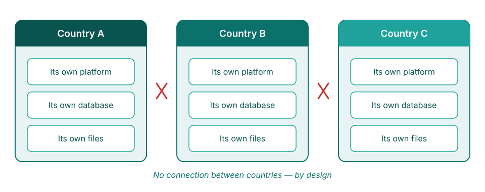
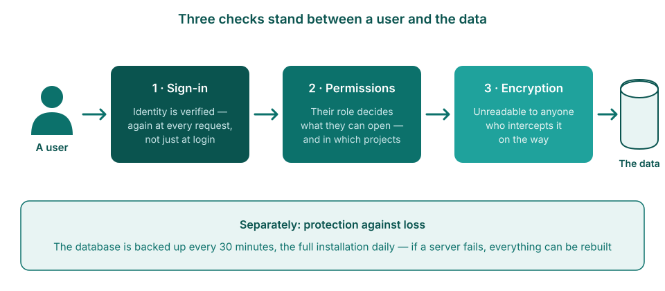
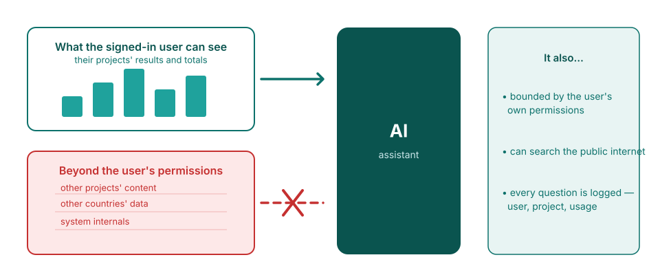
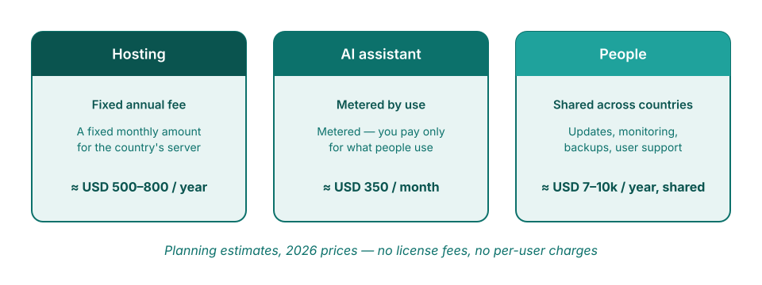
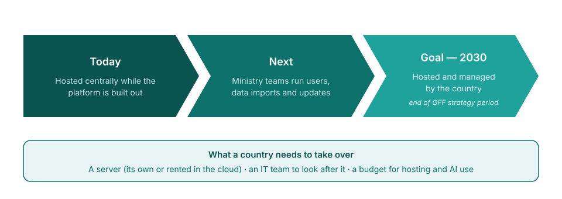

<!-- _class: title-cover -->

  

  
  

# Security, costs, and ownership

**How the FASTR platform protects a country's data — and what it takes to run it**

---

<!-- _class: section-cover -->

# Data security

---

<!-- _class: spacious -->

## What the platform holds

- **Monthly service totals per facility** — for example, 45 first antenatal visits at one clinic in March
- The **same figures as the DHIS2 reports** the ministry already produces
- **No patient records** — no names, no addresses, nothing individual

<!--
- Answer the question behind the security question first: what is even in there.
- The platform imports aggregated numerators from DHIS2 (facility-month counts). Nothing more granular exists in it.
- If pressed: even a full breach could not expose a single patient's record, because none are there.
-->

---

## Each country is fully separate

Sharing between countries is not restricted — it is **technically impossible**. Each country runs its own installation.

<!--
- Separate application, separate database, separate storage per country. Nothing shared.
- Same principle inside a country: each project team sees its own workspace, reading only the results package attached to it.
-->

---

<!-- _class: spacious -->

## Who can see what

- The ministry decides **who gets an account**, and each person's role
- Roles set what a person can do — **view, edit, or administer** — and in which projects
- Identity is **re-checked on every request**, not just at login
- Only a **small, named group of administrators** can change the setup

<!--
- Sign-in runs through a specialist identity service (Clerk); the platform never stores passwords itself. No back doors in production.
- Two role levels: instance-wide and per-project. Permissions live in the database and are checked on every request.
- The server itself: two named engineers, cryptographic keys only.
-->

---

## How the data is protected

The platform checks who you are at every step, makes everything unreadable while it travels, and keeps automatic backup copies.

<!--
- HTTPS everywhere, certificates renewed automatically; secrets never reach the browser.
- Database snapshot every 30 minutes (kept 3 days) plus full daily/weekly/monthly snapshots.
- Creating or restoring a backup needs explicit permission on top of a valid login.
-->

---

## What the AI can see

Aggregated totals only — the numbers a user could already see on screen, within that user's permissions. **Never the underlying rows.**

<!--
- The AI is Claude, by Anthropic; the access key stays on the server.
- The platform computes the aggregated answer first and sends only that; identifier lists are collapsed to counts. There is no facility-name dimension the AI can query.
- Fixed, read-only toolset: no code execution, no database access. Web search IS available (runs on Anthropic's servers) for general questions — do not claim "no internet."
- Every request is logged: user, project, model, token usage. Daily per-user and weekly per-instance limits are enforced.
-->

---

<!-- _class: section-cover -->

# Costs and ownership

---

## Running costs

Three lines: **server hosting** (fixed), **AI use** (metered), **maintenance** (shared team). No license fees, no per-user fees — the software is open source.

<!--
- The next slide carries the actual figures. This one sets the structure.
- AI spend is logged per request, so it can be monitored and capped. Driver = active users, not data volume.
- Adding accounts costs nothing.
-->

---

<!-- _class: spacious -->

## The figures — planning estimates

Estimates at 2026 prices and today's usage. **Not a quote.**

- **Hosting** a country's instance: about **USD 500–800 per year** — larger countries toward the top
- **AI use**: about **USD 350 per month** (~USD 4,000 per year) for a typical country; the largest countries several times this, and it grows with use
- **Shared platform maintenance** (engineering, monitoring, backups): roughly **USD 7,000–10,000 per country per year** today — it falls as more countries join
- **Optional support** (data refresh, quality checks, analysis): about **USD 5,000–15,000 per year**, depending on level
- **Total: about USD 12,000 per year** — up to USD 20,000–30,000 with support

<!--
- Frame clearly: planning estimates, not a quote — and the maintenance line is financed centrally today.
- The AI line is the one that moves: metered, follows usage, will grow as AI features are used more.
-->

---

<!-- _class: spacious -->

## Hosting — today and tomorrow

- Hosted **centrally today**, while the platform is in active development — every country receives fixes and new features the same day
- Built **portable**: the same platform can run on a ministry's own servers
- **Moving later requires no rebuild** — the same software runs in either place
- **All of a country's data can be exported in full at any time**, now or later, regardless of hosting

<!--
- "Portable" = Docker containerization. The platform's own technical documentation: deploying a country instance on other infrastructure, including on-premise, is relatively straightforward.
- Central hosting is a development-phase choice, not a permanent dependency.
- Self-hosting takes real ministry effort: a team for servers, backups, and upgrades, plus procurement for hosting and for AI services (bought from a commercial provider such as Anthropic).
-->

---

## The path to country ownership

<!--
- Stage 2 is already partly real: country admins manage users and data imports today.
- The 2030 goal (end of the current GFF strategy period) is proposed messaging — confirm before presenting as a commitment.
- End on the needs box: server, IT capacity, budget line.
-->

---

<!-- _class: spacious -->

## The essentials

- **Monthly totals only** — never patient records
- **One installation per country** — no pathway between countries
- **About USD 12,000 per year** to run — hosting, metered AI, shared maintenance; no license or per-user fees
- **Country hosting by 2030** — the stated transition goal

<!--
- One-slide recap for the official who reads only one slide.
- If one fact is remembered: zero patient records in the platform.
- Next steps to offer: agree the cost figures; draw up the country readiness checklist.
-->

---

<!-- _class: section-cover -->

# Technical annex — for IT and DHIS2 teams

---

<!-- _class: spacious -->

## Architecture and isolation

- Each country instance is a **separate Docker deployment**: its own application container, its own **PostgreSQL** database, its own **Valkey** cache, its own storage volume, on a private network
- Within an instance, each project has its **own database** (`project_{uuid}`) for authoring content
- Computed results live in **versioned results packages** (parquet files, queried via DuckDB) — projects read the package attached to them, never each other's

<!--
- Cross-country and cross-project isolation is structural: no shared database, cache, or filesystem path.
- Source: the platform's technical documentation and codebase (github.com/FASTR-Analytics/platform).
-->

---

<!-- _class: spacious -->

## Authentication and access control

- Identity is managed by **Clerk** (managed identity provider); session claims are **verified by middleware on every request** — auth bypass exists only for local development and is disabled in production
- **Two-tier RBAC**: instance-level permissions plus per-project roles resolved from the database on each request
- Server access: **SSH by cryptographic key only**, restricted to two named engineers — no password login

<!--
- The platform never stores passwords; Clerk handles credentials, MFA and session management.
- Project scoping is enforced server-side via a Project-Id header checked against per-project user roles.
-->

---

<!-- _class: spacious -->

## Data protection and operations

- **TLS terminates at nginx**, certificates provisioned and auto-renewed via certbot; secrets are injected as environment variables at runtime — never in images, never sent to the browser
- **R analysis modules run in ephemeral containers** (removed on completion) that mount only their own run's sandbox directory
- Backups: **pg_dump every 30 minutes** (3-day rolling window) plus **volume snapshots daily / weekly / monthly**; restores are permission-gated (`can_restore_backups`) and require a server-held key on top of a valid session

<!--
- The restore flow validates paths against traversal and fully resets the target database before loading — backups are a recovery path, not an attack surface.
-->

---

<!-- _class: spacious -->

## AI integration, precisely

- Claude (Anthropic) is reached through a **server-side proxy**; the API key never leaves the server
- Tool calls run **inside the user's authenticated session** — the AI holds no permissions of its own
- Data tools return **aggregated metric outputs only**: there is **no facility-identifier dimension** in the query interface, and any dimension with more than 20 values is summarized as a count
- **Server-side web search/fetch (Anthropic-hosted) is enabled** in the project chat for general questions
- Every request is logged (user, project, model, tokens); **daily per-user and weekly per-instance limits** are enforced

<!--
- These statements were verified directly against the platform source code, not only the documentation.
- If asked about the web tools: searches run on Anthropic's infrastructure as part of the AI request; they are not initiated from the platform server or the user's browser.
-->

---

<!-- _class: spacious -->

## Data and interoperability

- Source data: **aggregated DHIS2 numerators** (facility-month service counts) — imported server-side, with per-(indicator, month) replace semantics and a per-indicator import ledger
- **Full export at any time**: a country's data and results can be exported regardless of hosting arrangement
- The codebase is **open source**: github.com/FASTR-Analytics/platform

<!--
- The import ledger (By indicator tab) shows months of data, last import, and failed months per indicator — auditable data lineage for the DHIS2 team.
-->

