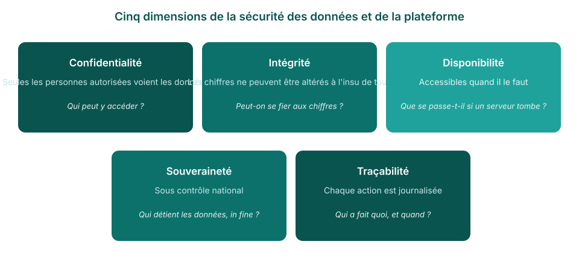

<!-- _class: title-cover -->

  

  
  

# Sécurité, coûts et appropriation

**Comment la plateforme FASTR protège les données d'un pays — et ce qu'il faut pour la faire tourner**

---

<!-- _class: section-cover -->

# Sécurité des données

---

<!-- _class: spacious -->

## Ce que contient la plateforme

- Des **totaux mensuels de services par établissement** — par exemple, 45 premières consultations prénatales dans une clinique en mars
- Les **mêmes chiffres que les rapports DHIS2** que le ministère produit déjà
- **Aucun dossier patient** — pas de noms, pas d'adresses, rien d'individuel
- C'est **le périmètre d'aujourd'hui, pas un plafond** : héberger plus tard des données individuelles n'est pas exclu — cela viendrait avec un ensemble supplémentaire de garanties, définies (annexe technique)

<!--
- Répondre d'abord à la question derrière la question de sécurité : qu'y a-t-il dedans.
- La plateforme importe des numérateurs agrégés depuis DHIS2 (totaux établissement-mois). Rien de plus fin n'y existe aujourd'hui.
- Si on insiste : aujourd'hui, même une intrusion complète ne pourrait exposer le dossier d'un seul patient — il n'y en a aucun. Si le périmètre s'étend un jour aux données individuelles, l'exigence de sécurité s'élève avec lui — la diapositive d'annexe en dresse la liste.
-->

---

## Ce que « sécurisé » veut dire pour une telle plateforme

En logiciel et en hébergement de données, la sécurité n'est pas une chose — c'en est cinq. Les diapositives suivantes les prennent une à une : le risque, puis ce qui y répond.

<!--
- C'est le cadre standard (confidentialité / intégrité / disponibilité, plus souveraineté et traçabilité pour des données publiques), en termes simples.
- Inviter la salle à ajouter ses inquiétudes — ce qui n'est pas couvert va à l'annexe technique ou en suivi.
-->

---

## Nos données peuvent-elles échapper au contrôle du pays ?

**Souveraineté.** Le risque : des données versées dans un espace partagé, ou visibles d'un autre pays. La réponse : il n'existe aucun espace partagé — chaque pays fonctionne sur sa propre installation, le partage est techniquement impossible, et tout peut être exporté intégralement à tout moment.

<!--
- Application, base de données et stockage séparés par pays. Rien de partagé.
- Même principe à l'intérieur d'un pays : chaque équipe projet voit son propre espace et ne lit que le paquet de résultats qui lui est rattaché.
-->

---

<!-- _class: spacious -->

## Un accès non autorisé est-il possible ?

**Confidentialité.** Le risque : un mot de passe qui fuite, ou un initié qui dépasse son rôle. La réponse : des comptes, des rôles, et une identité revérifiée à chaque requête.

- Le ministère décide **qui reçoit un compte**, et le rôle de chaque personne
- Le rôle fixe ce qu'une personne peut faire — **consulter, éditer ou administrer** — et dans quels projets
- L'identité est **revérifiée à chaque requête**, pas seulement à la connexion
- Seul un **petit groupe d'administrateurs identifiés** peut modifier la configuration

<!--
- La connexion passe par un service d'identité spécialisé (Clerk) ; la plateforme ne stocke jamais les mots de passe. Aucune porte dérobée en production.
- Deux niveaux de rôles : instance et projet. Les permissions sont en base et vérifiées à chaque requête.
- Le serveur lui-même : deux ingénieurs nommés, clés cryptographiques uniquement.
-->

---

## Les données peuvent-elles être interceptées — ou perdues ?

**Confidentialité et disponibilité.** Le risque : une interception sur le réseau, ou une panne de serveur qui emporte les données. La réponse : rien de lisible ne quitte la plateforme, et des copies automatiques permettent de tout reconstruire.

<!--
- HTTPS partout, certificats renouvelés automatiquement ; les secrets n'atteignent jamais le navigateur.
- Instantané de la base toutes les 30 minutes (3 jours) plus instantanés complets quotidiens/hebdomadaires/mensuels.
- Créer ou restaurer une sauvegarde exige une permission explicite en plus d'une connexion valide.
-->

---

<!-- _class: spacious -->

## Les chiffres peuvent-ils être altérés ?

**Intégrité.** Le risque : des chiffres modifiés sans trace, ou des analyses impossibles à reproduire. La réponse : une seule source de vérité, des importations enregistrées, des résultats versionnés.

- **DHIS2 reste la source de vérité** — la plateforme importe depuis DHIS2, et les mois réimportés sont rafraîchis pour y correspondre
- **Chaque importation est enregistrée** : un registre indicateur par indicateur montre les mois chargés, quand, et les échecs éventuels
- **Les résultats arrivent en paquets versionnés et datés** — le même paquet donne les mêmes chiffres à tous ; de nouveaux chiffres exigent un nouveau paquet
- Les méthodes d'analyse et leurs paramètres sont **documentés et consignés avec chaque paquet**

<!--
- C'est l'argument de confiance, pour les analystes comme pour les directions : un chiffre d'un rapport se retrace jusqu'à un paquet daté, ses paramètres de modules et l'importation DHIS2 derrière.
- Personne ne corrige un chiffre à la main — tout changement passe par une nouvelle importation et un nouveau paquet, tous deux enregistrés.
-->

---

## L'IA peut-elle exposer ce qu'elle voit ?

**Confidentialité et traçabilité.** Le risque : un assistant qui en voit trop. La réponse : il ne reçoit que des totaux agrégés — les chiffres qu'un utilisateur verrait déjà, dans la limite de ses propres permissions, et chaque question posée est journalisée. **Jamais les lignes en dessous.**

<!--
- L'IA est Claude, d'Anthropic ; la clé d'accès reste sur le serveur.
- La plateforme calcule d'abord la réponse agrégée et n'envoie que cela ; les listes d'identifiants sont réduites à des nombres. Aucune dimension « nom d'établissement » n'est interrogeable par l'IA.
- Outils fixes, en lecture seule : pas d'exécution de code, pas d'accès à la base. La recherche web EST disponible (côté serveurs Anthropic) pour les questions générales — ne pas affirmer « pas d'Internet ».
- Chaque requête est journalisée : utilisateur, projet, modèle, usage en jetons. Des limites quotidiennes par utilisateur et hebdomadaires par instance s'appliquent.
-->

---

<!-- _class: section-cover -->

# Coûts et appropriation

---

## Coûts de fonctionnement

Trois lignes : **hébergement du serveur** (fixe), **usage de l'IA** (au compteur), **maintenance** (équipe partagée). Pas de licence, pas de frais par utilisateur — le logiciel est open source.

<!--
- La diapositive suivante porte les chiffres réels. Celle-ci pose la structure.
- La dépense IA est journalisée par requête : elle se suit et se plafonne. Déterminant = utilisateurs actifs, pas volume de données.
- Ajouter des comptes ne coûte rien.
-->

---

<!-- _class: spacious -->

## Les chiffres — estimations de planification

Estimations aux prix 2026 et à l'usage actuel. **Ce n'est pas un devis.**

- **Hébergement** de l'instance d'un pays : environ **500 à 800 USD par an** — les grands pays vers le haut de la fourchette
- **Usage de l'IA** : environ **350 USD par mois** (~4 000 USD par an) pour un pays typique ; plusieurs fois plus pour les plus grands pays, et cela croît avec l'usage
- **Maintenance partagée de la plateforme** (ingénierie, supervision, sauvegardes) : environ **7 000 à 10 000 USD par pays et par an** aujourd'hui — cela baisse à mesure que des pays rejoignent
- **Appui optionnel** (actualisation des données, contrôles qualité, analyses) : environ **5 000 à 15 000 USD par an** selon le niveau
- **Total : environ 12 000 USD par an** — jusqu'à 20 000–30 000 USD avec l'appui
- Les lignes incluent les services externes : le **service de connexion (Clerk)** et l'**API d'IA (Anthropic)** — aucun abonnement caché
- **Les économies d'échelle jouent déjà** : une seule équipe et un seul code servent tous les pays, la part de maintenance par pays baisse à mesure que des pays rejoignent — des économies qu'un pays abandonne en s'hébergeant seul

<!--
- Cadrer clairement : estimations de planification, pas un devis — et la ligne maintenance est financée centralement aujourd'hui.
- La ligne qui bouge est l'IA : au compteur, elle suit l'usage et croîtra avec les fonctions IA.
-->

---

<!-- _class: spacious -->

## Hébergement — et ce que migrer demande vraiment

- Hébergée **de façon centralisée aujourd'hui**, pendant le développement actif — chaque pays reçoit correctifs et nouveautés le jour même
- Construite **portable** : le même logiciel tourne tel quel sur les serveurs d'un ministère — aucune reconstruction
- **Mais migrer est un projet, pas un interrupteur** : évaluation de préparation, achat des serveurs, formation de l'équipe, période de fonctionnement en parallèle, puis bascule — cela se compte en **mois, planifiés ensemble**
- **Et s'héberger seul, c'est porter seul** ce qui est partagé aujourd'hui : maintenance, supervision, mises à niveau et correctifs deviennent la charge de l'équipe du ministère
- **Toutes les données d'un pays peuvent être exportées intégralement à tout moment**, quel que soit l'hébergement

<!--
- « Portable » = conteneurisation Docker. Documentation technique de la plateforme : déployer une instance pays sur une autre infrastructure, y compris sur site, est relativement simple.
- L'hébergement centralisé est un choix de phase de développement, pas une dépendance permanente.
- L'auto-hébergement demande un vrai effort du ministère : une équipe pour serveurs, sauvegardes et mises à niveau, plus la passation de marchés pour l'hébergement et les services d'IA (achetés auprès d'un fournisseur commercial comme Anthropic).
-->

---

## Le chemin vers l'appropriation par le pays

Pour les pays qui souhaitent s'héberger eux-mêmes, un effort du ministère de la Santé sera nécessaire. Une équipe devra faire tourner serveurs, sauvegardes et mises à niveau ; et des marchés devront être en place pour l'hébergement et pour les services d'IA, achetés auprès d'un fournisseur commercial (par ex. Anthropic, OpenAI).

<!--
- L'étape 2 est déjà en partie réelle : les administrateurs pays gèrent aujourd'hui utilisateurs et imports.
- L'objectif 2030 (fin de la période stratégique actuelle du GFF) est un message proposé — à confirmer avant de le présenter comme un engagement.
- Terminer sur l'encadré des besoins : serveur, capacité informatique, ligne budgétaire.
-->

---

<!-- _class: spacious -->

## L'essentiel

- **Des totaux agrégés aujourd'hui** — aucun dossier patient ; tout hébergement futur de données individuelles s'accompagnerait de garanties supplémentaires
- **Une installation par pays** — aucun passage entre pays
- **Environ 12 000 USD par an** de fonctionnement — hébergement, IA au compteur, maintenance partagée ; ni licence ni frais par utilisateur
- **Hébergement par le pays d'ici 2030** — l'objectif de transition affiché

<!--
- Récapitulatif en une diapositive pour le responsable qui n'en lira qu'une.
- Si un seul fait doit rester : zéro dossier patient dans la plateforme.
- Prochaines étapes à proposer : arrêter les chiffres de coûts ; établir la liste de préparation du pays.
-->

---

<!-- _class: section-cover -->

# Annexe technique — pour les équipes informatiques et DHIS2

---

<!-- _class: spacious -->

## Architecture et isolation

- Chaque instance pays est un **déploiement Docker séparé** : son conteneur applicatif, sa base **PostgreSQL**, son cache **Valkey**, son volume de stockage, sur un réseau privé
- Au sein d'une instance, chaque projet a sa **propre base** (`project_{uuid}`) pour le contenu d'édition
- Les résultats calculés résident dans des **paquets de résultats versionnés** (fichiers parquet, interrogés via DuckDB) — les projets lisent le paquet qui leur est rattaché, jamais celui des autres

<!--
- L'isolation entre pays et entre projets est structurelle : ni base, ni cache, ni chemin de fichiers partagés.
- Source : documentation technique et code de la plateforme (github.com/FASTR-Analytics/platform).
-->

---

<!-- _class: spacious -->

## Authentification et contrôle d'accès

- L'identité est gérée par **Clerk** (fournisseur d'identité géré) ; les jetons de session sont **vérifiés par middleware à chaque requête** — le contournement d'authentification n'existe qu'en développement local, désactivé en production
- **RBAC à deux niveaux** : permissions d'instance et rôles par projet, résolus en base à chaque requête
- Accès aux serveurs : **SSH par clé cryptographique uniquement**, restreint à deux ingénieurs nommés — pas de connexion par mot de passe

<!--
- La plateforme ne stocke jamais de mots de passe ; Clerk gère identifiants, MFA et sessions.
- Le périmètre projet est appliqué côté serveur via un en-tête Project-Id confronté aux rôles par projet.
-->

---

<!-- _class: spacious -->

## Protection des données et exploitation

- **TLS terminé sur nginx**, certificats provisionnés et renouvelés via certbot ; les secrets sont injectés en variables d'environnement à l'exécution — jamais dans les images, jamais côté navigateur
- **Les modules R s'exécutent dans des conteneurs éphémères** (supprimés à la fin) qui ne montent que le répertoire de travail de leur exécution
- Sauvegardes : **pg_dump toutes les 30 minutes** (fenêtre glissante de 3 jours) plus **instantanés de volume quotidiens / hebdomadaires / mensuels** ; la restauration est contrôlée par permission (`can_restore_backups`) et par une clé côté serveur en plus d'une session valide

<!--
- La restauration valide les chemins contre la traversée de répertoires et réinitialise entièrement la base cible avant chargement — les sauvegardes sont une voie de récupération, pas une surface d'attaque.
-->

---

<!-- _class: spacious -->

## L'intégration IA, précisément

- Claude (Anthropic) est atteint via un **proxy côté serveur** ; la clé d'API ne quitte jamais le serveur
- Les appels d'outils s'exécutent **dans la session authentifiée de l'utilisateur** — l'IA n'a aucune permission propre
- Les outils de données renvoient **uniquement des sorties métriques agrégées** : il n'existe **aucune dimension identifiant d'établissement** dans l'interface de requête, et toute dimension de plus de 20 valeurs est résumée en nombre
- La **recherche web côté serveur (hébergée par Anthropic) est activée** dans le chat projet pour les questions générales
- Chaque requête est journalisée (utilisateur, projet, modèle, jetons) ; **des limites quotidiennes par utilisateur et hebdomadaires par instance** s'appliquent

<!--
- Ces affirmations ont été vérifiées directement dans le code source de la plateforme, pas seulement dans la documentation.
- Si la question vient sur les outils web : les recherches s'exécutent sur l'infrastructure d'Anthropic dans le cadre de la requête IA ; elles ne partent ni du serveur de la plateforme ni du navigateur de l'utilisateur.
-->

---

<!-- _class: spacious -->

## Données et interopérabilité

- Données source : **numérateurs DHIS2 agrégés** (totaux établissement-mois) — importés côté serveur, avec remplacement par paire (indicateur, mois) et un registre d'importation par indicateur
- **Export intégral à tout moment** : les données et résultats d'un pays sont exportables quel que soit l'hébergement
- Le code est **open source** : github.com/FASTR-Analytics/platform

<!--
- Le registre d'importation (onglet Par indicateur) montre les mois de données, la dernière importation et les mois en échec par indicateur — une traçabilité auditable pour l'équipe DHIS2.
-->

---

<!-- _class: spacious -->

## Si des données patients étaient hébergées : les exigences

Le périmètre agrégé est un choix de conception, valable aujourd'hui. Héberger des données individuelles n'est pas exclu — et serait conditionné à un ensemble supplémentaire de garanties :

- **La base légale d'abord** : conformité au droit national de protection des données et des données de santé, accords de partage — et possiblement **l'hébergement dans le pays** comme précondition
- **Chiffrement au repos** en plus du chiffrement en transit ; **pseudonymisation** partout où l'analyse le permet
- **Accès au strict nécessaire** : rôles plus fins, restrictions par champ, et journaux d'audit sur chaque accès à un enregistrement
- Des procédures formelles de **réponse aux incidents et de notification des violations**, des tests de sécurité indépendants et des pratiques de niveau certification
- **Gouvernance ministérielle** : une autorité désignée d'accès aux données décidant qui peut voir quoi, et pourquoi

<!--
- Rien d'exotique ici — c'est l'exigence standard pour des données de santé individuelles, partout.
- La conception agrégée maintient un profil de risque bas aujourd'hui tout en laissant cette voie ouverte ; la décision et son calendrier appartiennent au pays.
-->

