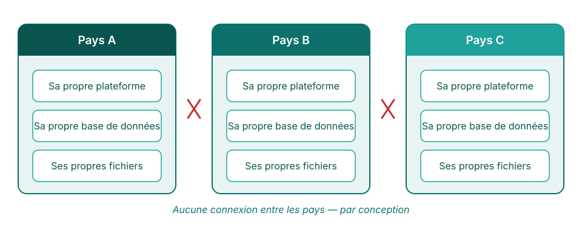
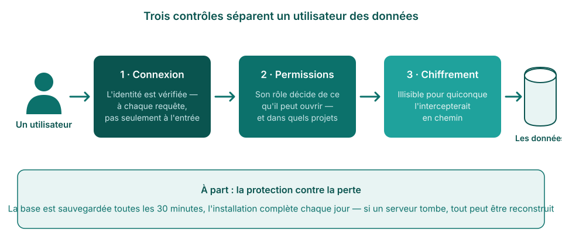
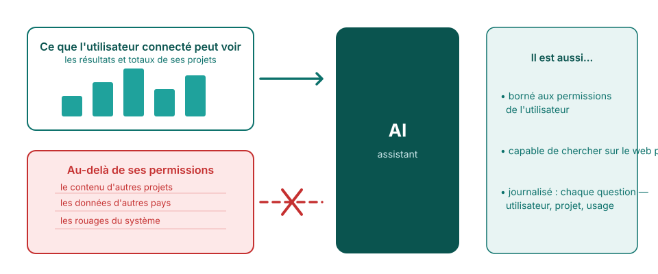
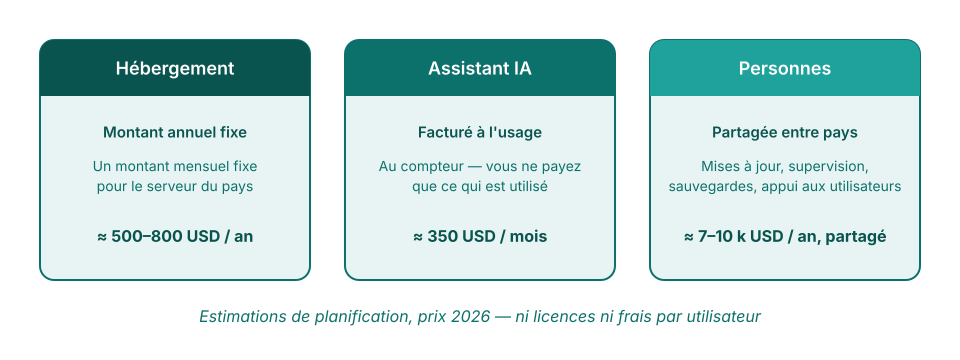
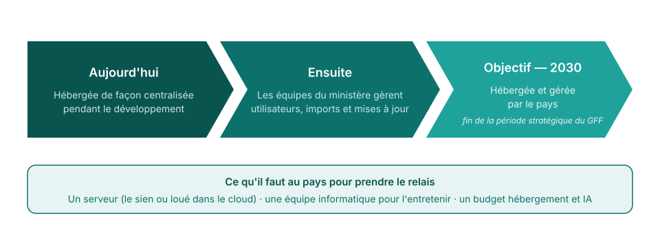

<!-- _class: title-cover -->

  

  
  

# Sécurité, coûts et appropriation

**Comment la plateforme FASTR protège les données d'un pays — et ce qu'il faut pour la faire tourner**

---

<!-- _class: section-cover -->

# Sécurité des données

---

<!-- _class: spacious -->

## Ce que contient la plateforme

- Des **totaux mensuels de services par établissement** — par exemple, 45 premières consultations prénatales dans une clinique en mars
- Les **mêmes chiffres que les rapports DHIS2** que le ministère produit déjà
- **Aucun dossier patient** — pas de noms, pas d'adresses, rien d'individuel

<!--
- Répondre d'abord à la question derrière la question de sécurité : qu'y a-t-il dedans.
- La plateforme importe des numérateurs agrégés depuis DHIS2 (totaux établissement-mois). Rien de plus fin n'y existe.
- Si on insiste : même une intrusion complète ne pourrait exposer le dossier d'un seul patient — il n'y en a aucun.
-->

---

## Chaque pays est entièrement séparé

Le partage entre pays n'est pas restreint — il est **techniquement impossible**. Chaque pays fonctionne sur sa propre installation.

<!--
- Application, base de données et stockage séparés par pays. Rien de partagé.
- Même principe à l'intérieur d'un pays : chaque équipe projet voit son propre espace et ne lit que le paquet de résultats qui lui est rattaché.
-->

---

<!-- _class: spacious -->

## Qui voit quoi

- Le ministère décide **qui reçoit un compte**, et le rôle de chaque personne
- Le rôle fixe ce qu'une personne peut faire — **consulter, éditer ou administrer** — et dans quels projets
- L'identité est **revérifiée à chaque requête**, pas seulement à la connexion
- Seul un **petit groupe d'administrateurs identifiés** peut modifier la configuration

<!--
- La connexion passe par un service d'identité spécialisé (Clerk) ; la plateforme ne stocke jamais les mots de passe. Aucune porte dérobée en production.
- Deux niveaux de rôles : instance et projet. Les permissions sont en base et vérifiées à chaque requête.
- Le serveur lui-même : deux ingénieurs nommés, clés cryptographiques uniquement.
-->

---

## Comment les données sont protégées

La plateforme vérifie qui vous êtes à chaque étape, brouille tout ce qu'elle transmet et enregistre des copies automatiquement.

<!--
- HTTPS partout, certificats renouvelés automatiquement ; les secrets n'atteignent jamais le navigateur.
- Instantané de la base toutes les 30 minutes (3 jours) plus instantanés complets quotidiens/hebdomadaires/mensuels.
- Créer ou restaurer une sauvegarde exige une permission explicite en plus d'une connexion valide.
-->

---

## Ce que l'IA peut voir

Des totaux agrégés uniquement — les chiffres qu'un utilisateur verrait déjà à l'écran, dans la limite de ses permissions. **Jamais les lignes en dessous.**

<!--
- L'IA est Claude, d'Anthropic ; la clé d'accès reste sur le serveur.
- La plateforme calcule d'abord la réponse agrégée et n'envoie que cela ; les listes d'identifiants sont réduites à des nombres. Aucune dimension « nom d'établissement » n'est interrogeable par l'IA.
- Outils fixes, en lecture seule : pas d'exécution de code, pas d'accès à la base. La recherche web EST disponible (côté serveurs Anthropic) pour les questions générales — ne pas affirmer « pas d'Internet ».
- Chaque requête est journalisée : utilisateur, projet, modèle, usage en jetons. Des limites quotidiennes par utilisateur et hebdomadaires par instance s'appliquent.
-->

---

<!-- _class: section-cover -->

# Coûts et appropriation

---

## Coûts de fonctionnement

Trois lignes : **hébergement du serveur** (fixe), **usage de l'IA** (au compteur), **appui** (équipe partagée). Pas de frais par utilisateur.

<!--
- Hébergement : un serveur dédié par pays, montant mensuel fixe. [Chiffre à confirmer — ne pas présenter sans.]
- IA : pas de licence ; chaque requête est journalisée avec son coût exact — la dépense se suit et se plafonne. Déterminant = utilisateurs actifs, pas volume de données. [Fourchette à confirmer.]
- Appui : mises à jour, supervision, sauvegardes, aide aux utilisateurs — une équipe partagée aujourd'hui.
- Ajouter des comptes ne coûte rien.
-->

---

<!-- _class: spacious -->

## Hébergement — aujourd'hui et demain

- Hébergée **de façon centralisée aujourd'hui**, pendant le développement actif — chaque pays reçoit correctifs et nouveautés le jour même
- Construite **portable** : le même logiciel peut tourner sur les serveurs d'un ministère
- **Migrer plus tard n'exige aucune reconstruction** — le même logiciel tourne dans les deux cas

<!--
- « Portable » = conteneurisation Docker. Documentation technique de la plateforme : déployer une instance pays sur une autre infrastructure, y compris sur site, est relativement simple.
- L'hébergement centralisé est un choix de phase de développement, pas une dépendance permanente.
-->

---

## Le chemin vers l'appropriation par le pays

<!--
- L'étape 2 est déjà en partie réelle : les administrateurs pays gèrent aujourd'hui utilisateurs et imports.
- L'objectif 2030 (fin de la période stratégique actuelle du GFF) est un message proposé — à confirmer avant de le présenter comme un engagement.
- Terminer sur l'encadré des besoins : serveur, capacité informatique, ligne budgétaire.
-->

---

<!-- _class: spacious -->

## L'essentiel

- **Des totaux mensuels uniquement** — jamais de dossiers patients
- **Une installation par pays** — aucun passage entre pays
- **Trois lignes de coûts connues** — hébergement, IA au compteur, appui ; pas de frais par utilisateur
- **Hébergement par le pays d'ici 2030** — l'objectif de transition affiché

<!--
- Récapitulatif en une diapositive pour le responsable qui n'en lira qu'une.
- Si un seul fait doit rester : zéro dossier patient dans la plateforme.
- Prochaines étapes à proposer : arrêter les chiffres de coûts ; établir la liste de préparation du pays.
-->
