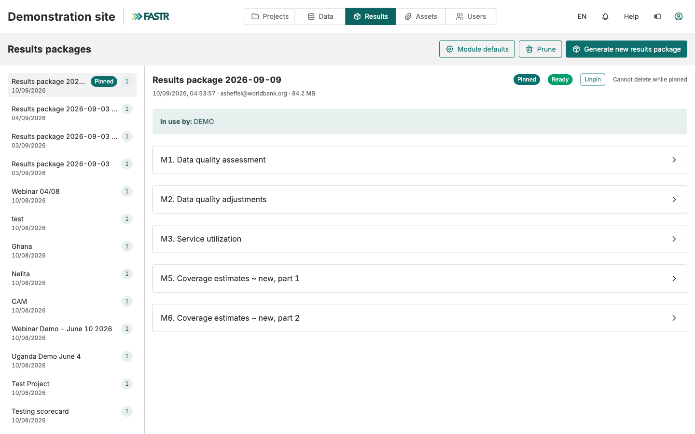
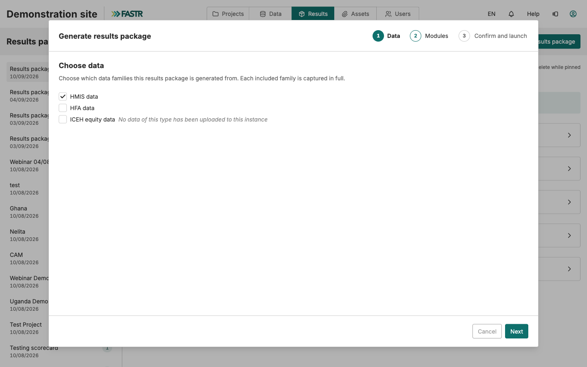
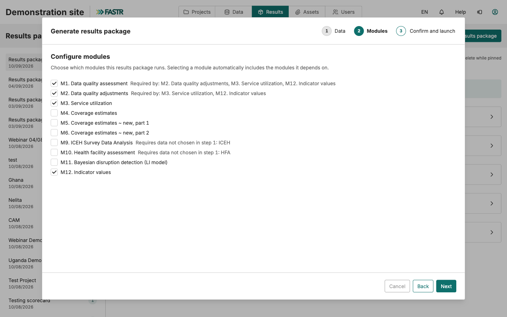
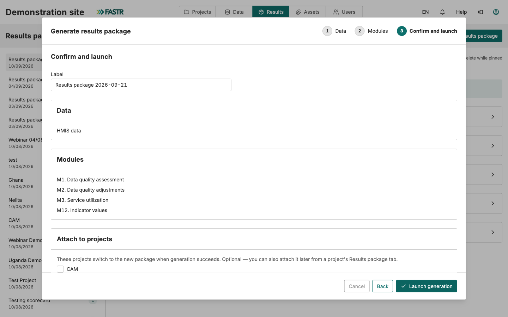
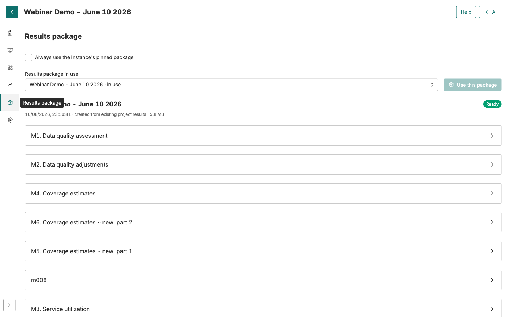

# Updating data from DHIS2

<strong>Step-by-step guide</strong> · <strong>~15 min + processing time</strong>

<aside class="p1-sidebar">

Before you start

- ☐ You are logged into your FASTR instance with an admin account
- ☐ You know which month your current data stops at
- ☐ You know which month DHIS2 is filled up to

</aside>

## What this guide is for

Every month, facilities enter their reports into DHIS2 — and FASTR knows nothing about them until someone runs the update.

Since the latest platform version, that update takes **three moves**:

1. **Import** the new months from DHIS2
2. **Generate a results package** — this is what recomputes the analyses
3. **Attach** the package to the projects

**The example this guide follows:** the last import stops at **November 2025**. DHIS2 now holds reports through **July 2026**. We will download **December 2025 → July 2026**, then follow through.

> **The "Update data" button no longer exists.** If you knew the old method — import, then click "Update data" in each project — forget it. The **results package** replaced it: all of a project's numbers come from a package, and you switch projects onto the most recent one.

---

## The three moves

| # | What you do | Where |
|---|---|---|
| 1 | Import the new months from DHIS2 | **Data** → HMIS → **Data** → **Imports** |
| 2 | Generate a results package | **Results** → **Generate new results package** |
| 3 | Attach the package to the projects | Ticked directly in step 2, or project by project |

The idea in one sentence: the import fills the data store, the package does the computing, and each project reads its numbers from the package attached to it.

> **A tip that avoids surprises.** Reports for recent months often change after the fact — facilities enter data late. When you choose the period to import, push the start back a few months. For our example: rather than December 2025 → July 2026, take **September 2025 → July 2026**. Re-downloaded months are simply refreshed with the up-to-date numbers.

---

<h2 class="step-h">1Launch the import</h2>

1. Click **Data** in the top bar, then, in the **HMIS** section, the **Data** card.

   

2. Click **Imports**, then **New DHIS2 import**.

   

The wizard opens. It has five steps: **Credentials**, **Indicators**, **Time**, **Config**, **Review & launch**.

3. **Credentials** — the stored DHIS2 connection appears. Click **Next**.

   

---

4. **Indicators** — tick the indicators to download. For a routine update, the safe choice: **tick them all**, with the checkbox at the top of the list. Then **Next**.

   

5. **Time** — choose **Now**, then **Next**.

   

> **Worth noting for later:** the **Recurring** option schedules this import to repeat by itself, every month. Once the routine is well in hand, move 1 disappears from your list.

---

6. **Config** — set the **period range** with the two sliders: the window of months to download. For our example: **September 2025 → July 2026** — the new months, plus the margin for late entries.

   

7. **Review & launch** — reread the summary: the connection, the indicator count, the window. Then click **Start import**.

   

The import runs in the background — from a few minutes to much longer, depending on the window and the number of indicators. The **History** tab of the Imports page tells you when it is finished. **Wait for it to finish before move 2**: a package generated too early would compute on the old data.

---

<h2 class="step-h">2Generate the results package</h2>

The new months are downloaded, but no analysis has recomputed. That is the package's job.

1. Click **Results** in the top bar. The **Results packages** page lists the existing packages, with each one's date and the projects using it.

   

2. Click **Generate new results package**. The wizard has three steps.
3. **Data** — tick **HMIS data**. Then **Next**.

   

4. **Modules** — tick the analysis modules to run, the usual ones for your instance. If a module needs another one, FASTR adds it by itself. Then **Next**.

   

---

<h2 class="step-h">3Attach the package to the projects</h2>

The attachment happens on the wizard's last step — move 3, built into move 2.

1. **Confirm and launch** — a label is suggested, with today's date. Keep it, or name the package more clearly: "Data through July 2026".
2. Under **Attach to projects**, **tick every project that should switch to the new numbers.** As soon as generation succeeds, those projects switch to the new package — with no further action from you.

   

3. Click **Launch generation**. It runs in the background; progress shows on the Results packages page.

> **Forgot a project?** No problem. Open that project, go to its **Results package** tab, pick the new package from the list and click **Use this package**. FASTR first shows you what the change would affect, then switches. A project you don't switch keeps showing the old numbers — without warning anyone.

---

## Check that the new months are in

Open one of the attached projects and display a chart you know well — a monthly series. The time axis should now run through **July 2026**.

In the project's **Results package** tab, you can also check at a glance which package is in use and how old it is — the line under its name gives the generation date.

> **The setting that simplifies everything: the pinned package.** On the **Results** page, the **Pin** button designates the instance's reference package. In each project, the **"Always use the instance's pinned package"** checkbox makes that choice follow automatically — but it is **not on by default**: tick it once in each project concerned. From then on, the monthly routine comes down to: import, generate, **pin**. The projects follow by themselves.

## If a number doesn't add up

- **A recent month is missing everywhere** — the import didn't cover that month, or it wasn't finished when the package was generated. Check the Imports **History** tab, then generate a new package.
- **The month is imported but missing from one project** — that project stayed on an old package. Open its **Results package** tab and switch it.
- **A recent number differs from DHIS2** — facilities entered data after your import. Run another import including that month, then a new package.

---

## Recap

| Move | Where | Effect |
|---|---|---|
| Import from DHIS2 | Data → HMIS → Data → Imports | Downloads the new months into the instance |
| Generate a results package | Results → Generate new results package | Recomputes all analyses on the up-to-date data |
| Attach to projects | Ticked at generation, or the project's Results package tab | The projects show the new numbers |

**Our example, in short:** data stopped at November 2025, DHIS2 filled through July 2026. Import **September 2025 → July 2026** (margin included), wait for it to finish, generate a package **"Data through July 2026"** ticking the projects concerned. The charts now run through July 2026.

**The good habit:** make these moves on a fixed date, every month, once DHIS2 entry has stabilized. And two settings make them nearly automatic: the **Recurring** import (move 1) and the **pinned** package with projects set to "always follow" (move 3).
