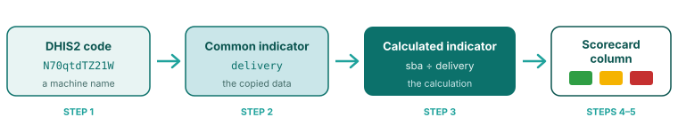
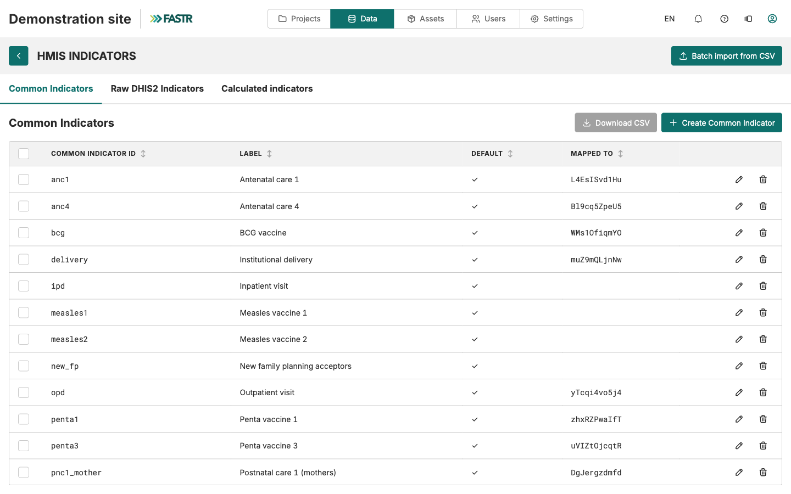
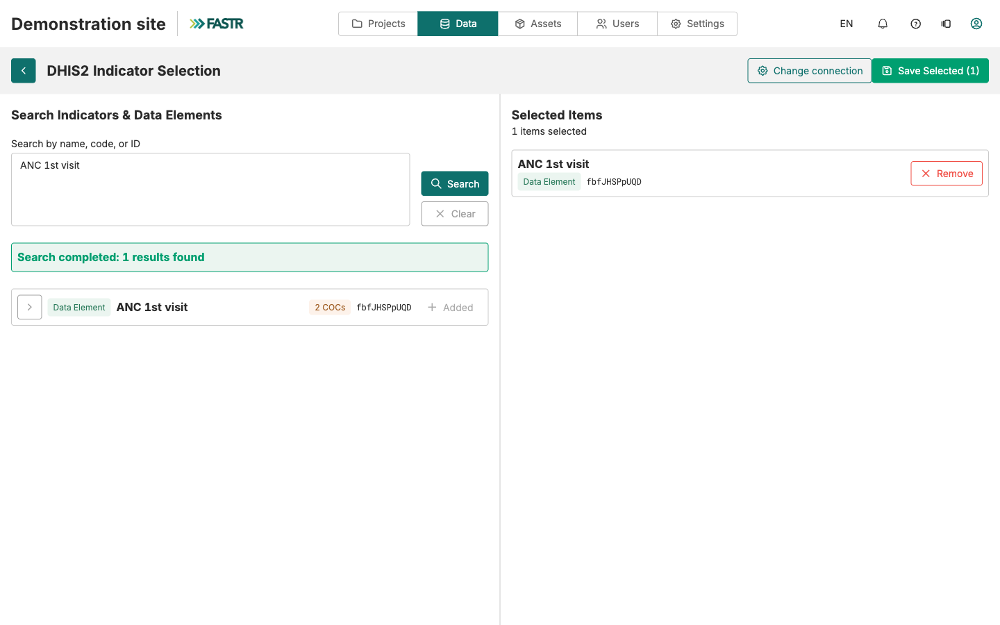
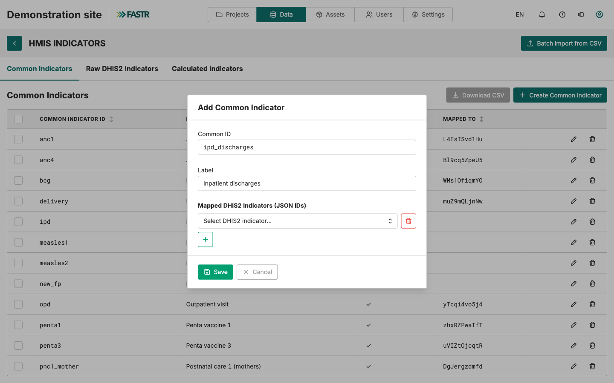
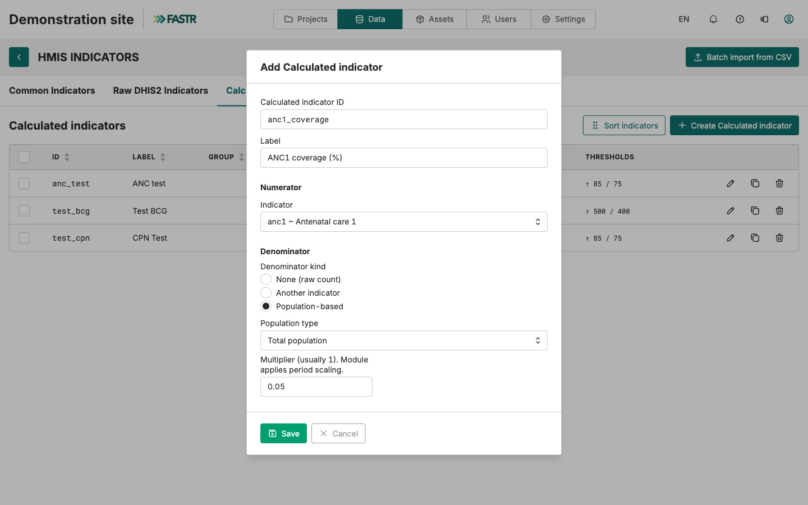
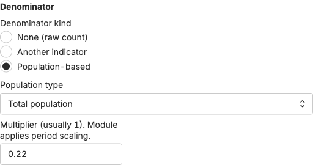
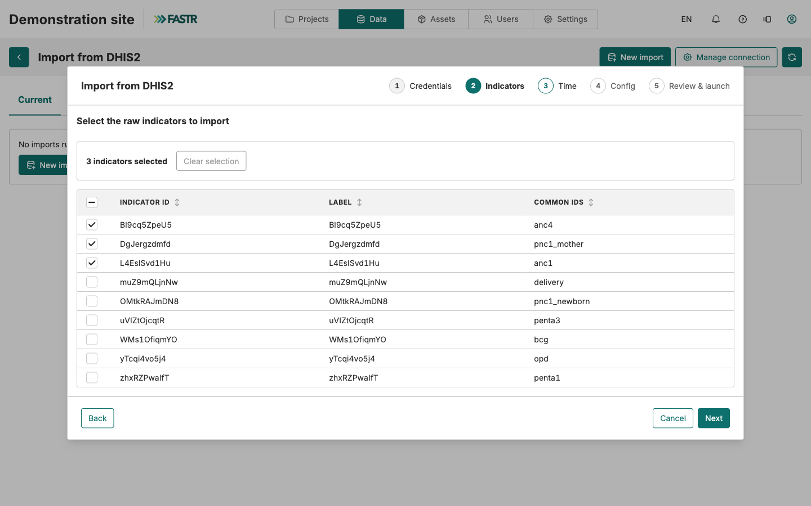
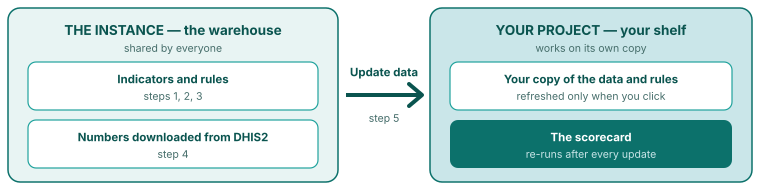
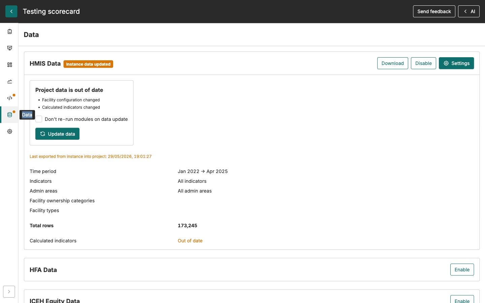
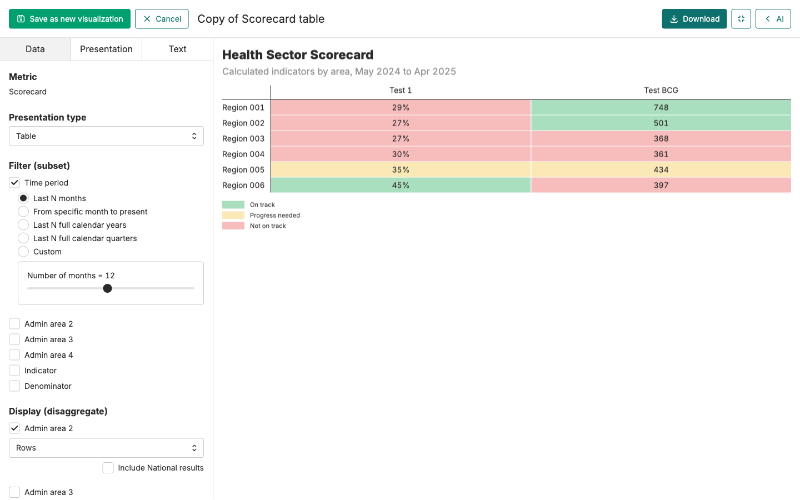

# Adding an indicator to the scorecard

<strong>Step-by-step guide</strong> · <strong>~30 min</strong>

<aside class="p1-sidebar">

Before you start

- ☐ You are logged into FASTR with an admin account that has the **Configure data** permission
- ☐ You have the **DHIS2 ID** of each indicator, or its exact name
- ☐ You know which program each indicator belongs to

</aside>

## The three kinds of indicators

FASTR does not collect data itself. It **copies the data from DHIS2**, through a direct connection between the two systems. Three words describe what happens to that data:

- The **raw DHIS2 indicator** is the code from DHIS2, like `jE6e5ftmgvL`. It tells FASTR exactly what to copy.
- The **common indicator** is the readable name you give it in FASTR, like `anc1`. The copied monthly counts are stored under this name.
- The **calculated indicator** is the **calculation**: divide this by that, shown as a percent or a rate — with the cutoffs that color it green, yellow, or red.

**Every column on the scorecard is a calculated indicator.** Nothing else can be a column. So to add one column, you build all three things, in order. This guide walks you through it.

> **A real example from the Nigeria platform.** `sba` is a common indicator: deliveries attended by skilled birth staff each month, copied from DHIS2. `delivery` is another: all reported deliveries. `skilled_birth_attendance` is a calculated indicator: `sba` divided by `delivery`, shown as a percent. The scorecard shows it as one colored cell per state — green from 80%, yellow from 50%, red below.

---

## The six steps

| # | What you do | Where |
|---|---|---|
| 1 | Tell FASTR the DHIS2 code exists | Instance → **Data** → **Indicators** → **Raw DHIS2 Indicators** tab |
| 2 | Give it a name people understand | Same page, **Common Indicators** tab |
| 3 | Create the calculated indicator | Same page, **Calculated indicators** tab |
| 4 | Copy the numbers over from DHIS2 | Instance → **Data** → HMIS **Data** → **Import from DHIS2** |
| 5 | Update your project | Project → **Data** → **Update data** |
| 6 | The new column appears on the scorecard | Happens by itself after step 5 |

Some steps may already be done. If the code is already in FASTR, start at step 2. If the name already exists and has data, start at step 3.

**The example used in this guide.** We follow one request from start to finish: the Safe Motherhood Coordinator wants **ANC1 coverage** on the scorecard — out of all pregnant women, how many came for their first antenatal visit? Look for **Our example** on each page.

> **Steps 1–3 happen in the shared part of FASTR.** Your project only sees them after you click **Update data** in step 5. Created something and it's not showing? Changed a color cutoff and nothing moved? Do step 5.

---

<h2 class="step-h">1Tell FASTR the DHIS2 code exists</h2>

1. Log into FASTR. Click the **Data** icon in the top bar.
2. Click the **Indicators** card. You will see three tabs: **Common Indicators**, **Raw DHIS2 Indicators**, **Calculated indicators**.

   

3. Open the **Raw DHIS2 Indicators** tab. Click **Import DHIS2 indicator**.
4. Paste the **DHIS2 ID** in the search box. No ID? Type the name instead. Click **Search**.
5. Find your indicator in the results. Click **Add** next to it. It moves to the **Selected Items** list on the right.
6. Want more indicators? Repeat. When done, click **Save Selected**.

   

> **Tip:** you can search several things at once. Separate them with commas. A broad word like `delivery` finds the whole family in one go.

The code is now in FASTR. But it has no name and no numbers yet.

**Our example:** we type `ANC 1st visit` in the search box, click **Search**, click **Add** on the right row, then **Save Selected**.

---

## When you need a subgroup (an age band, a sex, a facility type)

In DHIS2, one indicator is often split into subgroups — by age, by sex, by facility type. These subgroups are called **COCs**. They do not show up in search results on their own. Here is how to find one:

1. Search for the main indicator by its ID.
2. Look at the result row. An orange badge saying **"N COCs"** means it has subgroups.
3. Click the small **arrow (chevron)** on the left of the row. The subgroups unfold.
4. Each subgroup has its own line, with an ID made of two parts and a dot: `N70qtdTZ21W.idn6U8HSREb`. Before the dot: the main indicator. After the dot: the subgroup.
5. Click **Add** on the **subgroup line** — not on the main line.

> **Why it matters.** The main line gives you **everything added together** — all ages, all groups. The subgroup line gives you just the slice you want. If someone hands you an ID with a dot in it, it is a subgroup: search for the part **before** the dot, then unfold.

**Our example:** ANC 1st visit has no subgroups, so we used the main line. But suppose "Deliveries" is split by type and we only want cesareans — then we unfold Deliveries and click **Add** on the cesarean line only.

---

<h2 class="step-h">2Give it a name people understand</h2>

1. Open the **Common Indicators** tab.
2. First, check the list. Does the name you need already exist? If yes, click its **pencil icon** and jump to point 4.
3. If not, click **Create Common Indicator**. Fill in two boxes:
   - **Common ID** — the short technical name, like `ipd_discharges`.
   - **Label** — the name people will see on screen, like "Inpatient discharges".
4. Under **Mapped DHIS2 Indicators (JSON IDs)**, click **+**. Pick the DHIS2 code you saved in step 1.
5. Save.

   

## The ID and the label: same indicator, two audiences

- **The ID is for the machine.** It is used in calculations and data files, so the rules are strict: small letters, numbers, and underscore ( _ ) only. No capitals, no spaces, no dashes, no accents. `ipd_discharges` ✓ · `IPD-Discharges` ✗ · `ipd discharges` ✗. An ID that breaks these rules cannot be used in a calculated indicator. And an ID **can never be changed after saving** — a typo means delete and start over. Start the ID with the program area (`anc1_visits`, `nut_stunting_u5`) so related indicators sort together in the list.
- **The label is for people.** It appears in menus, tables, and chart legends — accents, spaces, and capitals are fine. Make it short and clear enough that a colleague from another program understands it without you there to explain. "ANC1 women 15–17 years" works. "ANC1 g2" does not. On a chart, a long label gets cut off — aim for a handful of words.

**One name can hold several codes.** Click **+** again to link more DHIS2 codes to the same name. FASTR **adds them together**. This is how you build totals that DHIS2 doesn't give you — like two age bands added into one, or an old code and its replacement joined into one series.

**Our example:** Common ID `anc1`, Label "ANC 1st visits", linked to the ANC 1st visit code we saved in step 1.

---

<h2 class="step-h">3Create the calculated indicator</h2>

1. Open the **Calculated indicators** tab. Click **Create Calculated indicator**.

   

2. Fill in the top of the form:
   - **Calculated indicator ID** — same strict rules as before: small letters, numbers, underscores. Cannot be changed later.
   - **Label** — the column title on the scorecard. Keep it short.
   - **Group** — which section of the scorecard it belongs to, like "Reproductive health".
3. **Numerator** → **Indicator**: pick the common indicator to count. This is the **top** of the division.
4. **Denominator**: pick what to divide by. This is the **bottom**. Three choices — next page explains them.
5. **Format**: how the result should look — **Percent**, **Number**, or **Rate per 10,000**. The preview shows you.
6. **Thresholds**: set the colors. Two pages ahead explains them.

> **There is no formula box.** A calculated indicator is always **one thing divided by one thing**. Nothing more.
>
> Need to add two things first? Like total deliveries = normal deliveries + cesareans? **Do the adding in step 2.** Create one common indicator called `deliveries_total` and link **both** DHIS2 codes to it. FASTR adds them up for you. Then use it here as one thing.

**Our example:** ID `anc1_coverage`, Label "ANC1 coverage (%)", Group "Reproductive health". Numerator: `anc1`. The denominator and colors are on the next pages.

---

## The denominator: what are you dividing by?

| Choice on screen | What it means | When to use it |
|---|---|---|
| **None (raw count)** | Don't divide. Just show the count. | Things you count directly: maternal deaths, snake bite cases |
| **Another indicator** | Divide by another common indicator | C-sections out of all deliveries |
| **Population-based** | Divide by the number of people in the area | ANC1 visits out of all pregnant women |

If you pick **Population-based**, two more boxes appear:

- **Population type** — which people to divide by. In Nigeria, always pick **Total population** — it is the only group loaded.
- **Multiplier** — the share of the population that is your group. The next page gives the numbers to use.

**Our example:** ANC1 coverage divides visits by pregnant women. We pick **Population-based**, Population type **Total population**, Multiplier **0.05**.

---

## The population file

The population numbers come from one file, `population.csv`, on the instance's **Assets** tab. **In Nigeria it is already loaded — nothing to create or upload.** It holds the **total population** of every zone, state, and LGA, per year, for 2020–2025.

## Dividing by a smaller group: use the multiplier

To divide by a smaller group, pick **Total population** as the population type and set the **Multiplier** to that group's share:

| Group | Multiplier |
|---|---|
| Women of reproductive age | **0.22** |
| Infants (under 1) | **0.04** |
| Expected pregnancies | **0.05** |

The first two are exactly what the existing Nigeria indicators use. The pregnancies share is the common planning figure — confirm it with the M&E team before relying on it.

**Our example:** for ANC1 coverage we divide by pregnant women: **Total population**, Multiplier **0.05**.

Good to know: FASTR converts the yearly figures to monthly on its own, and matches areas to the health data by name. You never touch the file for any of this.

---

## Thresholds: setting the colors

Every cell on the scorecard gets a color by comparing its value to two cutoffs that **you** set:

- **Green** — the target is reached. The scorecard calls it **"On track"**.
- **Yellow** — not there yet, but close. **"Progress needed"**.
- **Red** — far from the target. **"Not on track"**.

First set the **Direction**:

- **Higher is better** — for good things: vaccinations, ANC visits. Green when the value is **above** the green cutoff.
- **Lower is better** — for things you want fewer of: maternal deaths, stockouts. Green when the value is **below** the green cutoff.

Then type the two cutoffs, written the same way the value is shown. For a percent, write `80` to mean 80%. FASTR's starting values are green at 80 and yellow at 70 — fine for most coverage indicators.

> **The cutoffs are a program decision.** What is the national target? What counts as "close enough"? Ask the program officer. Write the answer in the form at the end of this guide.

**Our example:** the national ANC1 target is 80%. Direction **Higher is better**, green cutoff **80**, yellow cutoff **70**. A state at 84% shows green. A state at 73% shows yellow. A state at 65% shows red.

## Column order

The scorecard shows columns in the order of the indicator list — not the order you created them. Click **Sort indicators** on the **Calculated indicators** tab and drag the rows into place. Keep indicators from the same program next to each other.

---

<h2 class="step-h">4Copy the numbers over from DHIS2</h2>

Everything you made so far is empty labels and rules. No numbers have moved yet. Now copy them over.

1. Click the **Data** icon in the top bar, then the **Data** card in the **HMIS** section. Click **Import from DHIS2** and start a new import.
2. The saved DHIS2 connection appears. Confirm it.
3. Tick the indicators to copy, **including the new ones**.
4. Choose to run it now. Set the time period. Start the import.

   

The import runs in the background. It can take a few minutes or much longer. You can leave the page and come back.

> **Set the period to match your old data.** Your other indicators go back years. If you only copy this year for the new ones, every chart that looks back further will have a hole in it. Copy the same period as the rest.

**Our example:** we tick ANC 1st visit and copy from 2019 to today — the same period as the rest of the data.

---

<h2 class="step-h">5Update your project</h2>

The numbers are in FASTR's central store now. But your project doesn't look at the central store. It works on **its own copy**. The warehouse is full — your shelf doesn't fill itself. Go get the boxes:

1. Click the **Projects** icon in the top bar. Open the project with the scorecard.
2. Go to **Data**. A banner tells you the project's data is out of date.
3. Click **Update data**.

   

This one click does everything: the project takes a fresh copy of the data, picks up your new indicators and rules, and re-runs the scorecard.

## Check that it worked

Open the scorecard. Your new column is there, in the position you chose, with your colors.

**Our example:** the scorecard now has an "ANC1 coverage (%)" column in the Reproductive health group — green, yellow, and red by state.

> **The trap to know.** Some projects are set to take only a **fixed list** of indicators. Your new indicators are not on that list — the list was made before they existed. **Update data** will not add them by itself. Open the project's data settings, tick the new indicators, then click **Update data** again.

---

## No scorecard in the project yet? Create one

The scorecard comes from the **scorecard module** — look for "Scorecard" in the project's list of modules. Two things to know:

- It needs the **data quality adjustment module** to have run first. The platform keeps the order for you.
- When you add it, it **creates a scorecard table by itself**: one row per state, indicators as columns, the last 12 months.

   

That first table has a "default" badge and cannot be edited directly. Open it for editing and FASTR gives you **your own copy** — that copy is yours to change:

- **Rows** — want one row per LGA instead of per state? Switch the admin level, and filter to your state.
- **Period** — show more months, fewer months, or quarters instead of months.
- **Columns** — hide the indicators this audience doesn't need. They stay available everywhere else.

Two things are **not** set here, so don't look for them: the **colors** (they come from each indicator's thresholds, step 3) and the **column order** (that's **Sort indicators**, on the indicators page).

The finished scorecard behaves like any other table. You can put it in dashboards, reports, and slide decks.

---

## If something is not working

- **My new column is not on the scorecard.** The project has not been updated since you created the indicator. Go to the project, click **Update data**.
- **I changed a cutoff and the colors didn't move.** Same cause: click **Update data**.
- **My common indicator is not in the Numerator dropdown.** Its ID breaks the rules — a capital, a space, a dash. IDs cannot be changed. Make a new common indicator with a correct ID, link the same DHIS2 codes to it, and use that one.
- **Update data fails and mentions calculated indicators.** One of your calculated indicators points at an indicator that has no data in this project. Copy its data over (step 4), or tick it in the project's data settings. Then update again.
- **A population-based column is empty.** Check the calculated indicator: in Nigeria the population type must be **Total population**, with the multiplier carrying the group's share. If that's already the case, flag it to the FASTR team.
- **FASTR won't let me delete a common indicator.** A calculated indicator still uses it. The message tells you which one. Change or delete that calculated indicator first.
- **I made a typo in an ID.** IDs cannot be changed. Delete the item and make it again. Everything else — labels, links, cutoffs — can be changed at any time.

## Who can do what

Creating indicators needs the **Configure data** permission. Most training participants won't have it. They can view and use the scorecard; the changes are made by you. The form on the next page is how you collect what they want.

---

# The request form: one per indicator

<strong>For the training</strong> · fill one with each program officer · enter it in FASTR later

This form matches the FASTR screen, question by question. A filled form can be entered directly.

| Question | How to answer | Example |
|---|---|---|
| Who is asking? | Program and officer | Safe Motherhood Coordinator |
| ID | Small letters, numbers, _ only. Can never change. | `anc1_coverage` |
| Label | The column title. Short. | ANC1 coverage (%) |
| Group | Which section of the scorecard | Reproductive health |
| Top of the division | Which indicator to count. New? Write its DHIS2 ID too. | ANC 1st visit — already in FASTR |
| Bottom of the division | Nothing / another indicator / a population share | Total population × 0.05 |
| Format | Percent, Number, or Rate per 10,000 | Percent |
| Direction | Higher is better, or lower is better? | Higher is better |
| Green cutoff | The target | 80 |
| Yellow cutoff | "Close enough" | 70 |

**Before leaving the table, check the two things that block everything:**

- ☐ The indicator exists in DHIS2 — name and ID written down. Subgroup? Write the full two-part ID.
- ☐ Dividing by population? The group's share of total population is agreed and written down.

---

## Quick list: one line per request

One line per request. Fill the full form later for the ones that go ahead.

| Program | Indicator wanted | Count what? (DHIS2 name/ID) | Divide by what? | Format | Green / Yellow |
|---|---|---|---|---|---|
| | | | | | |
| | | | | | |
| | | | | | |
| | | | | | |
| | | | | | |
| | | | | | |

---

## Recap: the whole chain on one page

1. **Search DHIS2** — *Raw DHIS2 Indicators → Import DHIS2 indicator*. Find the code and save it. FASTR now knows it exists. No name, no numbers.
2. **Create the container** — *Common Indicators → Create Common Indicator*. A labeled box with a proper name, like `ipd_discharges`. Still empty.
3. **Link the two** — *Mapped DHIS2 Indicators (JSON IDs) → +*. Now FASTR knows which code fills which box. Link several codes and FASTR adds them together.
4. **Copy the numbers over** — *Import from DHIS2*, ticking your new indicators, matching the old data's period. Now the boxes fill up — in the warehouse.
5. **Update the project** — *Project → Data → Update data*. Your shelf takes fresh boxes from the warehouse and the scorecard re-runs. Before this click, the project sees nothing of the above.
6. **The rule** — *Calculated indicators tab*. One box divided by one box (or by a population group, or by nothing), a format, and two color cutoffs. That is the scorecard column. Write the rule any time — it reaches the scorecard with the same **Update data** click.

**And the population file:** dividing by population uses `population.csv`, already loaded on the instance. It holds each area's total population — use the **Multiplier** to take your group's share (0.22 for women of reproductive age, 0.04 for infants, 0.05 for pregnancies).

Something missing at the end? Walk backwards: did you update the project (5)? Did you copy the numbers (4)? Is the box linked to the right code (3)? Does FASTR know the code at all (1)?

**Between day 1 and day 2 of the training:** collect the forms, create the common and calculated indicators that evening (steps 1–3), and start the copy from DHIS2 (step 4) before you leave, so it has time to finish. In the morning, click **Update data** (step 5).
