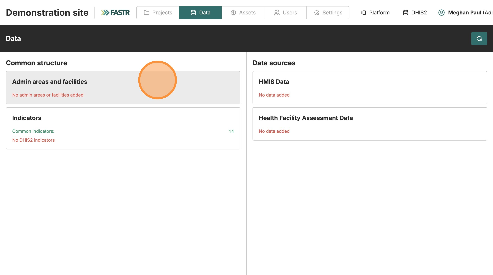
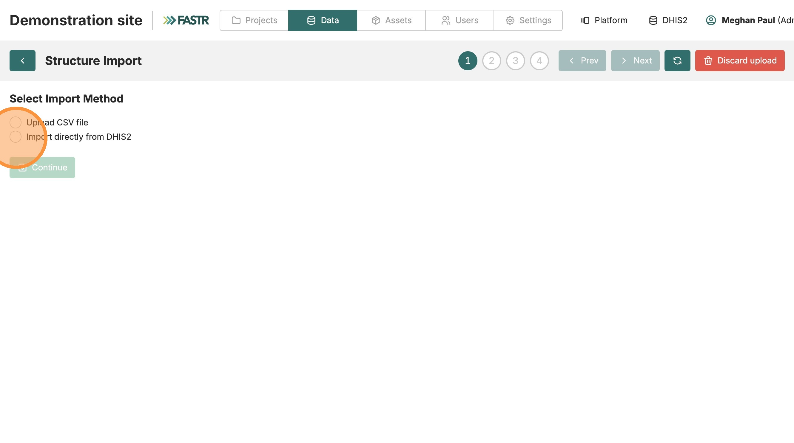
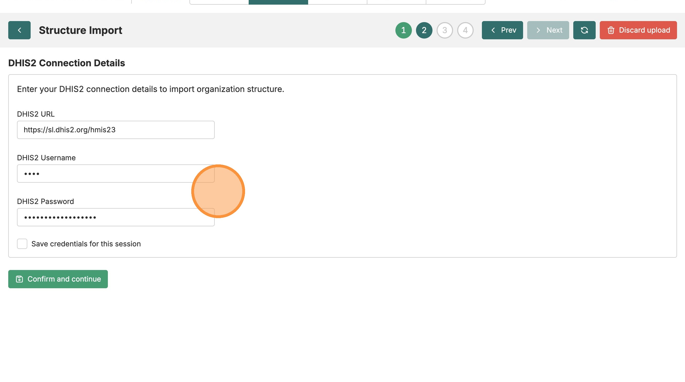
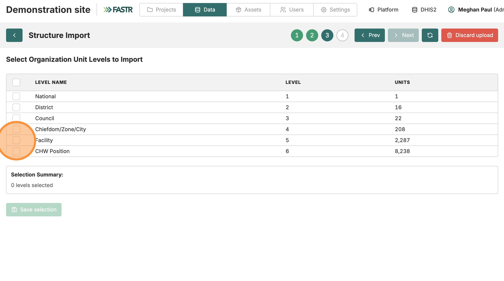
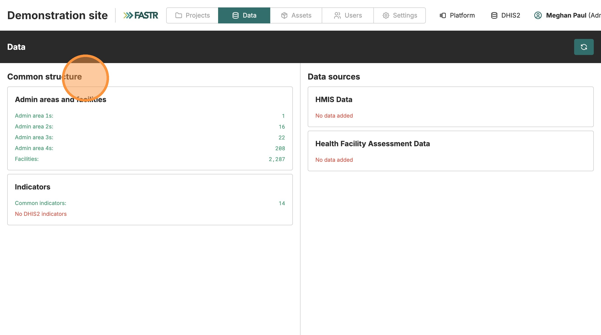

Facility structure → Indicators → Data → Verify

# Import facility structure

<strong>Instance Setup</strong> · <strong>~20 min</strong>

## Before you start

- ☐ You've read **Before you begin** (you know your DHIS2 URL + credentials)
- ☐ You know which level in your DHIS2 hierarchy corresponds to *facility* (often level 4 or 5)

## What you'll do

Pull your country's full administrative hierarchy (regions → districts → facilities) directly from DHIS2 into FASTR. After this, every analysis can disaggregate results by region, district, or facility.

## Phases

### Phase 1 — Open the import flow

1. Click the **Data** tab in the top navigation.
2. Go to **Structure & maps**.
3. Click **Admin areas and facilities**.
4. Click **Add admin areas and facilities**.

### Phase 2 — Choose "Import from DHIS2"

You'll see two options. Pick the **second one — Import directly from DHIS2**. (The first is for manual uploads from a spreadsheet — slower and more error-prone.)

Click **Continue**.

---

### Phase 3 — Connect to DHIS2 (first time only)

The platform now shows a small DHIS2 connection form. Fill three fields:

- **DHIS2 URL** — your DHIS2 instance address (include `https://`)
- **DHIS2 Username**
- **DHIS2 Password**

Tick **Save credentials for this session** — you won't be prompted again during the next imports.

Click **Confirm and continue**.

> If you've already saved credentials in this session (e.g., from a previous import), this step is skipped automatically.

### Phase 4 — Select the facility level

Select **Facility**. FASTR's analysis modules require facility-level data — they aggregate up from facilities to districts and regions internally, not the other way around. Selecting *Facility* brings all the levels above it (district, region, …) along automatically.

Click **Save**, then **Start import**.

---

### Phase 5 — Confirm and integrate

- Select **Add new facilities and update existing ones if needed**.
- Click **Finalize and integrate**.

Wait for the import to complete — a progress bar shows; usually 30 sec to a few minutes depending on country size.

## Checkpoint

After integration:

- The Admin areas and facilities page lists your country's hierarchy.
- Back on the **Data** page, Structure & maps appears as **green**.

## What could go wrong

- **Empty facility list** — your DHIS2 user may not have read access to org units. Check with the DHIS2 admin.
- **Hierarchy looks wrong** — you picked the wrong level. Re-import; the *update existing* option keeps modifications non-destructive.
- **Authentication fails** — usually the wrong URL (missing `https://` or trailing slash) or a typo in the password. Re-open the import flow to get the connect form back.
- **Import hangs** — large countries (1000+ facilities) take longer. Wait at least 5 min before retrying.

> 🔎 **Verify in your current UI**: panel locations and button labels may differ from the screenshots; the flow is the same.

## What's next

Move on to **Import and map indicators**.
