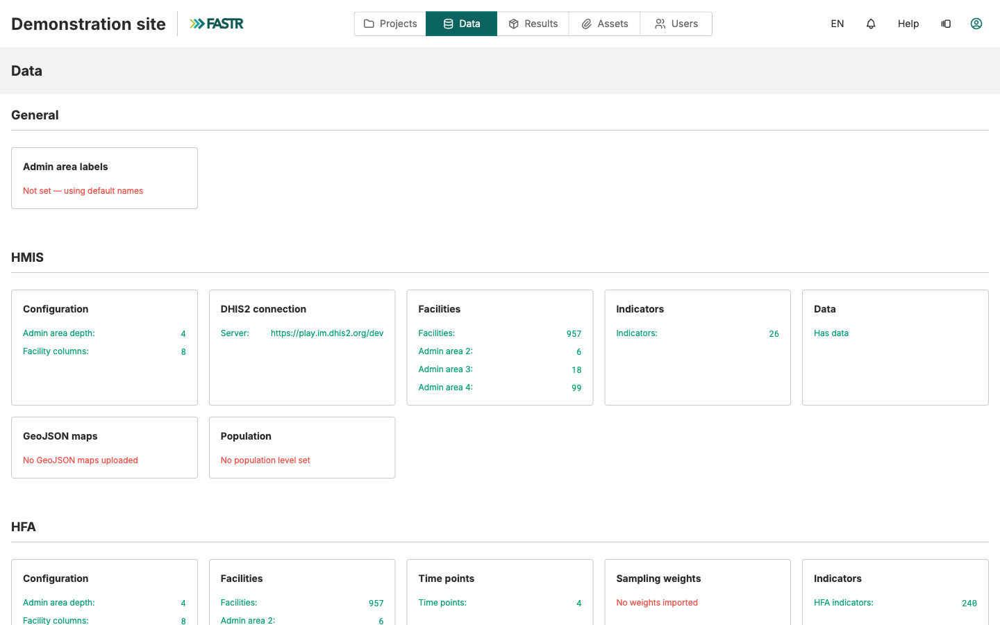
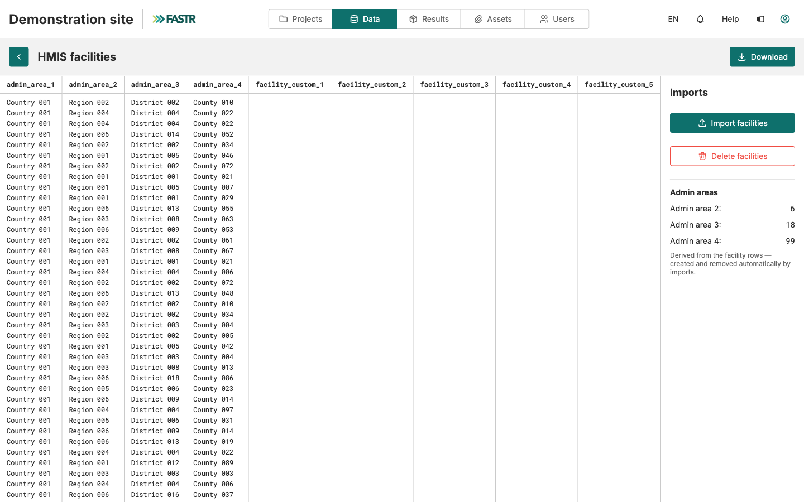

Facility structure → Indicators → Data → Verify

# Import facility structure

<strong>Instance Setup</strong> · <strong>~20 min</strong>

<aside class="p1-sidebar">

Before you start

- ☐ You've read **Before you begin** (you know your DHIS2 URL + credentials)
- ☐ You know which level in your DHIS2 hierarchy corresponds to *facility* (often level 4 or 5)

</aside>

## What you'll do

Pull your country's facility registry — every facility with its region and district — directly from DHIS2 into FASTR. The administrative areas are **derived automatically from the facility rows**: you never manage admin areas separately. After this, every analysis can disaggregate results by region, district, or facility.

<h2 class="step-h">1Open the Facilities registry</h2>

1. Click **Data** in the top navigation. The page is organized into **General**, **HMIS**, **HFA**, and **ICEH** sections.
2. In the **HMIS** section, click the **Facilities** card.

---

<h2 class="step-h">2Import from DHIS2</h2>

Start a DHIS2 import from the Facilities page. The **stored DHIS2 connection** appears — the one set up once for the whole instance via **Manage connection**. Confirm it.

> No stored connection yet? An administrator sets it up once — URL (with `https://`), username, password — and it is saved encrypted for the whole instance. Nobody re-types credentials after that.

<h2 class="step-h">3Select the facility level</h2>

Select **Facility**. FASTR's analysis modules require facility-level data — they aggregate up from facilities to districts and regions internally, not the other way around. Selecting *Facility* brings all the levels above it (district, region, …) along automatically.

Launch the import and wait for it to complete — usually 30 seconds to a few minutes depending on country size.

---

## Checkpoint

- The **Facilities** page lists your country's facilities with their admin areas.
- Back on the **Data** page, the Facilities card shows the counts — facilities, and admin areas at each level. Check they are plausible for your country.

## What could go wrong

- **Empty facility list** — the DHIS2 user behind the stored connection may not have read access to org units. Check with the DHIS2 admin.
- **Hierarchy looks wrong** — the wrong level was picked. Re-import with the right level; existing facilities are updated, not duplicated.
- **Authentication fails** — usually a malformed URL (missing `https://` or a trailing slash) rather than a wrong password. Fix it via **Manage connection** on the Imports page.
- **Import hangs** — large countries (1000+ facilities) take longer. Wait at least 5 minutes before retrying.

## What's next

Move on to **Import and map indicators**.
