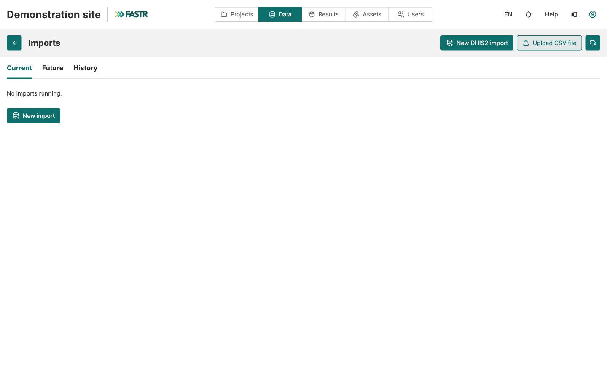
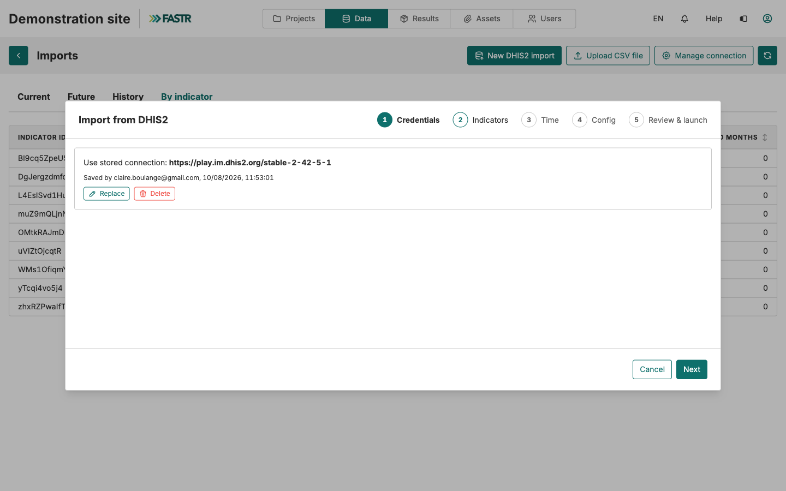
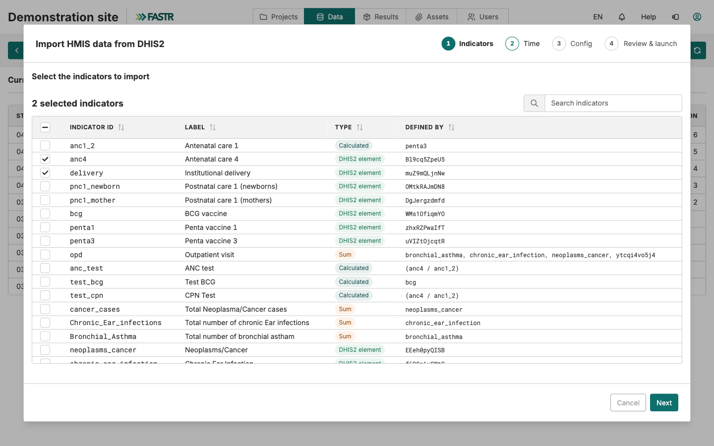
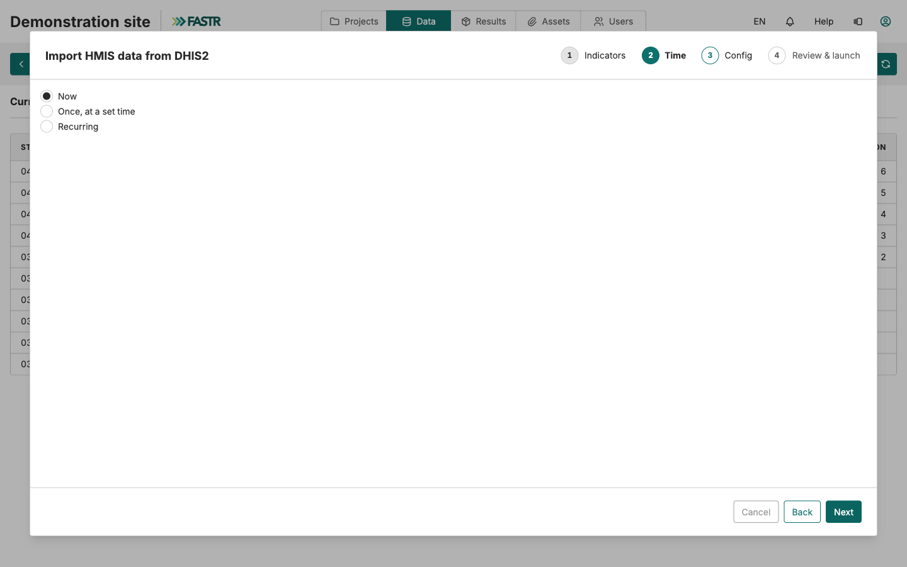
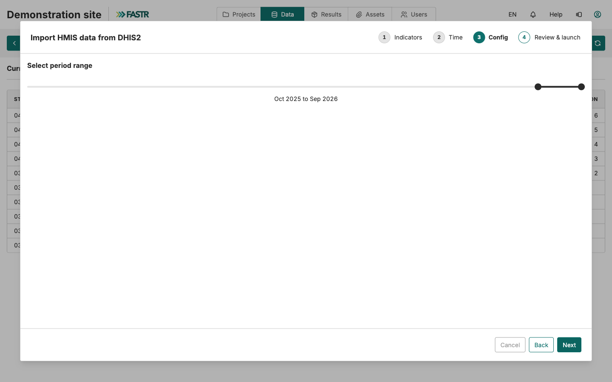
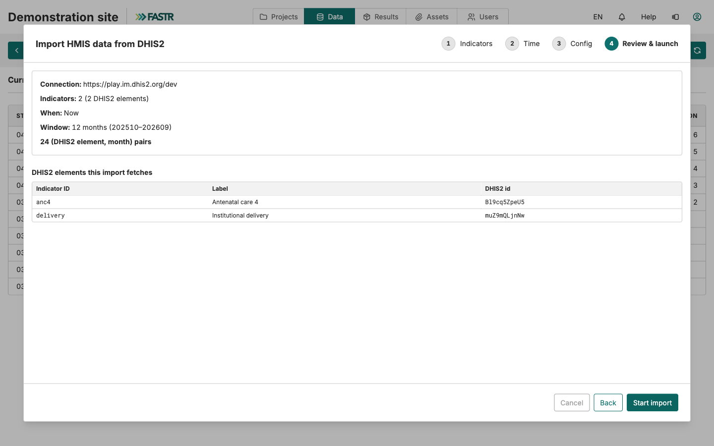
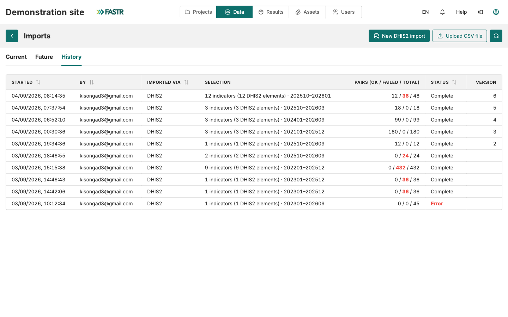
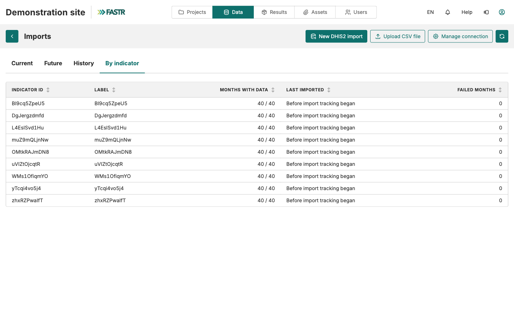

Facility structure → Indicators → Data → Verify

# Import HMIS data

<strong>Instance Setup</strong> · <strong>~15 min + server time</strong>

<aside class="p1-sidebar">

Before you start

- ☐ Facilities imported (the Facilities card shows your counts)
- ☐ Indicators imported and mapped (every DHIS2 indicator has a common-indicator link)
- ☐ You've decided which **time period** to pull (e.g., last 36 months — discuss with your team)

</aside>

## What you'll do

Pull the actual data values from DHIS2 for your chosen indicators and time period. This is the largest data operation in the setup — depending on country size, it can take 5–30 minutes to run. The import runs **on the server**, so once it's launched you can close the tab and come back.

<h2 class="step-h">1Open the Imports page</h2>

Click **Data** in the top bar, then the **Data** card in the **HMIS** section. Click **Imports**.

The page has four tabs — **Current**, **Future**, **History**, **By indicator** — plus the buttons **New DHIS2 import**, **Upload CSV file**, and **Manage connection**.

---

<h2 class="step-h">2Start the wizard — Credentials</h2>

Click **New DHIS2 import**. The wizard has five steps: **Credentials**, **Indicators**, **Time**, **Config**, **Review & launch**.

On **Credentials**, the stored DHIS2 connection appears. Click **Next**.

> No stored connection yet? Set one up once with **Manage connection** on the Imports page — it is saved for the whole instance, encrypted, so nobody re-types credentials for every import.

<h2 class="step-h">3Indicators</h2>

Tick every indicator you want data for — the top checkbox selects all. Click **Next**.

---

<h2 class="step-h">4Time</h2>

Choose **Now**, then **Next**.

> **Worth knowing for later:** **Recurring** schedules this import to repeat by itself — for example every month. Once your setup is stable, that's one routine task gone.

<h2 class="step-h">5Config — the period range</h2>

Set the **period range** with the two sliders. Be deliberate: 3 years of monthly data ≈ 36 periods × N facilities, which scales fast. Click **Next**.

---

<h2 class="step-h">6Review & launch</h2>

Check the summary — connection, indicator count, window, and the number of (indicator, month) pairs to fetch. Click **Start import**.

<h2 class="step-h">7Let the server work</h2>

The import runs on the server. The **Current** tab shows progress; you can close the tab, work elsewhere, or log off — the import keeps running. The **History** tab tells you when it is done.

## Checkpoint

The HMIS Data page now shows your indicators as a chart, with values flowing through time. The **By indicator** tab lists every indicator with its months of data and when it was last imported.

---

## What could go wrong

- **Some (indicator, month) pairs failed** — the import keeps everything that succeeded; nothing is rolled back. Open the **By indicator** tab to see failed months per indicator and retry just those pairs. A few failures usually mean no data exists in DHIS2 for that combination; many failures point to the indicator mapping (see *Import indicators*).

- **Network drops mid-import** — nothing to protect on your side: the fetch runs on the server, not in your browser. Check the History tab later.
- **The window was too narrow** — re-run the wizard with a wider period range. Re-imported months are simply refreshed with the current DHIS2 values.

## What's next

Final step: **Verify and explore** — confirm everything looks right and learn how to navigate your data. Then an administrator **generates a results package** so projects can use the new data.
