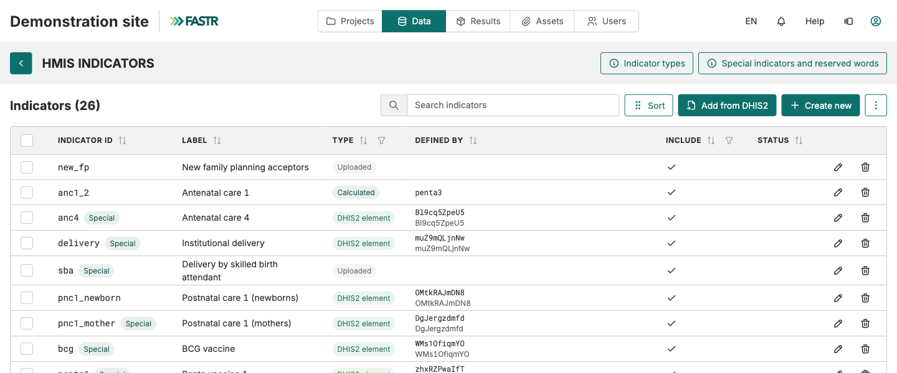
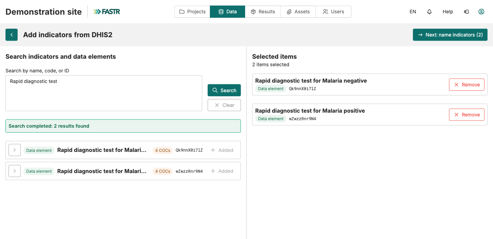
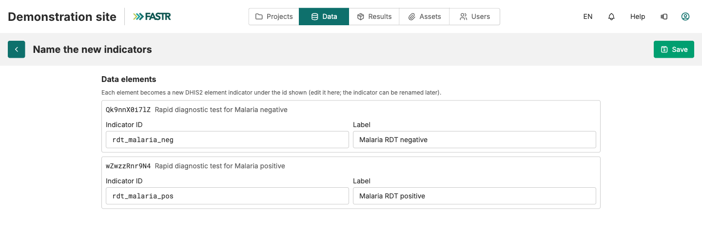
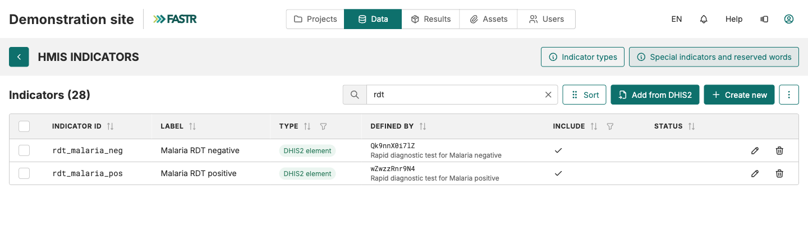

Facility structure → Indicators → Data → Verify

# Add indicators

<strong>Instance Setup</strong> · <strong>~30 min</strong>

<aside class="p1-sidebar">

Before you start

- ☐ You've completed **Connect to the platform** and **Import facility structure**
- ☐ Your **FASTR Data Prep Checklist** is open at the *Indicator mapping template* sheet — you'll use column **C — INDICATOR OF INTEREST** (e.g., ANC1, ANC4) and column **G — OFFICIAL INDICATOR NAME IN DHIS2**

Why it matters

Without indicators, FASTR doesn't know what to download from DHIS2 or what to call it in the analysis.

</aside>

## What you'll do

For each indicator on your list, three moves on one screen:

1. **Find it** in DHIS2, from inside FASTR
2. **Name it** — a short ID (e.g., `anc1`) and a readable label (e.g., "ANC 1st visit")
3. **Save**

All indicators live in **one table**. Each row has a type: **DHIS2 element** (fetched from DHIS2), **Uploaded** (CSV file), **Sum**, or **Calculated** (a formula). Here you create DHIS2 elements.

---

<h2 class="step-h">1Open the indicator list</h2>

1. Click **Data** in the top bar, then, in the **HMIS** section, the **Indicators** card.
2. Look at the **default list**. Each row shows the **Indicator ID**, its **label**, its **type**, and the **Defined by** column (the DHIS2 code and its original name). If an indicator on your list is already there, skip it.

> **Rows marked "Special"** are read by ID by the analysis modules (`anc1`, `delivery`, `bcg`…). Keep those IDs as they are: fill them with the right DHIS2 code rather than creating new ones.

---

<h2 class="step-h">2Search DHIS2</h2>

1. Click **Add from DHIS2**, top right of the list. FASTR uses the instance's **stored DHIS2 connection** (the **DHIS2 connection** card on the Data page, the same one as the previous step).
2. In the search field, type a term from column **G — OFFICIAL INDICATOR NAME IN DHIS2** (e.g., `antenatal`) or paste the DHIS2 ID. Click **Search**.
3. In the results, click **Add** next to each element you want. It moves to the **Selected items** column.

4. Search another term if needed; the selection is kept. Then click **Next: name indicators (N)**.

> **Tip:** a broad word (`vaccine`, `delivery`) brings the whole family at once. Greyed rows saying "Cannot be added" are not monthly counts. **Subgroup** (an age band, a sex)? Unfold the row's **chevron** and add the **COC** line you want, not the main line.

---

<h2 class="step-h">3Name, then save</h2>

FASTR proposes an **ID** and a **label** for each element, built from the DHIS2 name. Replace them:

- **Indicator ID** — the technical name. **Lowercase letters, digits and underscores only**, no accents, no spaces (e.g., `mam_new`). For an indicator on the FASTR list, use its standard ID (`anc1`, `anc4`, `penta1`…).
- **Label** — the name shown on charts. Accents and spaces are fine; take column **C — INDICATOR OF INTEREST**.

Click **Save**. Repeat steps 2 and 3 until your whole list is covered.

## Checkpoint

Back on the list, each new indicator shows the **DHIS2 element** badge, its DHIS2 code under **Defined by**, and a tick under **Include**. The **Indicators (N)** counter went up by as many.

---

## What could go wrong

- **"… already exists; choose another id"** — the ID is taken. Open the existing indicator with the pencil and change its DHIS2 code, or pick another ID.
- **"Already added as …"** — that DHIS2 code is already in FASTR. Nothing to create.
- **The ID is rejected** — an accent, space, comma, bracket, or a reserved word. Lowercase, digits, underscores.
- **DHIS2 search returns nothing** — try another term, or check that the connection's DHIS2 user can read the metadata.
- **"No DHIS2 connection is saved"** — Data page, **DHIS2 connection** card, enter the URL and credentials.
- **Two DHIS2 codes for one indicator** (two age bands to add up) — add both as elements, then **Create new** → type **Sum**.

## What's next

The indicators are defined but **no numbers have been downloaded yet**. Move on to **Import HMIS data**.
