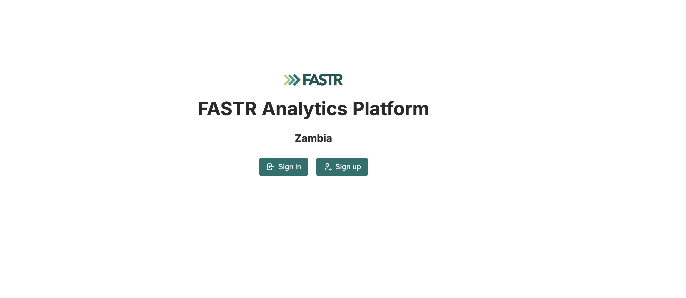
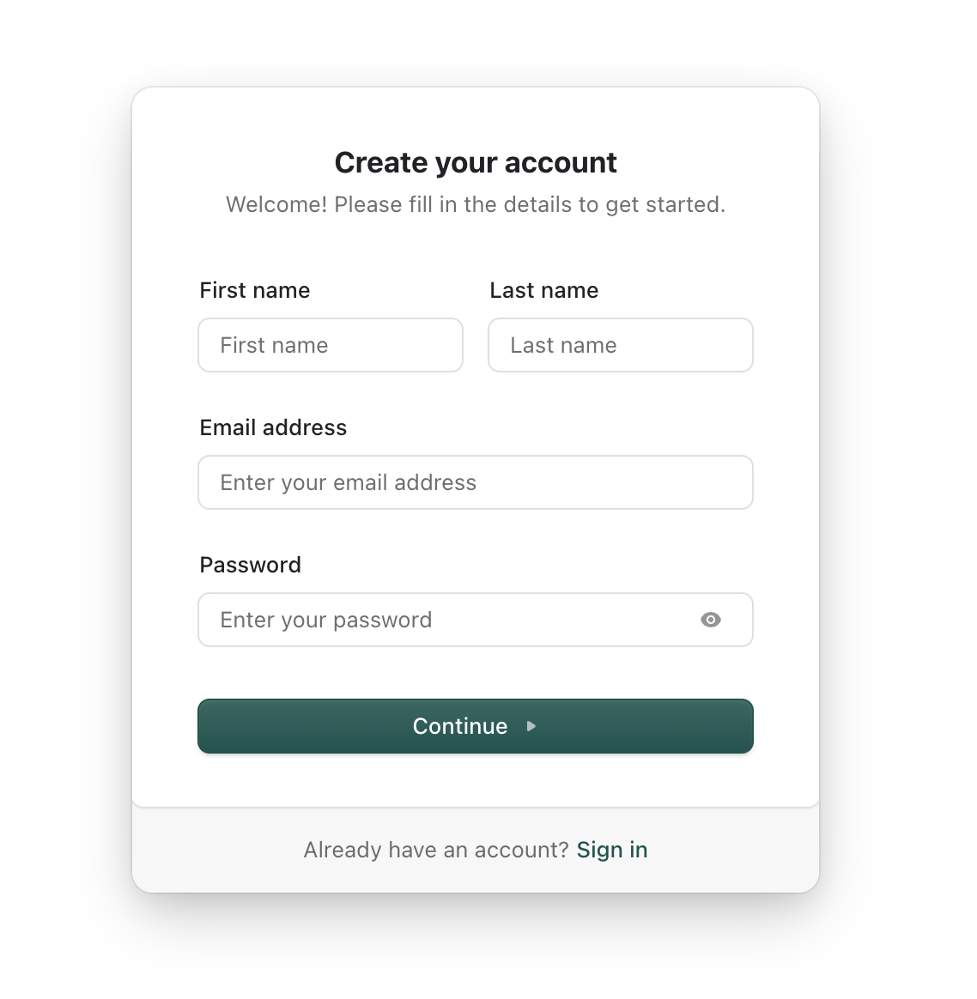
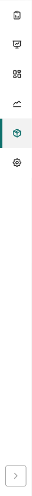

Log in → Your folder

# Log in to the platform

<strong>Activity</strong> · <strong>Getting Started</strong> · <strong>~10 min</strong>

<aside class="p1-sidebar">

Before you start

- ☐ You watched the facilitator's platform demo
- ☐ You have your **country platform URL** (your facilitator will share it)
- ☐ You have a working email address you can check during the activity (you'll need to verify it)

</aside>

## What you'll do

Create a FASTR account if you're new, sign in, and confirm you're in your country's project. This is your first time touching the platform — no data work yet.

<h2 class="step-h">1Open the platform URL</h2>

Go to your country's platform URL in a browser (your facilitator will share it; the format is usually `https://<country>.fastr-analytics.org`).

You should land on a login screen.

---

<h2 class="step-h">2Sign up or sign in</h2>

- If this is your **first time**: click **Sign up**, enter your email + a password, and create the account.
- If you already have an account: click **Sign in** and enter your credentials.

<h2 class="step-h">3Verify your email</h2>

Check your inbox for a verification email from FASTR. Click the link in it to confirm your account.

> If you don't see it within 2 minutes, check your spam folder.

<h2 class="step-h">4Sign in</h2>

Go back to the platform and sign in with your verified email + password.

---

<h2 class="step-h">5Find your project</h2>

After login, you land on the **Projects** tab. You'll see the projects you have access to:

- **If you're an instance admin**, every project on the instance is listed.
- **Otherwise**, you only see projects an admin has granted you access to. If your country's project is missing, ask your facilitator (or instance admin) to grant access.

Click your country's project to enter it. The project opens with a **left sidebar of icons** — **Reports**, **Decks**, **Dashboards**, **Visualizations**, **Metrics**, and **Results package**. Hover an icon to see its label; the **AI** button sits at the top right.

> Note: the **top navigation** (Projects · Data · Results · Assets · Users) is for **instance admins** managing the whole site. Inside a project the left-sidebar icons are what you'll use day to day.

## Checkpoint

After clicking into your project, you should see:

- The left sidebar of project icons (Reports, Decks, Dashboards, Visualizations, Metrics, Results package)
- The project name in the header (e.g., "Country X — Workshop project")

If yes, you're in. Move to the next activity.

---

## What could go wrong

- **"Account not approved"** — your account needs to be added to the country project by an administrator. Ask your facilitator to add you.
- **Verification email never arrives** — check spam. If still nothing after 5 min, ask your facilitator to re-trigger it.
- **"Invalid email or password"** after sign-up — double-check the email you entered. Typos are common. You can usually request a password reset.
- **No projects visible on the Projects tab (or your country's project is missing)** — you're not an instance admin and haven't been granted project access yet. Ask your facilitator or instance admin to grant you access to your country's project.

## What's next

Move on to **Create your user folder** — set up personal folders in the Slide Decks and Visualizations tabs so your work stays organized.
