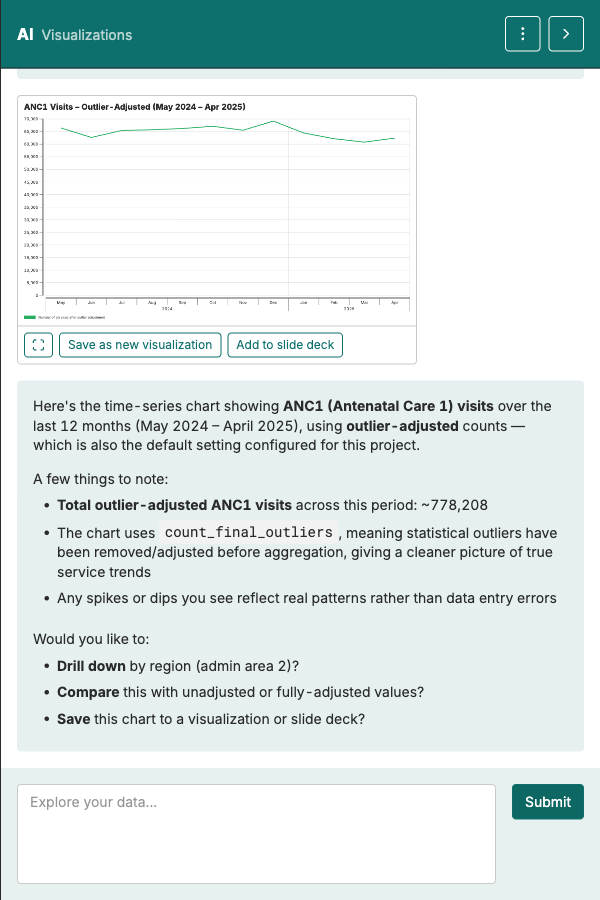

Reading a viz → Build manually → Build with AI → Write interpretation → AI interpretation → Spot disruption

# Build a visualization with the AI Assistant

<strong>Activity</strong> · <strong>Visualizations & Interpretation</strong> · <strong>~15 min</strong>

<aside class="p1-sidebar">

Before you start

- ☐ You've built at least one chart manually (previous handout)
- ☐ You're signed in and your folder is open
- ☐ You know which indicator you want to chart (ANC1, Penta3, …)

</aside>

## What you'll do

Get the AI Assistant to create the same kind of chart you just built manually — but by typing a request in plain language. Same end result, different path.

<h2 class="step-h">1Open the AI Assistant</h2>

The AI chat panel sits on the right side of the **Visualizations** tab. Type a short request like:

> *"Show me a time-series chart of ANC1 visits over the last 12 months, using outlier-adjusted data."*

The AI returns a chart in the panel with three buttons under it — **fullscreen**, **Save as new visualization**, **Add to slide deck** — and a short narrative explaining what it built and what it could change next.

> **Be specific about the adjustment.** *"Adjusted data"* on its own is ambiguous — the metric exposes four versions: no adjustment, outliers only, completeness only, or both. Say which one in the prompt, or the AI will pick one for you (usually outliers only).

---

<h2 class="step-h">2Review what the AI returns</h2>

The chart sits at the top of the panel; the narrative below it spells out the indicator, the period, and which adjustment the AI used. **Check it against what you asked for:**

- Right indicator? Right period?
- Line chart for a trend, or something else? Does it suit the question?
- Which adjustment did it use? The narrative names it explicitly (e.g. *outlier-adjusted*).

If anything is off, say so in plain language in the same chat — *"Use raw data instead"*, *"Switch to a bar chart"*, *"Cover the last 6 months only"*.

<h2 class="step-h">3Iterate</h2>

The first answer rarely lands the chart you want. Refine in short turns:

- *"Break it down by region."*
- *"Add Penta3 on the same axis."*
- *"Show only the last 6 months."*

Each instruction is a small step. The AI also volunteers next-action suggestions at the end of each reply — feel free to use them or ignore them.

<h2 class="step-h">4Save it</h2>

When you like what you see, click **Save as new visualization** under the chart and put it in your folder. The neighbouring **Add to slide deck** button does both in one move if you already have a deck open.

---

## Try it with three indicators

Run the same flow with three different indicators — pick from different programmes (ANC, immunisation, delivery). You'll get a feel for how the AI interprets short requests.

## Manual vs AI — when to use which

- **Manual** when you know exactly what you want and clicking is faster than typing.
- **AI** when you want to explore — *"show me something useful about X"* — or when you don't remember the exact filter names.

> The AI is an accelerator, not a replacement. You're still the one who decides whether the chart answers your question.

## What's next

The next handout is about **writing the interpretation** — the text that goes next to your chart on a slide. Use the six-step framework from the *Reading a viz* reference.

