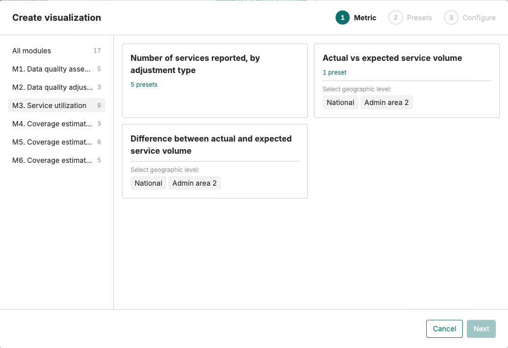
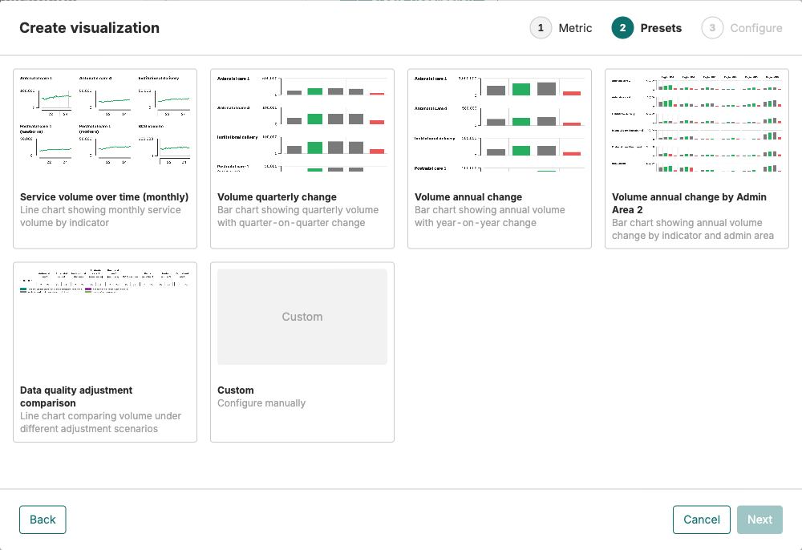
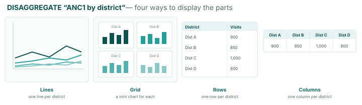
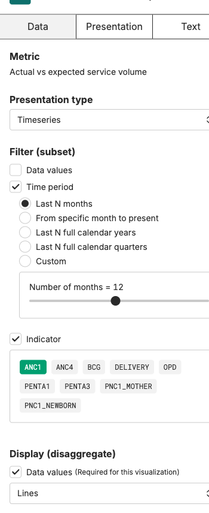

Reading a viz → Build manually → Build with AI → Write interpretation → AI interpretation → Spot disruption

# Create your first visualization

<strong>Activity</strong> · <strong>Visualizations & Interpretation</strong> · <strong>~15 min</strong>

<aside class="p1-sidebar">

Before you start

- ☐ You're signed in and looking at your country's project
- ☐ You're in the **Visualizations** tab
- ☐ You have a folder of your own (or you can use the shared one)

</aside>

## What you'll do

Build three time-series charts: first **ANC1**, then **BCG**, then **one indicator of your choice**. Each chart is saved into your folder in the project's Visualizations list. The next activity does the same task with the AI Assistant.

<h2 class="step-h">1Open the Create visualization dialog</h2>

In the **Visualizations** tab, click the **+ Create visualization** button in the top right.

A dialog opens that walks you through two steps — **Metric** then **Presets**. Picking a named preset opens the chart in the editor; picking **Custom** adds a third **Configure** step instead.

---

<h2 class="step-h">2Pick a metric</h2>

In the left panel of the dialog, click **M3. Service utilization**. The grid on the right now lists only M3 metrics.

Click the tile **Number of services reported, by adjustment type**, then **Next** at the bottom right.

> A metric is *what is measured*. A preset is *one ready-made way to draw it*. Each module groups the metrics it produces.

<h2 class="step-h">3Pick a preset</h2>

On the **Presets** step, click **Service volume over time (monthly)** — a line chart of monthly volume — then **Create**.

The chart opens in the editor.

---

<h2 class="step-h">4Filter to ANC1, last 12 months</h2>

The chart opens with every indicator drawn across the full date range. You'll narrow it to **ANC1, last 12 months**.

In the chart editor's **left panel**, scroll down to **Filter (subset)** and do two things:

- Tick **Indicator** — a row of chips appears (ANC1, ANC4, BCG, …). The chips start unselected; click **ANC1** to add it. Only the chips you add show in the chart.
- Tick **Time period** — the default is *Last N months* with N = 12, so the window is already correct. Use the slider if you want a different length.

The chart updates each time you tick.

> The metric also exposes four **Data values** chips (`count_final_none`, `_outliers`, `_completeness`, `_both`). The default `count_final_both` means *adjusted for both outliers and completeness* — the cleaner version of your country's data. Leave it as is unless you specifically want a different adjustment.

<h2 class="step-h">5Save it to your folder</h2>

Click **Save as new visualization** at the top of the editor. Give it a clear name (e.g. *ANC1 — monthly, last 12 months*) and save it into **your folder**.

It now appears in the Visualizations list under your folder.

## Now do it twice more

Repeat the same five steps for:

1. **BCG** — same path, but tick **BCG** at Step 4 instead of ANC1.
2. **An indicator of your choice** — anything that interests you (Penta1, ANC4, IPD admissions…).

You should end up with **three saved charts in your folder**.

---

## Filter vs disaggregate — what's the difference?

These two words come up a lot. They are not the same:

- **Filter = pick what to show.** Choose the indicators, places, or months you want — only those appear. e.g. *show ANC1 only*, or *Northern region only*. Like a spotlight: you point it at what you want to see.
- **Disaggregate = break it down.** Split one total into its parts so you can compare them — e.g. *one line per indicator*, or *one bar per district*. Nothing is hidden; the total is shown as its pieces.

> **Example.** Start with *total ANC1 visits, nationally*. **Filter** to "Northern region" → now you see only Northern's ANC1. **Disaggregate** "by district" → the same total split into one bar (or line) per district.

---

## Where you do this when you edit a viz

Open a saved visualization — the controls live in the **left panel**, and you'll often need to **scroll down** to find them (this is where people get lost). Two sections do the work:

- **Filter (subset)** — **pick what you want to see**: tick **Time period**, **Indicator**, and any admin level. Only the items you select appear.
- **Display (disaggregate)** — choose **how the parts are shown**. The dropdown gives five options:
  - **Lines** — one line per part, all on the same chart
  - **Grid** — a separate little chart for each part, side by side
  - **Rows** — one table row per part
  - **Columns** — one table column per part
  - **Multi-chart (replicants)** — one full-size chart per part, stacked

> **Watch out when you use both together.** Here's the trap, with an example. You split a chart **by district** because you want to compare the districts. Then you **filter** it down to just one district — so the others disappear. Now you're looking at a single district on its own, and there's nothing left to compare.
>
> **The simple rule:** use **filter** to pick the data you want to look at, and use **disaggregate** to split it into the parts you want to compare. Just don't filter down to only one of the things you wanted to compare.

---

## Exercise: split your ANC1 chart by admin level

Right now your ANC1 chart shows one line: the national total over the last 12 months. You'll turn it into one line per **admin area** so you can compare them side by side.

<h2 class="step-h">1Open the chart</h2>

In the **Visualizations** list, open your saved ANC1 chart (the one you named *ANC1 — monthly, last 12 months*).

<h2 class="step-h">2Disaggregate by admin level</h2>

In the chart editor's **left panel**, scroll down to **Display (disaggregate)**.

- Tick the admin level you want to compare. In FASTR the levels are labelled generically — **Admin area 2** is typically *Region*, **Admin area 3** is *District*. Pick *Admin area 2* to see one line per region.
- Leave the display style on **Lines** for now — one line per region, all on the same chart.

The chart redraws. Instead of one national line, you should now see **one line per region**.

<h2 class="step-h">3Try the other Display styles</h2>

Same data, different shape:

- **Grid** — a separate little chart per region, side by side. Useful when there are many regions and the lines overlap.
- **Rows** — a table with one row per region. Useful when you want the exact values rather than the shape.
- **Columns** — a table with one column per region.
- **Multi-chart (replicants)** — one full-size chart per region, stacked. Useful when each region deserves a full read.

Pick whichever reads best for your data.

<h2 class="step-h">4Save it as a new chart</h2>

Click **Save as new visualization** — name it e.g. *ANC1 — monthly, by region* and save it into **your folder**.

> **Don't overwrite the national chart.** Save *as new visualization*, not just *save*, so you keep both: the national trend and the regional split.

---

### Watch out

You set both Filter and Display in step 2 of the original walkthrough (filter to ANC1, last 12 months) and step 2 of this exercise (disaggregate by region). That's fine. The trap is **filtering down to one of the things you said you wanted to compare** — e.g. disaggregate by region *and then* filter to a single region. You'd be left with one line, nothing to compare.

### Now do it for BCG

Repeat the same three steps on your saved BCG chart. You should end up with **two regional charts** in your folder: one for ANC1, one for BCG.

---

## Try a few more options

Once your three charts are saved, try a different metric or preset:

- A coverage metric under **M6** (a coverage curve, not a volume trend).
- The quarterly-change bar chart preset (compares periods instead of plotting a continuous trend).

> **Tip:** Line charts (*Service volume over time*) are best for trends over time. Bar charts (*quarterly / annual change*) are better for comparing periods or places. The reference handout *How to read a FASTR visualization* goes deeper.

## Check yourself

You should now have:

- **Three saved charts** in your folder: ANC1, BCG, and one of your choice.
- The path memorised: **+ Create visualization → M3 → metric → preset → filter → Save as new visualization**.
- A sense of which presets suit trends vs comparisons.

## What's next

The next activity does the same thing using the AI Assistant — typing the request in plain language instead of clicking through the dialog. Same end result, different path.

