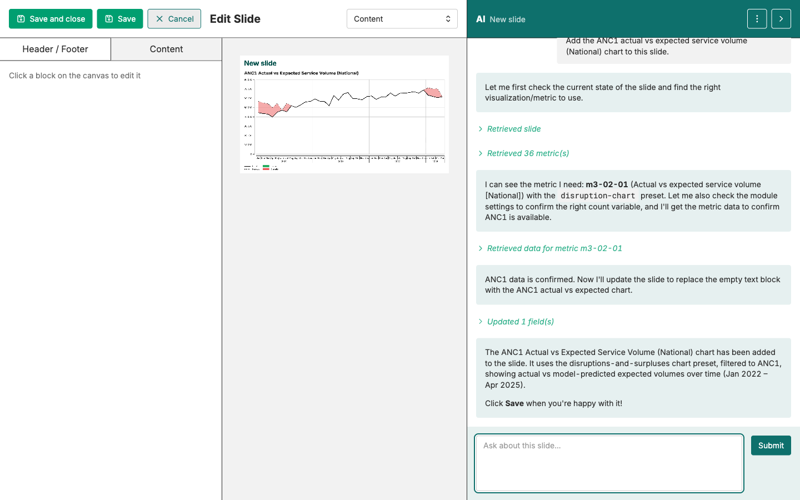

Create deck → Add manually → Add with AI → Edit & finalise

# Add a visualisation (with the AI Assistant)

<strong>Activity</strong> · <strong>Slide Decks</strong> · <strong>~15 min</strong>

<aside class="p1-sidebar">

Before you start

- ☐ You've created your slide deck and added a visualisation manually (see prior activities)
- ☐ You have at least one saved visualisation in the **Visualisations** tab
- ☐ The AI Assistant panel is open

</aside>

## What you'll do

Use the AI Assistant to surface a saved visualisation and add it directly to your slide deck — no menu navigation needed. Your facilitator has just demonstrated this; now do it yourself.

## Steps

1. In the AI Assistant, type a prompt naming one of **your** saved visualisations: *Display [your visualisation name].*
2. The AI finds the chart and shows a preview in the chat.
3. Below the preview, look for the button to **add the chart to a slide deck** — pick the deck you created.
4. Save.

> **No saved chart of your own yet?** Use this shared example prompt instead: *Display the quarterly change in service volume visualisation.*

---

## Checkpoint

Your deck should now have **two slides**: one chart added manually (previous activity), one added via the AI Assistant. They can be the same chart or different — the point is you've used both paths.

## Comparing the two paths

| Manual path | AI Assistant path |
|-------------|-------------------|
| Browse → Select → Insert | Prompt → Click "Add to deck" |
| Useful when you know exactly which chart you want | Useful when you don't remember the name or want the AI to surface candidates |
| One chart at a time | Can ask for multiple charts in one prompt |

Neither is "better." Pick whichever feels faster for the task.

## Tips

> **The AI sees what you've saved.** If a chart isn't in your saved Visualisations, the AI won't find it. Save first, then prompt.

- If the AI returns the wrong chart: name the chart more specifically in your prompt, or include the indicator + region in the request.
- If the **Add to deck** button doesn't appear: the AI didn't recognise the response as a chart-add request. Try rephrasing (*"Add the ANC1 chart to my deck"*).

## What's next

Move on to **Edit and finalise your slides** — review and polish what you've built.

> 🔎 **Verify in your current UI**: the AI chat preview controls may differ. The action (prompt → preview → add to deck) is the same.
