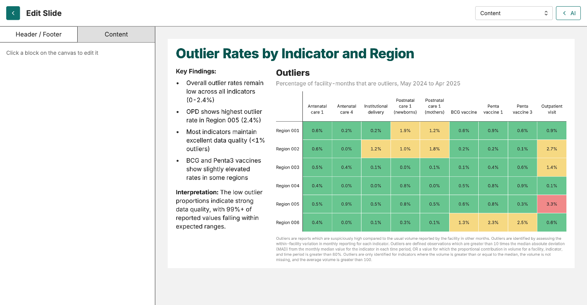
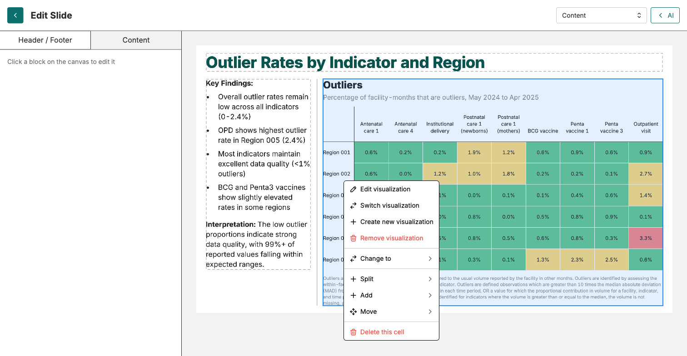
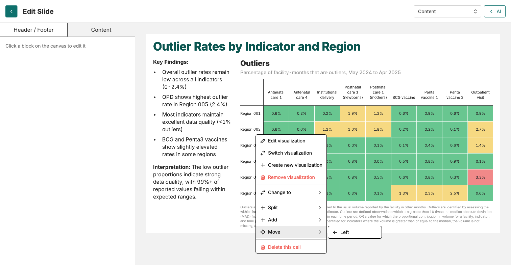

Create deck → Add manually → Add with AI → Edit & finalise

# Edit and finalise your slides

<strong>Activity</strong> · <strong>Slide Decks</strong> · <strong>~20 min</strong>

<aside class="p1-sidebar">

Before you start

- ☐ Your deck has at least one content slide with a visualisation and some text
- ☐ The deck is saved
- ☐ Your facilitator has shown the editor demo on screen

Why it matters

The AI generates the content. The layout almost always needs adjusting — text squeezed, a chart needing more room, a slide cluttered with too many cells. The slide editor is where you do that, one slide at a time.

</aside>

## Open the slide editor

In the deck overview, click into any slide thumbnail. The slide editor opens with the **slide preview** filling most of the page and an **edit panel** on the left.

The left panel has two tabs:

- **Header / Footer** — the slide title, sub-header, date, and which logos / footer text show on this slide.
- **Content** — the editing controls for the cells in the slide body. Reads "Click a block on the canvas to edit it" until you select one.

The top-right dropdown switches the slide TYPE between **Cover**, **Section**, and **Content**.

---

## Right-click is your friend

The slide canvas is built from cells. Each cell can hold a visualisation or text. To change a cell — its content, its layout, or its place — **right-click on it**. A context menu opens.

The menu has nine items, grouped:

| Action | What it does |
|--------|-------------|
| **Edit visualization** | Open the chart in the viz editor (same as Visualisations tab). |
| **Switch visualization** | Replace this chart with a different saved viz. |
| **Create new visualization** | Build a new chart and drop it in here. |
| **Remove visualization** | Empty the cell, keep the cell. |
| **Change to** | Convert the cell type (text ↔ visualisation, etc.). |
| **Split ▸** | Split THIS cell into sub-cells (e.g. Into columns). |
| **Add ▸** | Add a new neighbouring cell: **Col to left**, **Col to right**, **Row above**, **Row below**. |
| **Move ▸** | Move this cell around: **Left**, **Right**, **Up**, **Down** (only the directions that make sense). |
| **Delete this cell** | Remove the cell entirely. |

---

## The two most useful submenus

<h2 class="step-h">1Add ▸ — divide the slide into columns or rows</h2>

Use **Add** when you want a NEW cell next to an existing one. Right-click → **Add** → choose one of:

- **+ Col to left** — new column on the left of this cell
- **+ Col to right** — new column on the right
- **+ Row above** — new row above
- **+ Row below** — new row below

This is how you turn a single-column slide into a 2-column or chart+text layout.

---

<h2 class="step-h">2Move ▸ — reposition a cell without dragging</h2>

Right-click → **Move** → choose **Left**, **Right**, **Up**, or **Down**. Only directions that make sense for the current layout are shown.

For a chart that lives in the wrong column, this is faster than dragging.

---

## The four passes per slide

Work through each slide in your deck and do these four passes before moving on.

<h2 class="step-h">1Check accuracy</h2>

Read the slide as if you had not seen it before. Does the headline match what the chart shows? Is the interpretation text correct? Mark anything that needs an AI rewrite.

<h2 class="step-h">2Resize and reflow</h2>

When you click into a cell, a vertical divider appears between cells in the same row (and a horizontal divider between cells in a column). Drag the divider to give the chart more room or the text more room. The other cell resizes automatically.

<h2 class="step-h">3Restructure if needed</h2>

If the slide is too cramped, right-click and use **Add** to introduce a new column or row, or **Move** to push a cell to a different position. Use **Delete this cell** to remove anything that does not earn its place.

<h2 class="step-h">4Finalise header, footer, save</h2>

Switch to the **Header / Footer** tab. Fill in the slide title, sub-header, and date if needed. Save the deck (a small Save button at the deck-toolbar level — autosave catches most edits, but Save is the safety net for big restructures).

---

## Checkpoint

Every slide should:

- Have a clear headline that matches the chart
- Show charts at a readable size, properly aligned
- Have interpretation text that is fully visible and edited
- Have title, sub-header and date filled in

## What could go wrong

- **Right-click menu does not appear** — make sure you clicked into the slide editor first (you should see "Edit Slide" in the top-left).
- **Resize divider not visible** — it only appears once you have clicked on a cell. The cursor changes to a resize handle when you hover the line between two cells.
- **Chart still cramped after resizing** — the chart itself may be too detailed. Open it from **Edit visualization** in the right-click menu (or back in the Visualisations tab), simplify, save, return.
- **Cell stuck in the wrong place** — use **Move ▸ Left / Right / Up / Down** to reposition, or **Delete this cell** and re-add a new one in the right slot.

## What's next

The next handout covers report-wide settings (style, logos, footer, page numbers) before the deck is shared.
