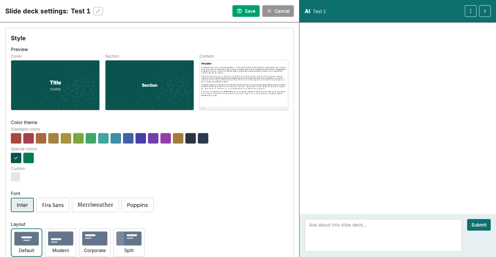

Create deck → Add manually → Add with AI → Edit & finalize → Format text → Deck settings

# Configure your slide deck settings

<strong>Activity</strong> · <strong>Slide Decks</strong> · <strong>~10 min</strong>

<aside class="p1-sidebar">

Before you start

- ☐ Your slide deck has at least one finalized content slide
- ☐ Any custom logos you want to use are already uploaded to **Assets** (see Pre-step below)

Why it matters

Deck Settings turn a working draft into something shareable. A clear name, a consistent style, the right logos in the right slots, and a global footer + page numbers across content slides. This is also where you rename the deck.

</aside>

## Pre-step — Custom logos live in Assets

Custom logos do not live inside a deck. They live in **Assets**, a library at the **instance level** that every project on the instance can use.

> **Uploading to Assets is admin-only.** If you are not an instance administrator, ask your facilitator or admin to upload your logo files (PNG or JPEG) before you open the deck Settings. Once they are in Assets, they show up under **Custom logos** in your deck.

For reference, admins reach Assets from the main landing page (top-left, the FASTR logo or project breadcrumb) → top navigation → **Assets** → **Upload assets**. Assets is also where admins upload other shared files (CSV data, GeoJSON map files).

---

## Open Settings

With your deck open, click the **Settings** button in the deck toolbar (top right). A panel titled **Slide deck settings: <deck name>** opens. Save / Cancel are at the top of the panel.

## What's inside

<h2 class="step-h">1Rename the deck</h2>

A pencil icon next to the deck name at the top of the panel lets you rename. Use the convention your team agreed on (country, period, topic, your name).

<h2 class="step-h">2Style</h2>

Three previews at the top show how the **Cover**, **Section**, and **Content** slides will look. Click any option below to update them live.

---

Sections inside Style:

- **Color theme** — standard palette, FASTR-branded specials, custom picker.
- **Font** — Inter, Fira Sans, Merriweather, Poppins.
- **Layout** — Default, Modern, Corporate, Split.
- **Cover & Section** — six variants (Bold, Muted, Light, Lighter, White, Pure).
- **Content Pages** — ten-plus variants (Default, Bold, Header Only, Classic, Soft, Bordered, Minimal).
- **Background detail** — None or a subtle pattern (Dots, Circles, Lines, Grid, Chevrons, Waves, Noise, Maze, World).

Pick one combination and keep it across the deck.

---

<h2 class="step-h">3Logos</h2>

Three logo slots, each independent:

- **Cover** — logo on the title slide
- **Content header** — logo at the top of each content slide
- **Content footer** — logo at the bottom of each content slide

Each slot has two built-in defaults: **FASTR (colored)** and **FASTR (white)**. Click one to apply.

For custom logos, click **Add** under **Custom logos** and pick from the images you uploaded to Assets (see Pre-step).

<h2 class="step-h">4Footer & page numbers</h2>

Two controls:

- **Set global footer text for all content slides** — type a short line (project name, period, author) that appears on every content slide. Cover and section slides ignore it.
- **Show page numbers (except on cover and section slides)** — toggle on for printed or PDF decks.

<h2 class="step-h">5Save</h2>

Click **Save** at the top right of the panel. Settings do not autosave the way slide content does — closing without Save loses your changes. Click **Cancel** to discard.

---

## Checkpoint

When you close the panel, your deck should:

- Have a clear name your team can find again
- Use one consistent color theme + font + layout across all slides
- Show the logos you intend in each slot
- Carry the global footer and page numbers if you turned them on

## What could go wrong

- **Custom logos slot is empty** — the file is not in Assets yet. Go back to Assets, upload, return.
- **Logo is too big or too small** — open the file in Assets, replace with a properly sized version (logos are scaled to fit the slot, but very large files slow rendering).
- **Footer text appears on the cover** — it shouldn't. If it does, check that you are on the latest platform version.
- **Page numbers missing** — confirm the toggle is on, and that you are looking at a content slide (cover and section slides intentionally hide the page number).

> 🔎 **Verify in your current UI**: the Settings panel layout may differ slightly between platform versions. The five sections above (rename, Style, Logos, Footer & page numbers, Save) apply across recent versions.

## What's next

The deck is now ready to share. The next module covers exporting and disseminating it.
