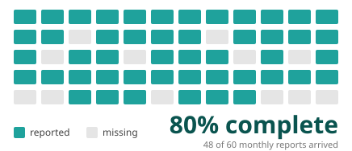
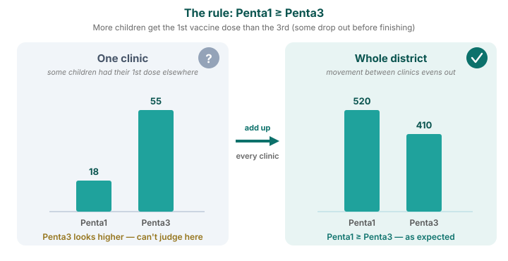

Methodology recap · Module M1

# Data quality assessment

<strong>What the module does</strong> · <strong>How to read its outputs</strong>

<aside class="p1-sidebar">

What it does

Before anyone trusts a number, this module checks the data. It reads every facility's monthly reports and flags where the data looks shaky — so you know how much to rely on each indicator.

What it does not do

It changes nothing. It only **measures** quality and shows you where the problems are. Fixing them is the next module's job.

The three checks

- **Outliers** — values that look too high to be real
- **Completeness** — months where a facility didn't report
- **Consistency** — related numbers that don't line up

</aside>

## How to read the outputs

Every table in this module uses the same **traffic light**:

- **Green** — meets the quality standard
- **Gold** — borderline; check it
- **Red** — falls short; this data needs attention

**What's behind each box.** Every check works the same way underneath. Take one facility, one month, one indicator — that single report either passes the check or it doesn't. That's **one test**. Each coloured box then gathers all those tests for an area and shows the **share that passed** (for outliers, the share that *failed*). So a box really answers: *of all the reports behind it, how many were OK?*

Read each table closely — the colours guide your eye, but the number in every box matters: it tells you **which indicator** and **which area** you can rely on, and where you can't.

Each check looks at the data from a different angle — are the values realistic (outliers), are the reports arriving (completeness), and do related numbers agree (consistency). Together they tell you how far to trust each indicator.

DQA measures quality — it does not change the data. Read it before you trust any trend; the next module repairs the problems it finds.

---

Check 1 of 3 · outliers

## Outliers — "is any month suspiciously high?"

**How we find them.** For each facility, FASTR learns what a normal month looks like for an indicator, then flags months that break the pattern in one of two ways:

- **A value far above normal.** Say a clinic usually reports 40–60 first antenatal visits a month, then one month shows 900. That is more than **10×** the facility's normal month-to-month variation, so it's flagged. (That variation is measured with the *median absolute deviation* — a robust average that one extreme month cannot distort.)
- **A single month dominates the year.** If one month holds more than **80%** of everything a facility reported for an indicator over the past 12 months, it's flagged — the typical sign of a whole year's total recorded in a single month.

Only indicators averaging more than 100 a month are checked, so small clinics aren't flagged for normal ups and downs.

---

Check 1 of 3 · the output

## Outliers — reading the table

- **What each cell is** — pick a region (a row) and an indicator (a column). The number is how often that indicator's monthly reports looked **too high to be real** in that region. 0.5% means it almost never happened; 3% means about 1 report in every 33
- **How to read it** — **green is good** (hardly any suspicious months); **red means a lot**. A whole **red row** means that region enters careless numbers across many indicators. A whole **red column** means that one indicator is hard to report correctly everywhere

Worked example — in the table above, find <strong>Region 005 → Outpatient visit: 3.3%, shown red</strong>. That means about 1 of every 30 monthly outpatient reports in Region 005 was flagged as too high — likely a clinic entering a lump sum instead of one month. The rest of Region 005's row is green, so it's that one indicator that needs a look, not the whole region. FASTR repairs these in the next module.

---

Check 2 of 3 · completeness

## Completeness — "did facilities actually report?"

**How we measure it.** FASTR first works out the window when a facility was actually active for an indicator — from its first report to its last, setting aside long stretches (6+ months) right at the start or end, when it clearly wasn't open yet or had stopped reporting. Within that active window it counts how many months carry a number. A facility active for 12 months that reported in only 9 is **75% complete**. A blank counts as missing — FASTR can't tell "no service happened" from "nobody filed the report", so it treats both as a gap.

---

Check 2 of 3 · the output

## Completeness — reading the table

- **What each cell is** — pick a district (a row) and an indicator (a column). The number is how many of the months that district *should* have reported actually arrived. 92% means 92 of every 100 expected reports came in
- **How to read it** — **green is good** (almost all reports arrived); **red means many are missing**. A whole **red column** is an indicator hardly anyone reports (maybe new, or unclear how). A whole **red row** is a district that reports weakly across the board

Worked example — in the table above, find <strong>District 005 → Antenatal care 1: 69.7%, shown red</strong>. Only about 7 of every 10 ANC1 reports that district should have sent actually arrived. A trend or coverage line built on that cell is standing on thin data — read it with caution.

---

Check 3 of 3 · consistency

## Consistency — "do related numbers make sense together?"

**How we check it.** Related indicators must keep a sensible order: more children get the 1st vaccine dose than the 3rd (**Penta1 ≥ Penta3**), more women a 1st antenatal visit than a 4th (**ANC1 ≥ ANC4**), and deliveries roughly match BCG doses (the jab given at birth).

At a **single clinic** these can break for innocent reasons — the numbers are small, and a child may get one dose at an outreach session and the next at a clinic. So FASTR adds up the **whole district** before checking; there, the comings and goings even out and the relationship should hold.

The check itself is just a **ratio**: FASTR compares each pair across the district — Penta1 against Penta3, ANC1 against ANC4 — and flags any that falls outside the plausible range. That's the whole point: a district reporting more 3rd doses than 1st is impossible in real life (no child gets a 3rd dose without a 1st), so the ratio flags it as an error.

---

Check 3 of 3 · the output

## Consistency — reading the table

- **What each cell is** — pick a region (a row) and a pair of related indicators (a column). The number is the share of that region's **districts** where the two numbers line up the way they must
- **How to read it** — **green is good** (the rule holds in almost every district); **red means it's broken in most**. The three rules: more 1st antenatal visits than 4th (**ANC1 ≥ ANC4**), more 1st than 3rd vaccine doses (**Penta1 ≥ Penta3**), and deliveries ≈ BCG doses

Worked example — <strong>Region 002 → "Delivery ≈ BCG": 0.0%, red</strong> means that in none of Region 002's districts do delivery and BCG numbers match. Often that's because the two are recorded in different places, not a true error — so treat this pair as a gentler warning than the antenatal and vaccine ones, which should hold tightly.

---

The summary

## The DQA score — one number per region, per year

**How it's built.** Look at one facility in a single month. It counts as **clean** only when every check passes there: the core indicators (outpatient visits, Penta1, ANC1) have no missing reports and no outliers, and the related pairs (Penta1/Penta3, ANC1/ANC4) line up. The DQA score is just the share of those facility-months that come out clean — so **84% means 84 of every 100 were clean and trustworthy.**

- **How to read it** — **green is good** (most facility-months are clean). Read **left to right** to see whether a region is improving year on year, and **top to bottom** to compare regions in one year

Worked example — <strong>Region 001 climbs 60.8% → 84.4% from 2022 to 2025</strong> (red to green): its data became steadily more trustworthy. <strong>Region 003 slips to 47.0%</strong> by 2025 (red) — that's where data quality needs attention first. Then move to the adjustment module, which repairs the problems found here.

