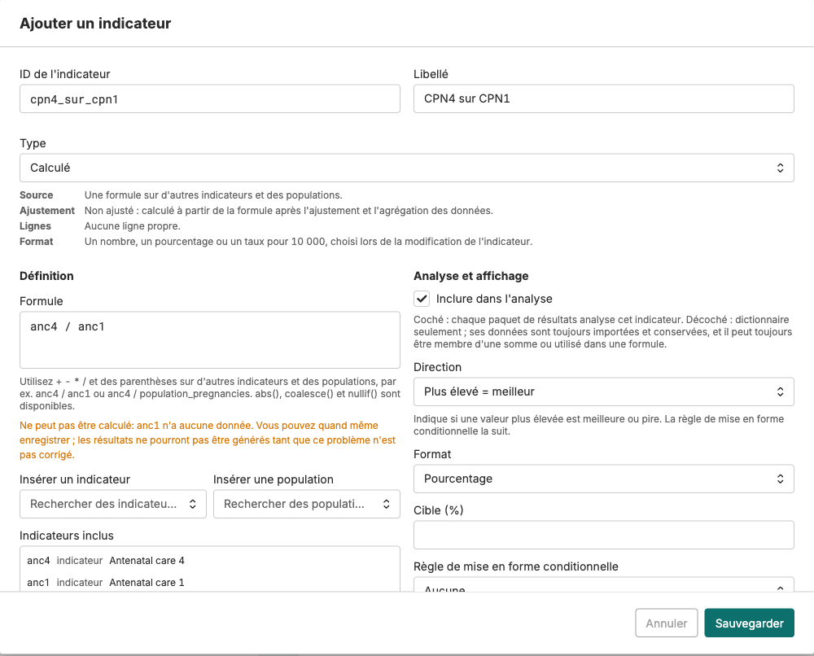

# Ajouter un indicateur dans FASTR

<strong>Guide pas à pas</strong> · <strong>~10 min par indicateur</strong>

<aside class="p1-sidebar">

Avant de commencer

- ☐ Vous êtes connecté à l'instance FASTR du Tchad
- ☐ Vous connaissez le **nom** de l'indicateur dans DHIS2 (ou son **ID**)
- ☐ La connexion DHIS2 de l'instance est enregistrée (page **Données**, carte **Connexion DHIS2**)

</aside>

## Ce que vous allez faire

Ajouter un indicateur, c'est trois gestes :

1. **Le chercher** dans DHIS2 depuis FASTR.
2. **Lui donner un nom** court et lisible.
3. **Enregistrer.**

Ensuite, deux gestes de plus pour que les chiffres arrivent dans les analyses : **télécharger les données**, puis **générer un paquet de résultats**.

> **Une seule liste.** Dans FASTR, tous les indicateurs sont dans un seul tableau. Chaque ligne porte un **type** : *Élément DHIS2* (récupéré depuis DHIS2), *Téléversé* (chargé par fichier CSV), *Somme* (total d'autres indicateurs) ou *Calculé* (une formule). Ce guide couvre le cas le plus courant : un **Élément DHIS2**.

---

<h2 class="step-h">1Ouvrir la liste des indicateurs</h2>

1. Cliquez sur **Données** dans la barre du haut.
2. Dans la section **SNIS**, cliquez sur la carte **Indicateurs**.

Vous arrivez sur la liste des indicateurs. Chaque ligne affiche l'**ID de l'indicateur**, son **libellé**, son **type** et la colonne **Défini par** (pour un élément DHIS2, c'est l'identifiant DHIS2).

---

<h2 class="step-h">2Chercher l'indicateur dans DHIS2</h2>

1. Cliquez sur **Ajouter depuis DHIS2**, en haut à droite de la liste.
2. Dans le champ de recherche, tapez le **nom** de l'indicateur, ou collez son **ID DHIS2**. Cliquez sur **Recherche**.

3. Dans les résultats, cliquez sur **Ajouter** à côté de l'indicateur voulu. Il passe dans la colonne **Éléments sélectionnés**, à droite. Les lignes grisées « Ne peut pas être ajouté » ne sont pas des dénombrements mensuels : FASTR ne peut pas les analyser.
4. Répétez pour chaque indicateur à ajouter.
5. Cliquez sur **Suivant : nommer les indicateurs**, en haut à droite. Le chiffre entre parenthèses indique combien vous en avez sélectionné.

> **Astuce.** Un mot large comme `prénatal` ramène toute une famille d'indicateurs en une recherche. Vous pouvez aussi chercher plusieurs termes d'un coup, séparés par des virgules.

---

<h2 class="step-h">3Donner un nom, puis enregistrer</h2>

FASTR propose un **ID de l'indicateur** et un **libellé** pour chaque élément sélectionné. Vous pouvez les garder ou les modifier.

| Champ | À quoi il sert | Règle |
|---|---|---|
| **ID de l'indicateur** | Nom technique, utilisé par les analyses et les exports | Minuscules, chiffres et tirets bas. **Pas d'accents, pas d'espaces.** Ex. `cpn1`, `accouchements_fosa` |
| **Libellé** | Nom affiché dans les graphiques et les listes | Court et clair, accents autorisés. Ex. « CPN 1ère visite » |

1. Vérifiez l'ID et le libellé de chaque ligne.
2. Cliquez sur **Enregistrer**.

## Vérification

De retour sur la liste, le nouvel indicateur apparaît avec le badge **Élément DHIS2**, son identifiant DHIS2 dans la colonne **Défini par**, et **Oui** dans la colonne **Inclure**.

> **Le libellé, c'est ce que tout le monde verra.** Imaginez-le sur la légende d'un graphique projeté en réunion. Un collègue d'un autre service doit comprendre sans explication.

---

## Cas particulier : un sous-groupe (tranche d'âge, sexe)

Dans DHIS2, un même élément est souvent découpé en sous-groupes. Ces découpages s'appellent des **COC**.

1. Dans les résultats de recherche, repérez le badge **N COCs** sur la ligne de l'élément.
2. Cliquez sur le **chevron** à gauche de la ligne pour dérouler les sous-groupes.
3. Cliquez sur **Ajouter** sur la ligne du **sous-groupe** voulu, pas sur la ligne principale.

> La ligne principale récupère **tout** (tous âges, tous sexes). La ligne COC récupère **seulement** le sous-groupe. Si vous voulez « moins de 18 ans », c'est le COC qu'il vous faut.

**Besoin d'additionner deux sous-groupes ?** Ajoutez-les tous les deux comme éléments DHIS2, puis cliquez sur **Créer** et choisissez le type **Somme** : vous cochez les deux membres, FASTR fait le total.

---

## Dénombrement ou taux ? Les deux familles d'indicateurs

| | **Dénombrement** | **Taux** |
|---|---|---|
| Ce que c'est | Un nombre de services par établissement et par mois : CPN1, accouchements, doses BCG | Un rapport entre deux chiffres : CPN4 / CPN1, accouchements / grossesses attendues |
| Types dans FASTR | **Élément DHIS2**, **Téléversé**, **Somme** | **Calculé** |
| D'où viennent les chiffres | Téléchargés depuis DHIS2 (étape 4) | Calculés par FASTR à partir d'autres indicateurs, rien à télécharger |
| Qualité des données | Vérifiés et ajustés par les modules de qualité | Calculés **après** l'ajustement, sur les totaux agrégés |
| Format | Toujours un nombre | Nombre, **pourcentage** ou taux pour 10 000, au choix |

> **Règle simple.** Tout ce qui se compte se télécharge (étapes 1 à 4). Tout ce qui se divise se calcule : créez-le avec **Créer**, il n'a pas besoin d'importation, seulement d'un nouveau paquet de résultats (étape 5).

---

## Créer un taux (indicateur calculé)

1. Dans la liste des indicateurs, cliquez sur **Créer**.
2. Choisissez le type **Calculé**.
3. Donnez un **ID** et un **libellé**, mêmes règles qu'à l'étape 3.
4. Écrivez la **formule** avec les ID des autres indicateurs et `+ - * /`, par exemple `anc4 / anc1`. Les boutons **Insérer un indicateur** et **Insérer une population** écrivent les ID à votre place.
5. Choisissez le **format** : **Pourcentage** pour un taux de 0 à 100 %.
6. Cliquez sur **Sauvegarder**.

Le message orange « Ne peut pas être calculé : … n'a aucune donnée » veut dire qu'un ingrédient de la formule n'a pas encore été téléchargé. Vous pouvez enregistrer quand même ; le taux se calculera dès que les données seront là.

> **Un dénominateur de population ?** Pour un taux de couverture (accouchements / grossesses attendues), la formule divise par un **terme de population**, par exemple `delivery / population_pregnancies`. Ces termes viennent de la page **Population** de l'instance ; s'ils ne sont pas renseignés, l'indicateur affiche « aucune donnée » et ne se calcule pas.

**Deux cas fréquents.** Un indicateur DHIS2 qui est déjà une formule dans DHIS2 : ajoutez-le avec **Ajouter depuis DHIS2**, FASTR crée ses ingrédients et l'indicateur calculé d'un coup. Deux sous-groupes à additionner : créez une **Somme**, pas un calculé.

---

<h2 class="step-h">4Télécharger les données</h2>

Créer l'indicateur ne télécharge **aucun chiffre**. FASTR sait maintenant qu'il existe ; il faut aller chercher ses données dans DHIS2.

1. Dans la liste des indicateurs, **cochez** les indicateurs que vous venez d'ajouter.
2. Dans la barre d'actions qui apparaît, cliquez sur **Importer les données HMIS depuis DHIS2**. L'assistant d'importation s'ouvre, déjà réglé sur ces indicateurs.

   
3. **Heure** : choisissez **Maintenant**, puis **Suivant**.

   

4. **Configuration** : réglez la **plage de périodes** avec les deux curseurs. Prenez la **même période que vos autres indicateurs**, sinon les graphiques comparatifs auront des trous. Puis **Suivant**.

   

5. **Vérifier et lancer** : cliquez sur **Démarrer l'importation**.

L'importation tourne sur le serveur. Suivez-la sous **Données** → **SNIS** → carte **Données** → **Importations**. **Attendez qu'elle soit terminée** avant l'étape suivante.

---

<h2 class="step-h">5Générer un paquet de résultats</h2>

Les projets ne lisent jamais la base directement. Ils lisent un **paquet de résultats**, c'est-à-dire les analyses déjà calculées. Tant qu'aucun nouveau paquet n'est généré, les nouveaux indicateurs restent invisibles dans les projets.

1. Cliquez sur **Résultats** dans la barre du haut, puis sur **Générer un nouveau paquet de résultats**.
2. **Données** : cochez **Données HMIS**. Puis **Suivant**.
3. **Modules** : cochez les modules habituels de votre instance. Puis **Suivant**.

   

4. **Confirmer et lancer** : sous **Rattacher aux projets**, cochez les projets qui doivent voir les nouveaux indicateurs. Cliquez sur **Lancer la génération**.

   

Dès que la génération réussit, les projets cochés basculent sur le nouveau paquet. Vos indicateurs apparaissent dans leurs listes.

> **Le réglage qui simplifie tout.** Sur la page **Résultats**, **épinglez** le paquet de référence, et dans chaque projet cochez **« Toujours utiliser le paquet épinglé de l'instance »**. La routine devient : importer, générer, épingler.

---

## Récapitulatif

| Étape | Où | Effet |
|---|---|---|
| 1 à 3. Ajouter l'indicateur | Données → Indicateurs → Ajouter depuis DHIS2 | Crée la ligne, aucune donnée |
| 4. Télécharger les données | Cocher les indicateurs → Importer les données HMIS depuis DHIS2 | Remplit la base de l'instance |
| 5. Générer un paquet | Résultats → Générer un nouveau paquet | Recalcule les analyses ; les projets basculent |

## Si ça ne marche pas

- **La recherche ne trouve rien.** Vérifiez l'orthographe, essayez le nom au lieu de l'ID, ou un mot plus court.
- **L'élément est grisé « Ne peut pas être ajouté ».** FASTR n'accepte que les éléments mensuels de type dénombrement. Choisissez un autre élément ou demandez à l'administrateur DHIS2.
- **« Déjà ajouté sous … »** L'élément existe déjà dans FASTR sous cet ID. Rien à faire : utilisez l'indicateur existant.
- **L'ID est refusé.** Il contient un accent, un espace, une virgule ou un crochet, ou c'est un mot réservé. Gardez minuscules, chiffres et tirets bas.
- **L'indicateur n'apparaît pas dans le projet.** Reprenez le tableau de bas en haut : le projet est-il sur le nouveau paquet ? L'importation est-elle terminée ? L'indicateur est-il **Inclus** dans l'analyse ?

---

# À faire — équipe Tchad

<strong>Indicateurs à ajouter</strong>

Pour chaque ligne, appliquez les étapes **1 à 3**. Une fois toutes les lignes faites, faites les étapes **4 et 5** une seule fois pour l'ensemble.

| Nom dans DHIS2 | ID de l'indicateur | Libellé |
|---|---|---|
| | | |
| | | |
| | | |
| | | |
| | | |
| | | |

> **Vérification finale.** La liste des indicateurs doit afficher chaque nouvel ID avec le badge **Élément DHIS2** et son identifiant DHIS2 dans la colonne **Défini par**. Si une ligne manque, reprenez l'étape 2 pour cet indicateur.
