

# Mettre à jour les données depuis DHIS2

<strong>Guide pas à pas</strong> · <strong>~15 min + le temps des traitements</strong>

<aside class="p1-sidebar">

Avant de commencer

- ☐ Vous êtes connecté à votre instance FASTR avec un compte admin
- ☐ Vous savez jusqu'à quel mois vos données actuelles s'arrêtent
- ☐ Vous savez jusqu'à quel mois DHIS2 est rempli

</aside>

## À quoi sert ce guide

Chaque mois, les structures saisissent leurs rapports dans DHIS2 — et FASTR n'en sait rien tant que personne ne fait la mise à jour.

Depuis la dernière version de la plateforme, cette mise à jour se fait en **trois gestes** :

1. **Importer** les nouveaux mois depuis DHIS2
2. **Générer un paquet de résultats** — c'est lui qui recalcule les analyses
3. **Rattacher** ce paquet aux projets

**L'exemple suivi dans ce guide :** la dernière importation s'arrête à **novembre 2025**. DHIS2 contient maintenant les rapports jusqu'à **juillet 2026**. Nous allons télécharger **décembre 2025 → juillet 2026**, puis faire suivre.

> **Le bouton « Mettre à jour les données » n'existe plus.** Si vous connaissiez l'ancienne méthode — importer puis cliquer « Mettre à jour les données » dans chaque projet — oubliez-la. Le **paquet de résultats** l'a remplacée : tous les chiffres d'un projet viennent d'un paquet, et on fait basculer les projets sur le paquet le plus récent.

---

## Les trois gestes

| # | Ce que vous faites | Où |
|---|---|---|
| 1 | Importer les nouveaux mois depuis DHIS2 | **Données** → SNIS → **Données** → **Importations** |
| 2 | Générer un paquet de résultats | **Résultats** → **Générer un nouveau paquet de résultats** |
| 3 | Rattacher le paquet aux projets | Coché directement à l'étape 2, ou projet par projet |

L'idée en une phrase : l'importation remplit la réserve de données, le paquet fait les calculs, et chaque projet lit ses chiffres dans le paquet qu'on lui a rattaché.

> **Un conseil qui évite des surprises.** Les rapports des derniers mois changent souvent après coup — des structures saisissent en retard. Quand vous choisissez la période à importer, reculez le début de quelques mois. Pour notre exemple : plutôt que décembre 2025 → juillet 2026, prenez **septembre 2025 → juillet 2026**. Les mois re-téléchargés sont simplement rafraîchis avec les chiffres à jour.

---

<h2 class="step-h">1Lancer l'importation</h2>

1. Cliquez sur **Données** dans la barre du haut, puis, dans la section **SNIS**, sur la carte **Données**.

   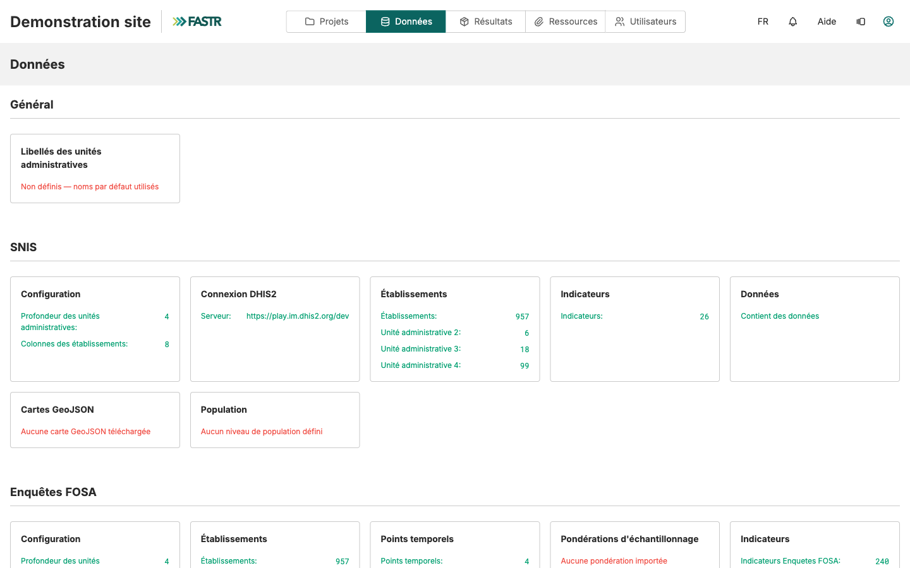

2. Cliquez sur **Importations**, puis sur **Nouvelle importation DHIS2**.

   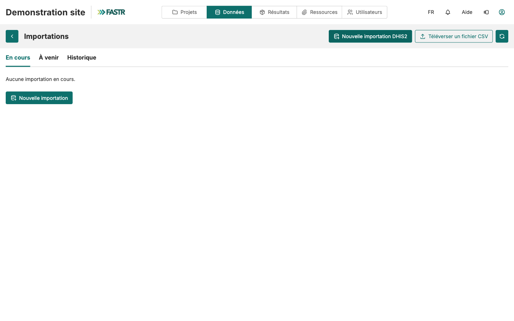

L'assistant s'ouvre. Il compte cinq étapes : **Identifiants**, **Indicateurs**, **Heure**, **Configuration**, **Vérifier et lancer**.

3. **Identifiants** — la connexion DHIS2 enregistrée s'affiche. Cliquez sur **Suivant**.

   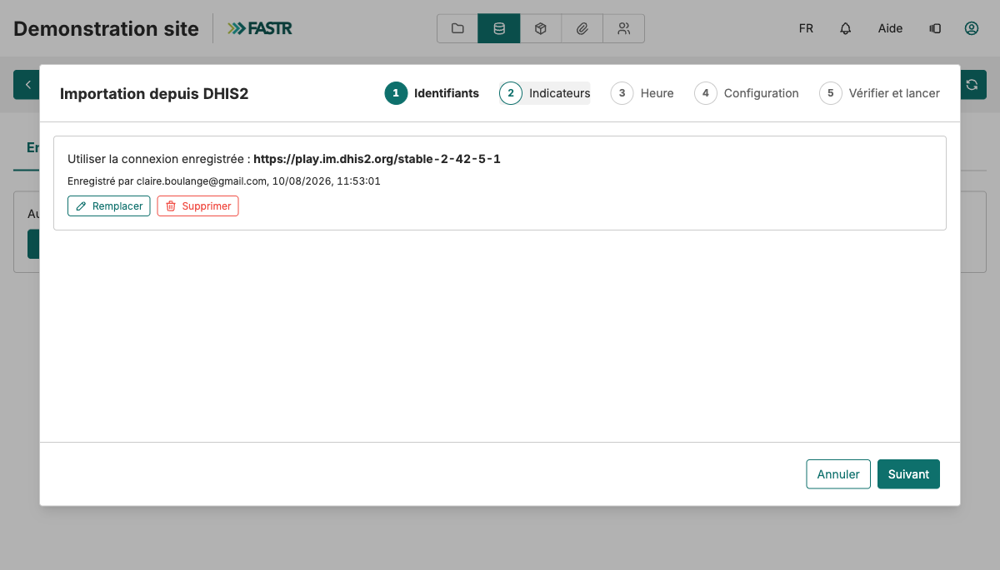

---

4. **Indicateurs** — cochez les indicateurs à télécharger. Pour une mise à jour de routine, le plus sûr : **cochez-les tous**, avec la case tout en haut de la liste. Puis **Suivant**.

   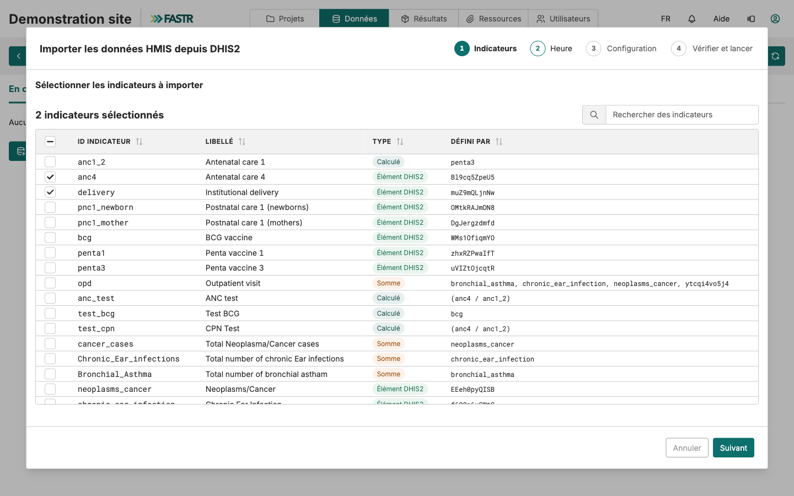

5. **Heure** — choisissez **Maintenant**, puis **Suivant**.

   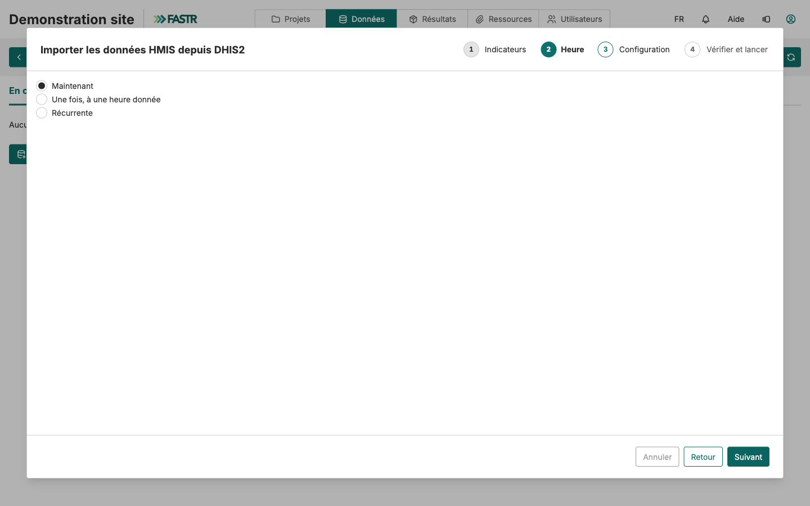

> **À noter pour plus tard :** l'option **Récurrente** permet de programmer cette importation pour qu'elle se répète toute seule, chaque mois. Une fois la routine bien en main, c'est le geste 1 qui disparaît de votre liste.

---

6. **Configuration** — réglez la **plage de périodes** avec les deux curseurs : la fenêtre de mois à télécharger. Pour notre exemple : **septembre 2025 → juillet 2026** — les nouveaux mois, plus la marge pour les saisies tardives.

   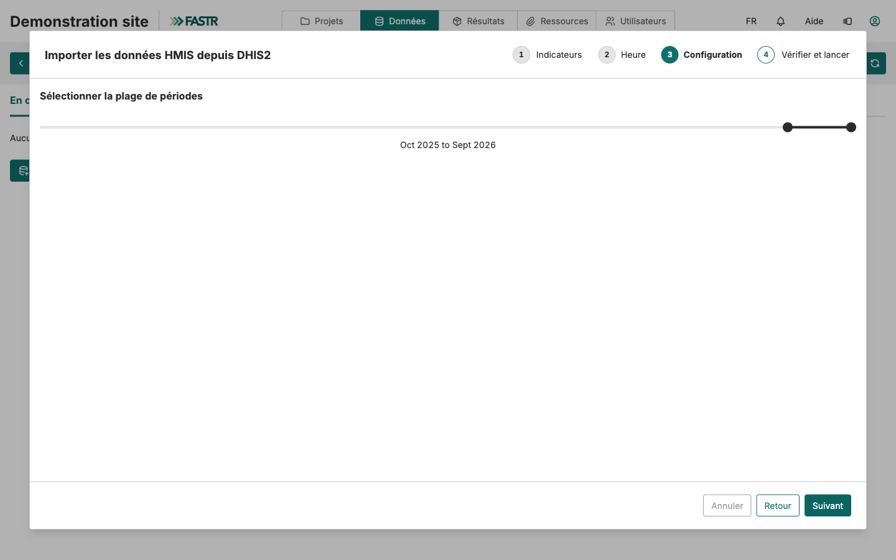

7. **Vérifier et lancer** — relisez le récapitulatif : la connexion, le nombre d'indicateurs, la fenêtre. Puis cliquez sur **Démarrer l'importation**.

   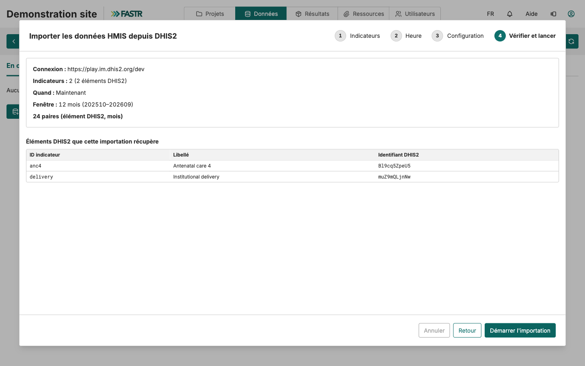

L'importation tourne en arrière-plan — de quelques minutes à beaucoup plus, selon la fenêtre et le nombre d'indicateurs. L'onglet **Historique** de la page Importations vous dit quand elle est terminée. **Attendez qu'elle soit finie avant de passer au geste 2** : un paquet généré trop tôt calculerait sur les anciennes données.

---

<h2 class="step-h">2Générer le paquet de résultats</h2>

Les nouveaux mois sont téléchargés, mais aucune analyse ne s'est recalculée. C'est le rôle du paquet.

1. Cliquez sur **Résultats** dans la barre du haut. La page **Paquets de résultats** liste les paquets existants, avec la date de chacun et les projets qui l'utilisent.

   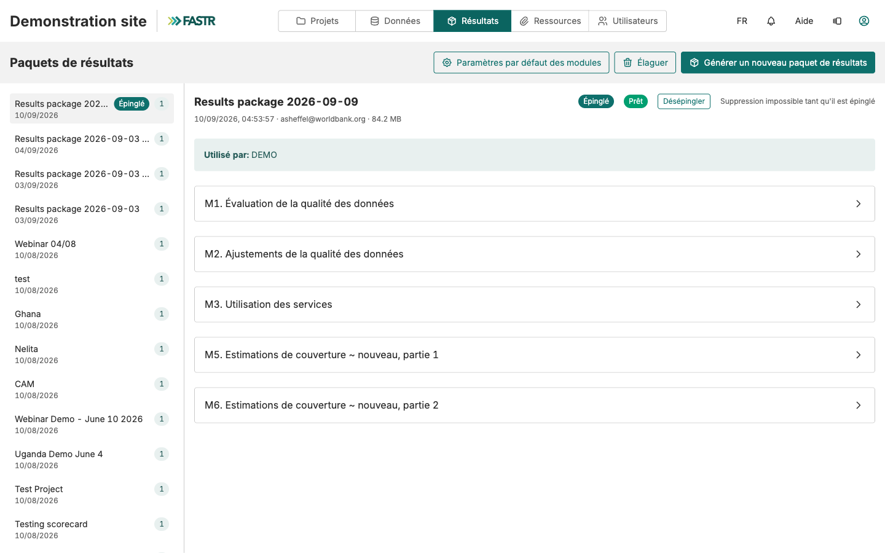

2. Cliquez sur **Générer un nouveau paquet de résultats**. L'assistant compte trois étapes.
3. **Données** — cochez **Données HMIS**. Puis **Suivant**.

   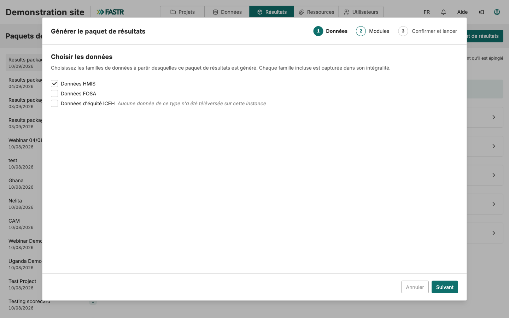

4. **Modules** — cochez les modules d'analyse à exécuter, les mêmes que d'habitude pour votre instance. Si un module en nécessite un autre, FASTR l'ajoute tout seul. Puis **Suivant**.

   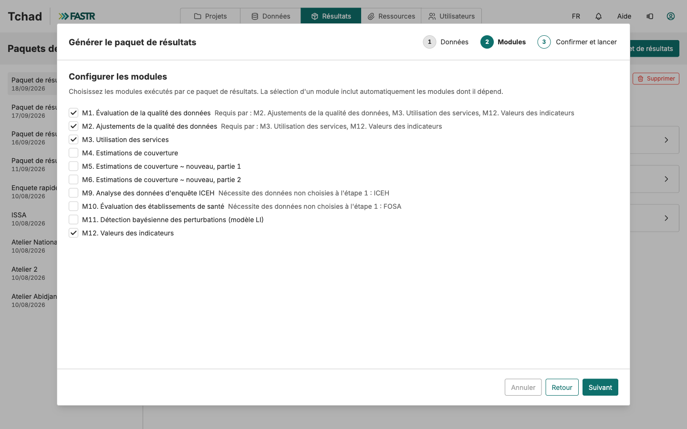

---

<h2 class="step-h">3Rattacher le paquet aux projets</h2>

Le rattachement se fait à la dernière étape de l'assistant — c'est le geste 3, intégré au geste 2.

1. **Confirmer et lancer** — un libellé est proposé, avec la date du jour. Gardez-le, ou nommez le paquet plus clairement : « Données jusqu'à juillet 2026 ».
2. Sous **Rattacher aux projets**, **cochez tous les projets qui doivent passer aux nouveaux chiffres.** Dès que la génération réussit, ces projets basculent sur le nouveau paquet — sans autre geste de votre part.

   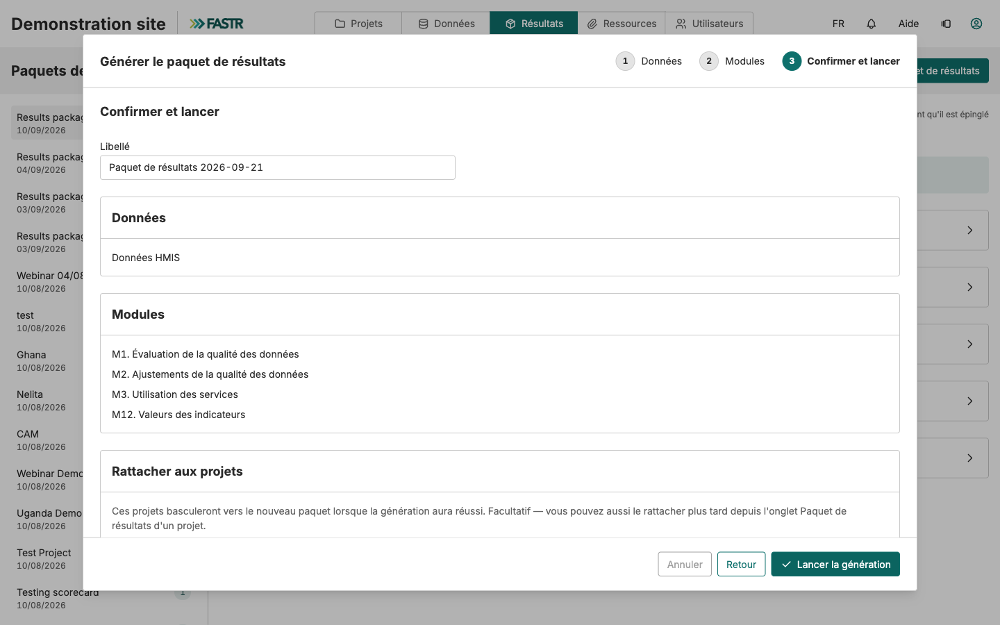

3. Cliquez sur **Lancer la génération**. Elle tourne en arrière-plan ; la progression s'affiche sur la page Paquets de résultats.

> **Un projet oublié ?** Pas grave. Ouvrez ce projet, allez dans son onglet **Paquet de résultats**, choisissez le nouveau paquet dans la liste et cliquez sur **Utiliser ce paquet**. FASTR vous montre d'abord ce que le changement toucherait, puis bascule. Un projet qu'on ne fait pas basculer continue d'afficher les anciens chiffres — sans prévenir personne.

---

## Vérifier que les nouveaux mois sont bien là

Ouvrez un des projets rattachés et affichez un graphique que vous connaissez bien — une série mensuelle. L'axe du temps doit maintenant aller jusqu'à **juillet 2026**.

Dans l'onglet **Paquet de résultats** du projet, vous pouvez aussi vérifier d'un coup d'œil quel paquet est utilisé et de quand il date — la ligne sous son nom donne la date de génération.

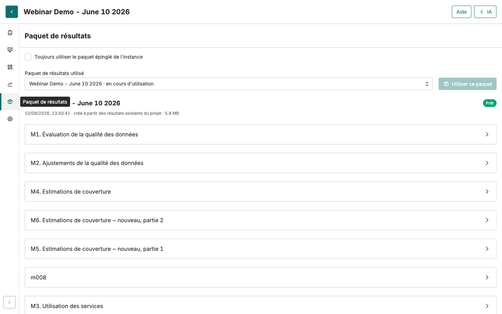

> **Le réglage qui simplifie tout : le paquet épinglé.** Sur la page **Résultats**, le bouton **Épingler** désigne le paquet de référence de l'instance. Dans chaque projet, la case **« Toujours utiliser le paquet épinglé de l'instance »** fait suivre ce choix automatiquement — mais elle n'est **pas cochée d'office** : cochez-la une fois dans chaque projet concerné. Ensuite, la routine mensuelle se réduit à : importer, générer, **épingler**. Les projets suivent tout seuls.

## Si un chiffre ne colle pas

- **Un mois récent manque partout** — l'importation ne couvrait pas ce mois, ou elle n'était pas finie quand le paquet a été généré. Vérifiez l'onglet **Historique** des importations, puis générez un nouveau paquet.
- **Le mois est importé mais absent d'un projet** — ce projet est resté sur un ancien paquet. Ouvrez son onglet **Paquet de résultats** et faites-le basculer.
- **Un chiffre récent diffère de DHIS2** — les structures ont saisi après votre importation. Refaites une importation incluant ce mois, puis un nouveau paquet.

---

## Récapitulatif

| Geste | Où | Effet |
|---|---|---|
| Importer depuis DHIS2 | Données → SNIS → Données → Importations | Télécharge les nouveaux mois dans l'instance |
| Générer un paquet de résultats | Résultats → Générer un nouveau paquet | Recalcule toutes les analyses sur les données à jour |
| Rattacher aux projets | Coché à la génération, ou onglet Paquet de résultats du projet | Les projets affichent les nouveaux chiffres |

**Notre exemple, en résumé :** données arrêtées à novembre 2025, DHIS2 rempli jusqu'à juillet 2026. Importation de **septembre 2025 → juillet 2026** (marge comprise), attendre la fin, générer un paquet **« Données jusqu'à juillet 2026 »** en cochant les projets concernés. Les graphiques vont maintenant jusqu'à juillet 2026.

**La bonne habitude :** faites ces gestes à date fixe, chaque mois, une fois la saisie DHIS2 stabilisée. Et deux réglages les rendent presque automatiques : l'importation **Récurrente** (geste 1) et le paquet **épinglé** avec les projets en « toujours suivre » (geste 3).
