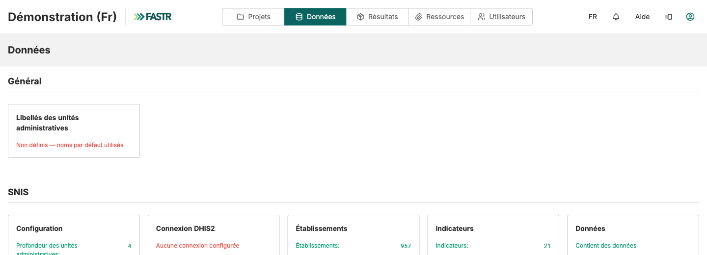
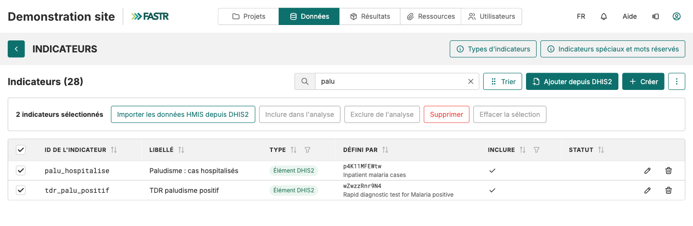

# Ajouter un indicateur DHIS2 dans FASTR

<strong>Guide pas à pas</strong> · <strong>~10 min par indicateur</strong>

<aside class="p1-sidebar">

Avant de commencer

- ☐ Vous êtes connecté à votre instance FASTR
- ☐ Vous avez l'**ID DHIS2** de l'indicateur (ou son nom exact)
- ☐ La connexion DHIS2 de l'instance est enregistrée (page **Données**, carte **Connexion DHIS2**)

</aside>

## Ce que vous allez faire

Dans DHIS2, chaque élément porte un code technique comme `s6MKkVJFwda`. Ce code ne dit rien à personne. Dans FASTR, le même élément porte un **ID lisible** (`cpn1_faf`) et un **libellé** (« CPN1 femmes ayant reçu FAF »).

Ajouter un indicateur, c'est donc : **le chercher** dans DHIS2, **lui donner un nom**, **enregistrer**. Puis télécharger ses données et générer un paquet de résultats.

> **L'analogie :** le code DHIS2 est le numéro de téléphone. L'ID FASTR est le nom dans votre répertoire. Vous composez toujours un nom, jamais un numéro.

---

<h2 class="step-h">1Ouvrir la liste des indicateurs</h2>

1. Cliquez sur **Données** dans la barre du haut.
2. Dans la section **SNIS**, cliquez sur la carte **Indicateurs**.

Tous les indicateurs sont dans **un seul tableau**. Chaque ligne affiche l'**ID de l'indicateur**, son **libellé**, son **type** et la colonne **Défini par** : pour un élément DHIS2, c'est le code DHIS2 et son nom d'origine.

---

<h2 class="step-h">2Chercher l'indicateur dans DHIS2</h2>

1. Cliquez sur **Ajouter depuis DHIS2**, en haut à droite de la liste.
2. Dans le champ de recherche, collez l'**ID DHIS2** de l'indicateur, ou tapez son nom. Cliquez sur **Recherche**.

3. Dans les résultats, cliquez sur **Ajouter** à côté de l'élément voulu. Il passe dans la colonne **Éléments sélectionnés**, à droite.
4. Répétez pour chaque indicateur à ajouter.
5. Cliquez sur **Suivant : nommer les indicateurs**, en haut à droite.

> **Astuce :** vous pouvez chercher plusieurs termes d'un coup en les séparant par des virgules. Un mot large comme `prénatal` ramène toute la famille d'indicateurs en une seule recherche. Les lignes grisées « Ne peut pas être ajouté » ne sont pas des dénombrements mensuels : FASTR ne peut pas les analyser.

---

## Trouver un sous-groupe : les désagrégations (COC)

Dans DHIS2, un même élément de données est souvent découpé en sous-groupes, par tranche d'âge, sexe ou type de structure. Ces découpages s'appellent des **COC** (*category option combos*).

1. Recherchez l'**élément de données** lui-même, par son ID, par exemple `Qi1WRFJoSnU`.
2. Sur la ligne de résultat, repérez le badge **« N COCs »**. Il indique que cet élément est désagrégé.
3. Cliquez sur le **chevron** à gauche de la ligne pour dérouler la liste des sous-groupes.
4. Chaque sous-groupe apparaît sur sa propre ligne, avec son ID complet sous la forme `élément.coc`, par exemple `Qi1WRFJoSnU.b39EuNOkecq`.
5. Cliquez sur **Ajouter** sur la ligne du sous-groupe voulu, pas sur celle de l'élément principal.

> **La différence est importante.** La ligne principale (`Qi1WRFJoSnU`) récupère **tous** les accouchements, tous âges confondus. Les lignes COC récupèrent précisément les tranches d'âge qui vous intéressent. Si vous voulez « moins de 18 ans », ce sont les COC qu'il vous faut.

**Deux sous-groupes à additionner ?** Ajoutez-les tous les deux, puis cliquez sur **Créer**, choisissez le type **Somme** et cochez les deux membres. FASTR fait le total par établissement et par mois. C'est le cas de l'exemple `accouchements_moins18ans` : deux cases d'âge distinctes dans DHIS2, un seul chiffre dans FASTR.

---

<h2 class="step-h">3Donner un nom, puis enregistrer</h2>

FASTR propose un **ID de l'indicateur** et un **libellé** pour chaque élément sélectionné, à partir du nom DHIS2. Vous pouvez les garder ou les modifier.

1. Remplacez l'ID proposé par un ID court, par exemple `cpn1_faf`. **Minuscules, sans accents, sans espaces** ; les tirets bas sont acceptés.
2. Remplacez le libellé par le nom à afficher, par exemple « CPN1 femmes ayant reçu FAF ». Accents et espaces autorisés.
3. Cliquez sur **Enregistrer**.

## Vérification

De retour sur la liste, le nouvel indicateur apparaît avec le badge **Élément DHIS2**, son code DHIS2 et son nom d'origine dans la colonne **Défini par**, et une coche dans la colonne **Inclure**.

---

## Pourquoi deux champs ? ID et libellé ne servent pas à la même chose

C'est la question qui revient le plus souvent. Les deux champs décrivent le même indicateur, mais ils s'adressent à des publics différents.

### L'ID de l'indicateur, pour la machine

L'ID est un **nom de variable**. Il est utilisé par le code d'analyse, les formules et les fichiers exportés. D'où les règles strictes : minuscules, chiffres et tirets bas uniquement, ni accents ni espaces. Un accent ou un espace dans un nom de variable casse les scripts d'analyse et les exports CSV.

Une convention cohérente rend la liste lisible quand elle atteint cent lignes. Nous préfixons par domaine : `cpn1_…` pour les consultations prénatales, `nut_…` pour la nutrition. Les indicateurs d'une même famille se retrouvent ainsi côte à côte au tri alphabétique.

### Le libellé, pour les humains

Le libellé est le nom affiché partout dans la plateforme : listes déroulantes, tableaux, et surtout **titres et légendes des graphiques**. Accents, espaces et majuscules sont autorisés, et attendus. Deux qualités comptent :

- **Clair** : « CPN1 femmes 15-17 ans » se comprend seul. « CPN1 g2 » non.
- **Concis** : sur un axe de graphique, un libellé long est tronqué. Visez une poignée de mots.

> **Le test à faire.** Imaginez le libellé sur la légende d'un graphique projeté en réunion. Un collègue d'un autre service comprend-il de quoi il s'agit, sans explication ? Si oui, c'est le bon libellé.

Inutile de répéter dans le libellé ce que le graphique dit déjà. Si le graphique porte sur la nutrition, « Retard de croissance moins de 5 ans » suffit. Le nom DHIS2 complet reste visible dans la colonne **Défini par**, mais il est trop long pour un axe.

> **Bon à savoir.** L'ID peut être renommé plus tard depuis l'icône crayon : FASTR réécrit les formules qui l'utilisent et garde les données. Le code DHIS2, lui, devient fixe dès que des données ont été téléchargées.

---

## Que faire si ça ne marche pas

- **La recherche DHIS2 ne renvoie rien.** Vérifiez l'orthographe de l'ID, essayez le nom au lieu de l'ID, ou un mot plus court.
- **Un message « Aucune connexion DHIS2 n'est enregistrée » apparaît.** Sur la page **Données**, ouvrez la carte **Connexion DHIS2** et saisissez l'URL et les identifiants DHIS2 de l'instance.
- **L'élément est grisé « Ne peut pas être ajouté ».** FASTR n'accepte que les éléments mensuels de type dénombrement (agrégation SUM). Choisissez un autre élément ou demandez à l'administrateur DHIS2.
- **« Déjà ajouté sous … ».** L'élément existe déjà dans FASTR sous cet ID. Rien à créer : utilisez l'indicateur existant.
- **L'ID est refusé.** Il contient un accent, un espace, une virgule, un point-virgule, un deux-points ou un crochet, dépasse 128 caractères, ou c'est un mot réservé. Tenez-vous-en aux minuscules, chiffres et tirets bas.
- **Vous vous êtes trompé d'ID.** Ouvrez l'indicateur avec l'icône crayon et corrigez l'ID. FASTR met à jour les formules et garde les données.

---

# À faire — équipe Madagascar

<strong>4 indicateurs à ajouter</strong>

Pour chacun des quatre indicateurs ci-dessous, appliquez les étapes **1 à 3** : recherchez l'ID DHIS2, cliquez sur **Ajouter**, puis à l'étape de nommage remplacez l'ID et le libellé proposés par ceux du tableau.

Ce sont des éléments de données simples, sans désagrégation. Vous n'avez donc **pas** besoin de dérouler les COC : recherchez l'ID, cliquez sur **Ajouter** sur la ligne principale.

| ID DHIS2 | ID de l'indicateur | Libellé |
|---|---|---|
| `naBJZSepUeV` | `cpn1_faf` | CPN1 femmes ayant reçu FAF |
| `qnL45tcZRpB` | `cpn1_15_17` | CPN1 femmes 15-17 ans |
| `xszA8v2QOOX` | `nut_retard_croissance_moins_5ans` | Retard de croissance moins de 5 ans |
| `xWYKMcj6CKu` | `nut_insuf_ponderale_moins_5ans` | Insuffisance pondérale moins de 5 ans |

> **Notez la différence.** Les **libellés** ci-dessus portent leurs accents : c'est ce que verront les utilisateurs. Les **ID** n'en ont pas, et c'est voulu. Les **noms DHIS2** en bas de page sont recopiés tels quels depuis DHIS2, sans accents : ne les corrigez pas, sinon la recherche ne trouvera plus rien.

---

## À quoi correspond chaque code dans DHIS2

Utile pour vérifier que vous avez bien ajouté le bon élément : le nom qui s'affiche dans les résultats de recherche, puis dans la colonne **Défini par**, doit correspondre.

| ID de l'indicateur | Nom dans DHIS2 |
|---|---|
| `cpn1_faf` | CPN Femmes Enceintes vues en 1ere CPN ayant recu FAF |
| `cpn1_15_17` | CPN Femmes Enceintes entre 15 - 17 ans vues en 1ere CPN |
| `nut_retard_croissance_moins_5ans` | Nutrition Surveillance nutritionnelle des enfants moins de 5 ans T/A inf -2 ZS Retard de croissance |
| `nut_insuf_ponderale_moins_5ans` | Nutrition Surveillance nutritionnelle des enfants moins de 5 ans P/A inf -2 ZS Insuf pond. |

> **Vérification finale.** Une fois les quatre faits, la liste doit afficher les quatre nouveaux ID, chacun avec le badge **Élément DHIS2** et son code DHIS2 dans la colonne **Défini par**. Si l'un manque, reprenez l'étape 2 pour cet indicateur.

---

# Et après ? Récupérer les données, puis générer un paquet de résultats

<strong>Deuxième partie</strong> · <strong>~15 min + le temps des traitements</strong>

Créer un indicateur ne récupère **aucune donnée**. Vous n'avez posé qu'une étiquette vide : FASTR sait désormais que `cpn1_faf` existe et à quel code DHIS2 il correspond, mais aucun chiffre n'a encore été téléchargé.

Il reste deux gestes, et l'ordre compte.

## Comprendre : l'instance, le paquet, les projets

FASTR range les données à trois niveaux.

- L'**instance** (Madagascar) contient **la base centrale**. C'est là qu'arrivent les données téléchargées depuis DHIS2. Il y en a une seule.
- Le **paquet de résultats** est un ensemble d'analyses **déjà calculées** sur ces données, généré au niveau de l'instance.
- Chaque **projet** lit ses chiffres dans **le paquet qu'on lui a rattaché**. Un projet ne lit jamais la base centrale en direct.

> **L'analogie :** l'instance est l'entrepôt, le projet est votre étagère. Une livraison arrive à l'entrepôt, mais votre étagère ne se remplit pas toute seule. L'entrepôt prépare un **carton complet** (le paquet), et votre étagère reçoit ce carton.

La conséquence pratique : **tout ce que vous changez au niveau de l'instance reste invisible dans les projets** jusqu'à ce qu'un **nouveau paquet de résultats** soit généré et rattaché. Vos quatre nouveaux indicateurs ne font pas exception.

---

<h2 class="step-h">4Télécharger les données depuis DHIS2</h2>

1. Dans la liste des indicateurs, **cochez** les quatre indicateurs que vous venez d'ajouter.
2. Dans la barre d'actions qui apparaît, cliquez sur **Importer les données HMIS depuis DHIS2**. L'assistant d'importation s'ouvre, déjà réglé sur ces indicateurs.

   
3. **Heure** : choisissez **Maintenant** pour lancer l'importation tout de suite, puis **Suivant**.

   

4. **Configuration** : réglez la **plage de périodes** avec les deux curseurs, la fenêtre de mois à télécharger. Puis **Suivant**.

   

5. **Vérifier et lancer** : relisez le récapitulatif, puis cliquez sur **Démarrer l'importation**.

L'importation tourne sur le serveur. Selon la période et le nombre d'indicateurs, comptez de quelques minutes à beaucoup plus. Vous pouvez fermer l'onglet : sous **Données** → **SNIS** → carte **Données** → **Importations**, l'**Historique** vous dit quand elle est terminée. **Attendez la fin avant le geste suivant** : un paquet généré trop tôt calculerait sur les anciennes données.

> **Prenez la même période que les données existantes.** Un indicateur ajouté aujourd'hui n'a pas d'historique tant que vous ne l'avez pas téléchargé. Si vos autres indicateurs remontent à 2019 et que vous n'importez que 2026 pour les nouveaux, les graphiques comparatifs auront des trous.

---

<h2 class="step-h">5Générer un paquet de résultats et le rattacher</h2>

Les données sont maintenant dans la base centrale, mais aucune analyse ne s'est recalculée. C'est le rôle du paquet.

1. Cliquez sur **Résultats** dans la barre du haut. La page **Paquets de résultats** liste les paquets existants, avec la date de chacun et les projets qui l'utilisent.

   

2. Cliquez sur **Générer un nouveau paquet de résultats**. L'assistant compte trois étapes.
3. **Données** : cochez **Données HMIS**. Puis **Suivant**.

   

4. **Modules** : cochez les modules d'analyse habituels de votre instance. Si un module en nécessite un autre, FASTR l'ajoute tout seul. Puis **Suivant**.

   

---

5. **Confirmer et lancer** : gardez le libellé proposé, ou nommez le paquet plus clairement. Sous **Rattacher aux projets**, **cochez les projets qui doivent voir les nouveaux indicateurs**, pour nous **Données SRMNIA-N**. Cliquez sur **Lancer la génération**.

   

La génération tourne en arrière-plan ; la progression s'affiche sur la page Paquets de résultats. Dès qu'elle réussit, les projets cochés basculent sur le nouveau paquet, vos quatre indicateurs compris.

## Vérifier que le projet a bien basculé

Ouvrez le projet et allez dans son onglet **Paquet de résultats** : le nom du paquet utilisé et sa date de génération s'affichent. Vos nouveaux indicateurs apparaissent maintenant dans les listes du projet.

> **Un projet oublié ?** Ouvrez-le, onglet **Paquet de résultats**, choisissez le nouveau paquet et cliquez sur **Utiliser ce paquet**. Et le réglage qui simplifie tout : sur la page **Résultats**, **épinglez** le paquet de référence, puis cochez dans chaque projet **« Toujours utiliser le paquet épinglé de l'instance »**. La routine devient : importer, générer, épingler.

---

## Récapitulatif

| Étape | Où | Effet |
|---|---|---|
| 1 à 3. Ajouter l'indicateur | Données → SNIS → Indicateurs → Ajouter depuis DHIS2 | Crée la ligne, aucune donnée |
| 4. Télécharger les données | Cocher les indicateurs → Importer les données HMIS depuis DHIS2 | Remplit la base centrale |
| 5. Générer un paquet et le rattacher | Résultats → Générer un nouveau paquet | Recalcule les analyses ; les projets basculent |

Si un chiffre manque à l'arrivée, reprenez ce tableau de bas en haut : le projet est-il sur le bon paquet, la donnée est-elle dans l'instance, l'indicateur porte-t-il bien son code DHIS2 dans la colonne **Défini par** ?
