<div class="brand-line"><span class="rule"></span></div>

# Importer un indicateur DHIS2 et créer l'indicateur commun correspondant

<p class="meta-line"><strong>Guide pas à pas</strong> · <strong>~15 min</strong></p>

<div class="p1-grid">
<aside class="p1-sidebar">

<p class="sb-label">Avant de commencer</p>

- ☐ Vous êtes connecté à votre instance FASTR
- ☐ Vous avez l'**ID DHIS2** de l'indicateur (ou son nom exact)
- ☐ Vous savez quel nom générique vous voulez lui donner

</aside>
<div class="p1-main">

## Ce que vous allez faire

Dans DHIS2, chaque indicateur porte un code technique comme `s6MKkVJFwda`. Ce code ne dit rien à personne, et il est différent dans chaque pays.

FASTR travaille donc à **deux niveaux** :

- l'**indicateur DHIS2** — le code technique, tel qu'il existe dans votre DHIS2
- l'**indicateur commun** — un nom lisible et stable, le même partout (`anc1`, `bcg`)

Vous allez faire les deux, puis les relier.

</div>
</div>

> **L'analogie :** l'indicateur DHIS2 est le numéro de téléphone. L'indicateur commun est le nom dans votre répertoire. Vous composez toujours un nom, jamais un numéro — et si le numéro change, seul le répertoire est à mettre à jour.

---

<div class="brand-line"><span class="rule"></span></div>

<h2 class="step-h"><span class="step-n">1</span><span>Ouvrir la page des indicateurs</span></h2>

1. Connectez-vous à votre instance FASTR.
2. Cliquez sur l'icône **Données** dans la barre de navigation en haut.

   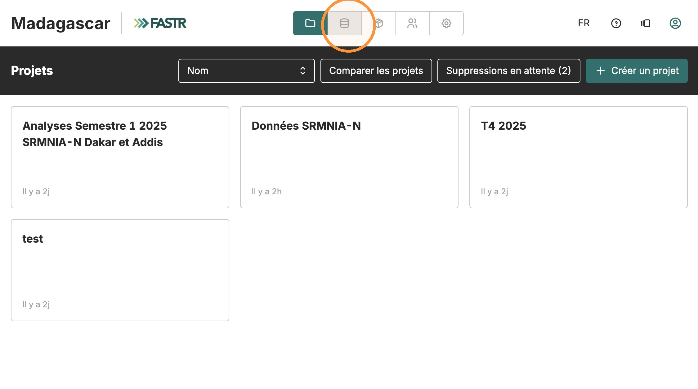

3. Cliquez sur la carte **Indicateurs**.

   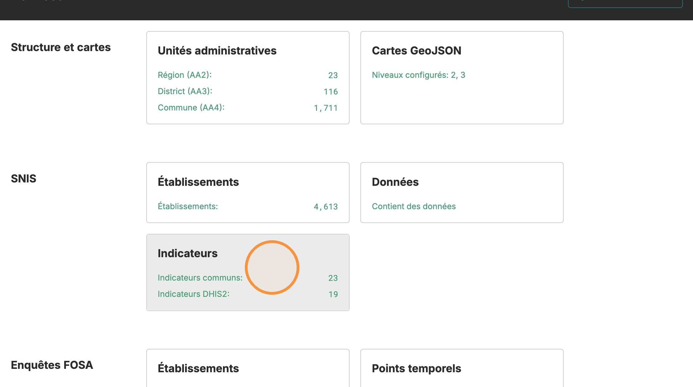

Vous arrivez sur une page à trois onglets : **Indicateurs communs**, **Indicateurs DHIS2**, **Indicateurs calculés**. Nous n'utiliserons que les deux premiers.

---

<div class="brand-line"><span class="rule"></span></div>

<h2 class="step-h"><span class="step-n">2</span><span>Importer l'indicateur depuis DHIS2</span></h2>

1. Ouvrez l'onglet **Indicateurs DHIS2**.

   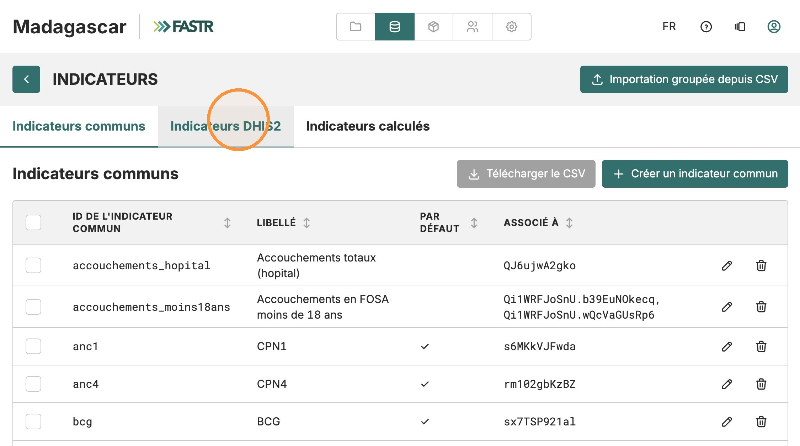

2. Cliquez sur **Importer un indicateur DHIS2**.

   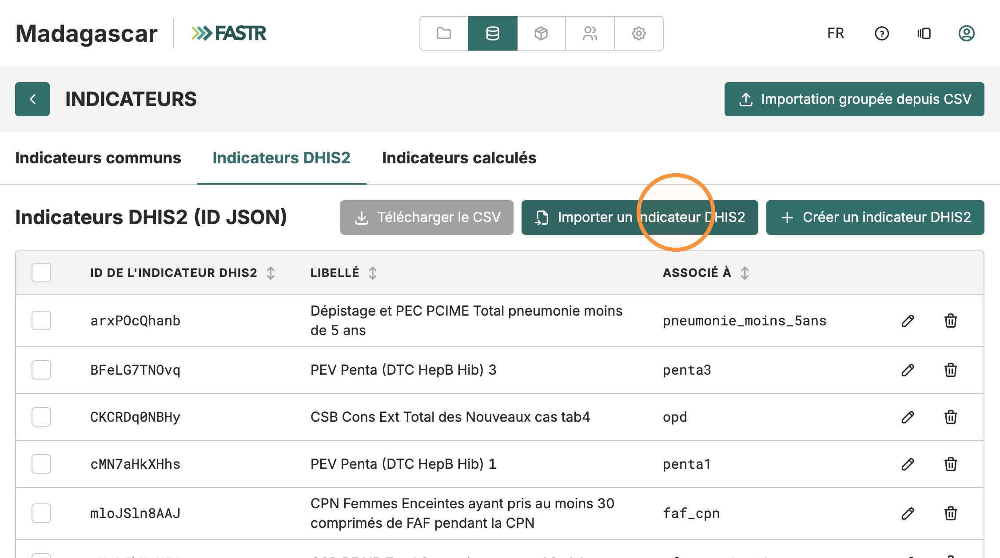

3. Dans le champ de recherche, collez l'**ID DHIS2** de l'indicateur — ou tapez son nom si vous ne connaissez pas l'ID.

   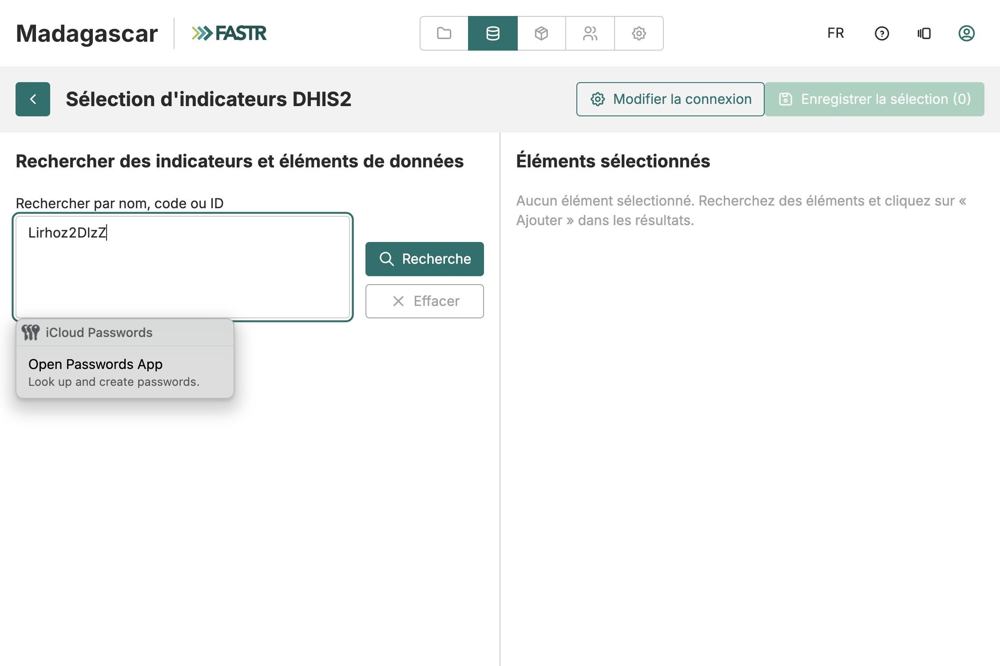

4. Cliquez sur **Recherche**.

---

<div class="brand-line"><span class="rule"></span></div>

> **Astuce :** vous pouvez chercher plusieurs indicateurs d'un coup en séparant les termes par des virgules ou des points-virgules. Un mot large comme `prénatal` ramène toute la famille d'indicateurs en une seule recherche.

5. Dans les résultats, cliquez sur **Ajouter** à côté de l'indicateur voulu. Il bascule dans la colonne **Éléments sélectionnés** à droite.

   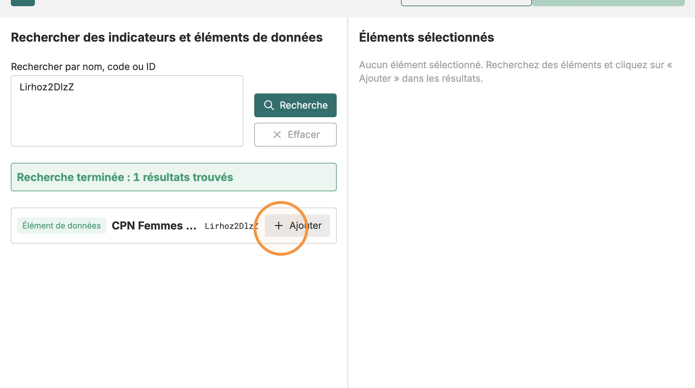

6. **Si vous cherchez un sous-groupe** (une tranche d'âge, un sexe, un type de structure), ne prenez pas la ligne principale. Voir l'encadré ci-dessous.
7. Répétez pour chaque indicateur à importer, puis cliquez sur **Enregistrer la sélection** en haut à droite.

   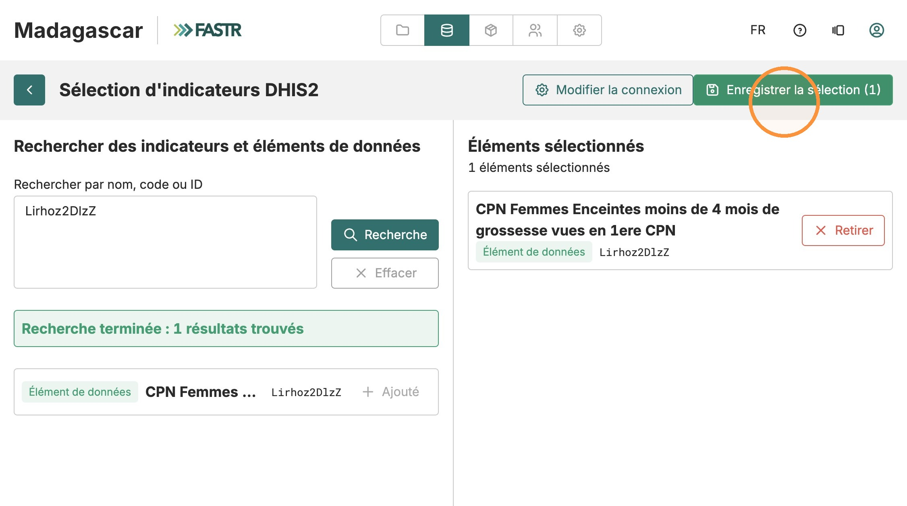

L'indicateur DHIS2 apparaît maintenant dans la liste de l'onglet **Indicateurs DHIS2**. À ce stade il est dans FASTR, mais encore relié à rien : il porte son code technique et personne ne peut l'utiliser dans une analyse.

---

<div class="brand-line"><span class="rule"></span></div>

## Trouver un sous-groupe : les désagrégations (COC)

Dans DHIS2, un même élément de données est souvent découpé en sous-groupes — tranches d'âge, sexe, type de structure. Ces découpages s'appellent des **COC** (*category option combos*).

Un COC n'apparaît **pas** directement dans les résultats de recherche. Il faut aller le chercher :

1. Recherchez l'**élément de données** lui-même, par son ID — dans notre exemple `Qi1WRFJoSnU`.
2. Sur la ligne de résultat, repérez le badge orange **« N COCs »**. Il indique que cet élément est désagrégé.
3. Cliquez sur le **chevron** à gauche de la ligne pour dérouler la liste des sous-groupes.
4. Chaque sous-groupe apparaît alors sur sa propre ligne, avec son ID complet sous la forme `élément.coc` — par exemple `Qi1WRFJoSnU.b39EuNOkecq`.
5. Cliquez sur **Ajouter** sur la ligne du sous-groupe voulu, pas sur celle de l'élément principal.

> **La différence est importante.** Ajouter la ligne principale (`Qi1WRFJoSnU`) récupère **tous** les accouchements, tous âges confondus. Ajouter les lignes COC récupère précisément les tranches d'âge qui vous intéressent. Si vous voulez « moins de 18 ans », ce sont les COC qu'il vous faut.

---

<div class="brand-line"><span class="rule"></span></div>

<h2 class="step-h"><span class="step-n">3</span><span>Créer l'indicateur commun et le relier</span></h2>

1. Revenez à l'onglet **Indicateurs communs**.

   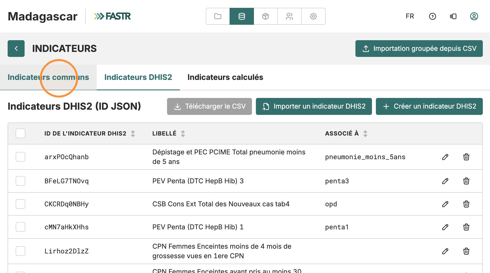

2. Vérifiez d'abord que l'indicateur commun n'existe pas déjà dans la liste. S'il existe, cliquez sur son **icône crayon** et passez directement au point 5.
3. Sinon, cliquez sur **Créer un indicateur commun**.

   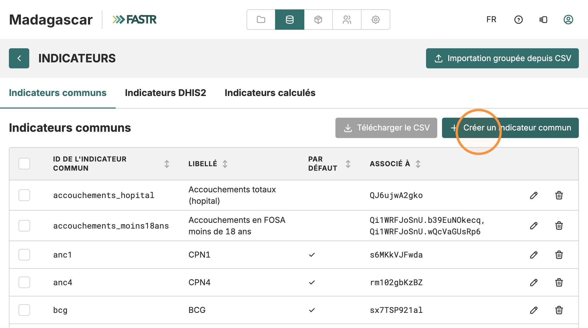

4. Remplissez les deux champs :
   - **ID commun** — le nom technique, p. ex. `cpn1_avant_4mois`. **Minuscules, sans accents, sans espaces** ; les tirets bas sont acceptés.
   - **Libellé** — le nom affiché à l'écran, p. ex. « CPN1 avant 4 mois de grossesse ». Accents et espaces autorisés.

---

<div class="brand-line"><span class="rule"></span></div>

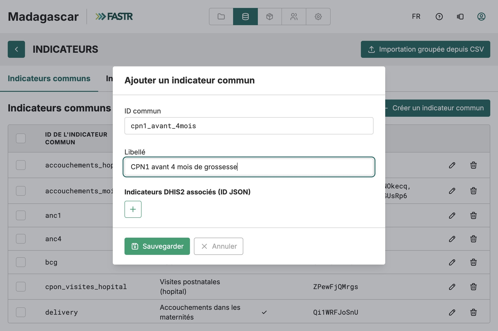

---

<div class="brand-line"><span class="rule"></span></div>

## Pourquoi deux champs ? ID et libellé ne servent pas à la même chose

C'est la question qui revient le plus souvent. Les deux champs décrivent le même indicateur, mais ils s'adressent à des publics différents.

### L'ID commun — pour la machine

L'ID est un **nom de variable**. Il est utilisé par le code d'analyse, les modules et les fichiers exportés. D'où les règles strictes : minuscules, chiffres et tirets bas uniquement, ni accents ni espaces.

Ce n'est pas une coquetterie technique. Un accent ou un espace dans un nom de variable casse les scripts d'analyse et les exports CSV. C'est aussi pourquoi **un ID ne peut plus être modifié après création** : d'autres éléments y font déjà référence.

Une convention cohérente rend la liste lisible quand elle atteint cent lignes. Nous préfixons par domaine : `cpn1_…` pour les consultations prénatales, `nut_…` pour la nutrition. Les indicateurs d'une même famille se retrouvent ainsi côte à côte au tri alphabétique.

### Le libellé — pour les humains

Le libellé est le nom affiché partout dans la plateforme : listes déroulantes, tableaux, et surtout **titres et légendes des graphiques**. Accents, espaces et majuscules sont autorisés, et attendus.

C'est le texte que verra quelqu'un qui découvre le graphique sans vous à côté pour l'expliquer. Deux qualités comptent :

- **Clair** — « CPN1 femmes 15-17 ans » se comprend seul. « CPN1 g2 » non.
- **Concis** — sur un axe de graphique, un libellé long est tronqué ou illisible. Visez une poignée de mots.

> **Le test à faire.** Imaginez le libellé sur la légende d'un graphique projeté en réunion. Est-ce qu'un collègue d'un autre service comprend de quoi il s'agit, sans explication et sans plisser les yeux ? Si oui, c'est le bon libellé.

Inutile de répéter dans le libellé ce que le graphique dit déjà. Si le graphique porte déjà sur la nutrition, « Retard de croissance moins de 5 ans » suffit — n'ajoutez pas « Nutrition — Surveillance nutritionnelle… ». Le nom DHIS2 complet reste consultable, mais il est trop long pour un axe.

---

<div class="brand-line"><span class="rule"></span></div>

5. Sous **Indicateurs DHIS2 associés (ID JSON)**, cliquez sur le bouton **+**, puis choisissez dans le menu déroulant l'indicateur DHIS2 importé à l'étape 2.

   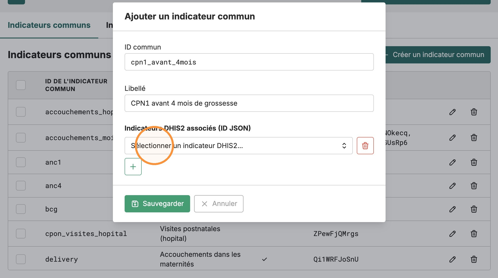

6. Cliquez sur **Sauvegarder**.

## Vérification

De retour sur la liste des **Indicateurs communs**, votre nouvel indicateur apparaît avec son code DHIS2 dans la colonne **Associé à**. C'est le signe que le lien est fait.

> **Plusieurs codes pour un seul indicateur commun ?** C'est permis, et souvent nécessaire. Ajoutez-en autant que voulu avec le bouton **+** : FASTR **additionne** leurs valeurs.

**L'exemple que nous avons fait ensemble.** L'indicateur commun `accouchements_moins18ans` (« Accouchements en FOSA moins de 18 ans ») est associé à **deux** codes DHIS2 :

```
Qi1WRFJoSnU.b39EuNOkecq
Qi1WRFJoSnU.wQcVaGUsRp6
```

La partie avant le point est la même : `Qi1WRFJoSnU`, l'élément de données « accouchements ». Ce qui change, c'est la partie après le point — la **désagrégation** (tranche d'âge). Dans DHIS2, les accouchements de moins de 18 ans sont saisis dans deux cases d'âge distinctes. Il n'existe donc aucun code unique pour « moins de 18 ans ».

En associant les deux à un même indicateur commun, vous reconstituez le total : FASTR fait la somme des deux cases et vous obtenez un seul chiffre utilisable dans les analyses.

---

<div class="brand-line"><span class="rule"></span></div>

## Que faire si ça ne marche pas

- **L'ID commun est refusé** — il contient une virgule, un point-virgule, un deux-points, ou dépasse 128 caractères. Tenez-vous-en aux minuscules, chiffres et tirets bas.
- **La recherche DHIS2 ne renvoie rien** — vérifiez l'orthographe de l'ID, essayez le nom au lieu de l'ID, ou vérifiez que votre compte DHIS2 a accès aux métadonnées.
- **Un formulaire de connexion DHIS2 apparaît** — normal si aucune connexion n'est enregistrée pour cette instance. Saisissez vos identifiants ; ils ne valent que pour la session. Le bouton **Modifier la connexion** permet d'en changer.
- **L'indicateur DHIS2 n'est pas dans le menu déroulant** — il n'a pas été importé. Retournez à l'étape 2.
- **Vous vous êtes trompé d'ID commun** — un ID ne peut pas être modifié après création, car les données existantes y font référence. Supprimez l'indicateur et recréez-le.

## Bon à savoir

L'indicateur commun est ce que verront les analystes partout dans la plateforme. Choisissez un ID court et descriptif, et un libellé que quelqu'un d'autre comprendra sans explication.

---

<div class="brand-line"><span class="rule"></span></div>

# À faire — équipe Madagascar

<p class="meta-line"><strong>4 indicateurs à ajouter</strong></p>

Pour chacun des quatre indicateurs ci-dessous, appliquez la procédure complète : **étape 2** (importer le code DHIS2), puis **étape 3** (créer l'indicateur commun et l'associer).

Ce sont des éléments de données simples, sans désagrégation. Vous n'avez donc **pas** besoin de dérouler les COC — recherchez l'ID, cliquez sur **Ajouter** sur la ligne principale.

| ID DHIS2 | ID commun | Libellé |
|---|---|---|
| `naBJZSepUeV` | `cpn1_faf` | CPN1 femmes ayant reçu FAF |
| `qnL45tcZRpB` | `cpn1_15_17` | CPN1 femmes 15-17 ans |
| `xszA8v2QOOX` | `nut_retard_croissance_moins_5ans` | Retard de croissance moins de 5 ans |
| `xWYKMcj6CKu` | `nut_insuf_ponderale_moins_5ans` | Insuffisance pondérale moins de 5 ans |

> **Notez la différence.** Les **libellés** ci-dessus portent leurs accents — c'est ce que verront les utilisateurs. Les **ID communs** n'en ont pas, et c'est voulu. Les **noms DHIS2** en bas de page sont recopiés tels quels depuis DHIS2, sans accents : ne les corrigez pas, sinon la recherche ne trouvera plus rien.

---

<div class="brand-line"><span class="rule"></span></div>

## À quoi correspond chaque code dans DHIS2

Utile pour vérifier que vous avez bien importé le bon élément — le nom qui s'affiche dans les résultats de recherche doit correspondre.

| ID commun | Nom dans DHIS2 |
|---|---|
| `cpn1_faf` | CPN Femmes Enceintes vues en 1ere CPN ayant recu FAF |
| `cpn1_15_17` | CPN Femmes Enceintes entre 15 - 17 ans vues en 1ere CPN |
| `nut_retard_croissance_moins_5ans` | Nutrition Surveillance nutritionnelle des enfants moins de 5 ans T/A inf -2 ZS Retard de croissance |
| `nut_insuf_ponderale_moins_5ans` | Nutrition Surveillance nutritionnelle des enfants moins de 5 ans P/A inf -2 ZS Insuf pond. |

> **Vérification finale.** Une fois les quatre faits, l'onglet **Indicateurs communs** doit afficher les quatre nouveaux ID, chacun avec son code DHIS2 dans la colonne **Associé à**. Si la colonne est vide pour l'un d'eux, l'association n'a pas été enregistrée — rouvrez-le avec l'icône crayon et refaites l'étape 3, point 5.

---

<div class="brand-line"><span class="rule"></span></div>

# Et après ? Récupérer les données, puis générer un paquet de résultats

<p class="meta-line"><strong>Deuxième partie</strong> · <strong>~15 min + le temps des traitements</strong></p>

Créer un indicateur ne récupère **aucune donnée**. Vous n'avez posé qu'une étiquette vide : FASTR sait désormais que `cpn1_faf` existe et à quel code DHIS2 il correspond, mais aucun chiffre n'a encore été téléchargé.

Il reste deux gestes, et l'ordre compte.

## Comprendre : l'instance, le paquet, les projets

FASTR range les données à trois niveaux.

- L'**instance** (Madagascar) contient **la base centrale**. C'est là qu'arrivent les données téléchargées depuis DHIS2. Il y en a une seule.
- Le **paquet de résultats** est un ensemble d'analyses **déjà calculées** sur ces données, généré au niveau de l'instance.
- Chaque **projet** lit ses chiffres dans **le paquet qu'on lui a rattaché**. Un projet ne lit jamais la base centrale en direct.

> **L'analogie :** l'instance est l'entrepôt, le projet est votre étagère. Une livraison arrive à l'entrepôt, mais votre étagère ne se remplit pas toute seule — l'entrepôt prépare un **carton complet** (le paquet), et votre étagère reçoit ce carton.

La conséquence pratique : **tout ce que vous changez au niveau de l'instance reste invisible dans les projets** jusqu'à ce qu'un **nouveau paquet de résultats** soit généré et rattaché. Vos quatre nouveaux indicateurs ne font pas exception.

---

<div class="brand-line"><span class="rule"></span></div>

<h2 class="step-h"><span class="step-n">4</span><span>Télécharger les données depuis DHIS2</span></h2>

1. Cliquez sur **Données** dans la barre du haut, puis, dans la section **SNIS**, sur la carte **Données**.

   

2. Cliquez sur **Importations**, puis sur **Nouvelle importation DHIS2**. L'assistant compte cinq étapes : **Identifiants**, **Indicateurs**, **Heure**, **Configuration**, **Vérifier et lancer**.

   

3. **Identifiants** — la connexion DHIS2 enregistrée s'affiche. Cliquez sur **Suivant**.

   

---

<div class="brand-line"><span class="rule"></span></div>

4. **Indicateurs** — cochez les indicateurs à télécharger, **y compris vos quatre nouveaux**. Puis **Suivant**.

   

---

<div class="brand-line"><span class="rule"></span></div>

5. **Heure** — choisissez **Maintenant** pour lancer l'importation tout de suite, puis **Suivant**.

   

6. **Configuration** — réglez la **plage de périodes** avec les deux curseurs : la fenêtre de mois à télécharger. Puis **Suivant**.

   

7. **Vérifier et lancer** — relisez le récapitulatif, puis cliquez sur **Démarrer l'importation**.

   

L'importation tourne sur le serveur. Selon la période et le nombre d'indicateurs, comptez de quelques minutes à beaucoup plus. Vous pouvez fermer l'onglet : la page **Importations** → **Historique** vous dit quand elle est terminée. **Attendez la fin avant le geste suivant** — un paquet généré trop tôt calculerait sur les anciennes données.

> **Prenez la même période que les données existantes.** Un indicateur ajouté aujourd'hui n'a pas d'historique tant que vous ne l'avez pas téléchargé. Si vos autres indicateurs remontent à 2019 et que vous n'importez que 2026 pour les nouveaux, les graphiques comparatifs auront des trous.

---

<div class="brand-line"><span class="rule"></span></div>

<h2 class="step-h"><span class="step-n">5</span><span>Générer un paquet de résultats et le rattacher</span></h2>

Les données sont maintenant dans la base centrale, mais aucune analyse ne s'est recalculée. C'est le rôle du paquet.

1. Cliquez sur **Résultats** dans la barre du haut. La page **Paquets de résultats** liste les paquets existants, avec la date de chacun et les projets qui l'utilisent.

   

2. Cliquez sur **Générer un nouveau paquet de résultats**. L'assistant compte trois étapes.
3. **Données** — cochez **Données HMIS**. Puis **Suivant**.

   

4. **Modules** — cochez les modules d'analyse habituels de votre instance. Si un module en nécessite un autre, FASTR l'ajoute tout seul. Puis **Suivant**.

   

---

<div class="brand-line"><span class="rule"></span></div>

5. **Confirmer et lancer** — gardez le libellé proposé, ou nommez le paquet plus clairement. Sous **Rattacher aux projets**, **cochez les projets qui doivent voir les nouveaux indicateurs** — pour nous, **Données SRMNIA-N**. Cliquez sur **Lancer la génération**.

   

La génération tourne en arrière-plan ; la progression s'affiche sur la page Paquets de résultats. Dès qu'elle réussit, les projets cochés basculent sur le nouveau paquet — vos quatre indicateurs compris.

## Vérifier que le projet a bien basculé

Ouvrez le projet et allez dans son onglet **Paquet de résultats** : le nom du paquet utilisé et sa date de génération s'affichent. Vos nouveaux indicateurs apparaissent maintenant dans les listes du projet.


> **Un projet oublié ?** Ouvrez-le, onglet **Paquet de résultats**, choisissez le nouveau paquet et cliquez sur **Utiliser ce paquet**. Et le réglage qui simplifie tout : sur la page **Résultats**, **épinglez** le paquet de référence, puis cochez dans chaque projet **« Toujours utiliser le paquet épinglé de l'instance »** — la routine devient : importer, générer, épingler.

---

<div class="brand-line"><span class="rule"></span></div>

## Récapitulatif

| Étape | Où | Effet |
|---|---|---|
| Créer l'indicateur | Instance → Indicateurs | Crée l'étiquette, aucune donnée |
| Importer depuis DHIS2 | Données → SNIS → Données → Importations | Remplit la base centrale |
| Générer un paquet et le rattacher | Résultats → Générer un nouveau paquet | Recalcule les analyses ; les projets basculent |

Si un chiffre manque à l'arrivée, reprenez ce tableau de bas en haut : le projet est-il sur le bon paquet, la donnée est-elle dans l'instance, l'indicateur est-il bien associé à son code DHIS2 ?
