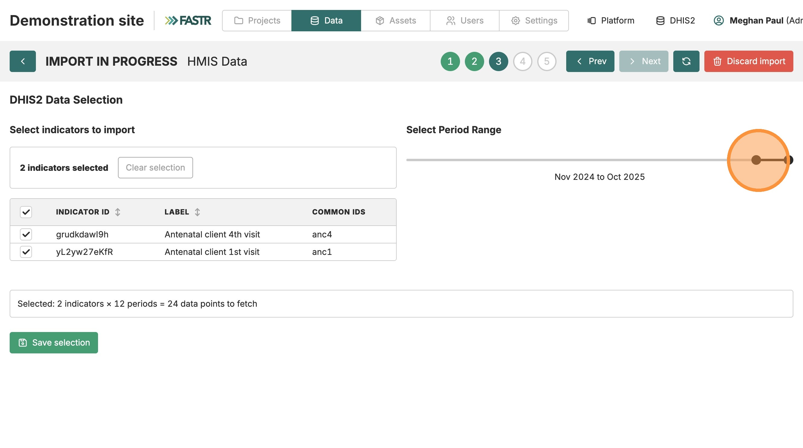
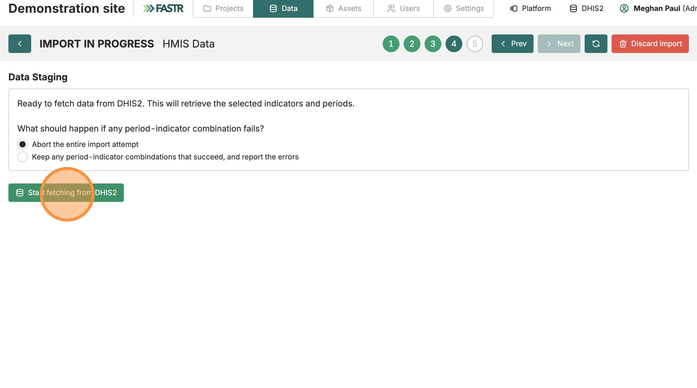
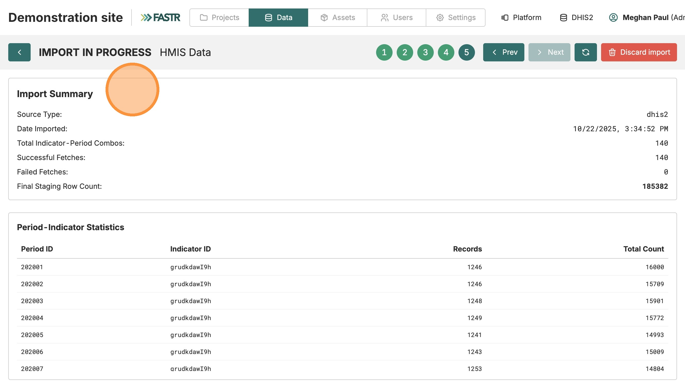

Avant de commencer → 1. Établissements → 2. Indicateurs → 3. Données → 4. Vérifier

# Importer les données HMIS

<strong>Configuration de l'instance</strong> · <strong>~25 min</strong>

## Avant de commencer

- ☐ Établissements importés (la page des unités administratives est verte)
- ☐ Indicateurs importés et mappés (chaque indicateur DHIS2 a un lien vers un indicateur commun)
- ☐ Vous avez décidé de la **plage temporelle** à importer (p. ex. 36 derniers mois — discutez avec votre équipe)

## Ce que vous allez faire

Récupérer les vraies valeurs de données depuis DHIS2 pour vos indicateurs et la plage choisie. C'est la plus grosse opération de l'installation — selon la taille du pays, elle peut prendre 5 à 30 minutes.

## Étapes

### 1. Ouvrir l'importation HMIS Data

Depuis la page **Données**, cliquez sur **HMIS Data**, puis **Nouvelle importation**.

### 2. Choisir « Importer depuis DHIS2 »

Même option que pour les établissements. Cliquez sur **Sauvegarder**.

> Si vous avez coché **Save credentials for this session** plus tôt (dans zones administratives ou indicateurs), la plateforme saute le formulaire de connexion ici. Sinon il s'affiche maintenant — mêmes champs qu'avant.

---

### 3. Sélectionner les indicateurs et la plage

- Cochez chaque indicateur pour lequel vous voulez des données.
- Définissez la **plage temporelle** avec le curseur — soyez délibéré (3 ans de données mensuelles ≈ 36 périodes × N établissements, ça monte vite).

Cliquez sur **Save selection**.

### 4. Configurer la gestion des erreurs

Sur l'écran de configuration d'importation, vérifiez que **Abort the entire import attempt** est sélectionné. Cela garantit l'intégrité : si une combinaison indicateur-période échoue, *toute* l'importation est annulée. Vous n'aurez pas de données partielles.

Cliquez sur **Start fetching from DHIS2**.

---

### 5. Suivre la progression

Un indicateur de progression montre le compteur de combinaisons indicateur-période récupérées.

> ⚠ **Ne fermez pas l'onglet.** La récupération tourne dans votre session navigateur.

### 6. Examiner le résumé

Une fois la récupération terminée, cliquez sur **Import Summary** pour voir :

- Source (URL DHIS2)
- Date
- Récupérations réussies vs échouées
- Total de lignes en attente d'intégration

### 7. Intégrer

Si le résumé semble correct, cliquez sur **Integrate and finalize**. Patientez jusqu'à la fin de la barre de progression.

### 8. Nettoyer

Cliquez sur **Remove completed upload form** pour nettoyer l'interface. Vos données importées restent en place — vous masquez juste le formulaire.

## Vérification

La page HMIS Data affiche maintenant vos indicateurs sous forme de graphique, avec les valeurs qui défilent dans le temps.

---

## Que faire si ça ne marche pas

- **« Failed: X combinations »** — généralement, une combinaison établissement-indicateur n'a pas de données dans DHIS2 pour cette période. Si quelques-unes seulement, vous pouvez ré-importer avec une sélection plus étroite. Si beaucoup, vérifiez votre mapping d'indicateurs (Phase 3 de *Importer les indicateurs*).
- **Le navigateur fige / onglet ne répond plus** — les gros tirages (1000+ établissements × 36 mois × 10 indicateurs) sollicitent le navigateur. Réduisez le nombre d'indicateurs ou raccourcissez la plage temporelle et tirez par lots.
- **Le réseau coupe en plein milieu** — le réglage *abort the entire import* vous protège ici. Relancez avec la même sélection.

> 🔎 **Vérifiez dans votre interface actuelle** : les écrans d'importation et libellés peuvent différer des captures ; le flux reste le même.

## Étape suivante

Dernière étape : **Vérifier et explorer** — confirmer que tout est correct et apprendre à naviguer dans vos données.
