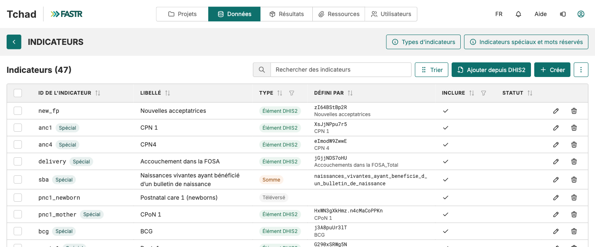
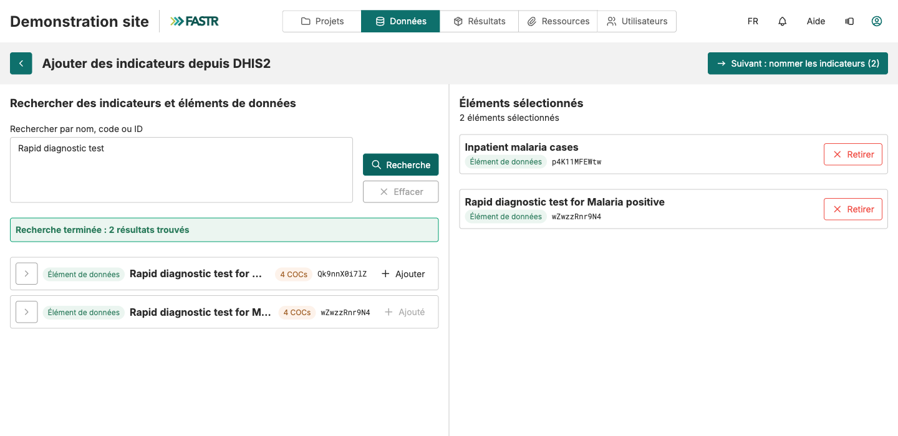
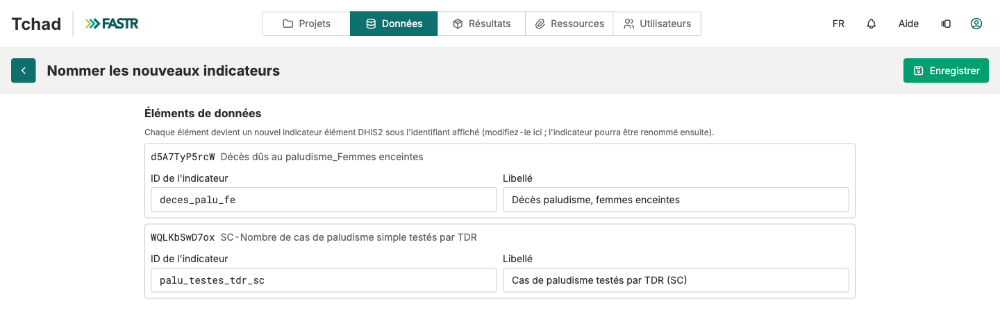
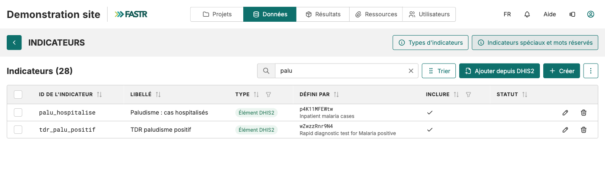

Structure des établissements → Indicateurs → Données → Vérifier

# Ajouter les indicateurs

<strong>Configuration de l'instance</strong> · <strong>~30 min</strong>

<aside class="p1-sidebar">

Avant de commencer

- ☐ Vous avez terminé **Se connecter à la plateforme** et **Importer la structure des établissements**
- ☐ Votre **Liste de préparation des données FASTR** est ouverte à la feuille *Modèle de correspondance des indicateurs* : vous utiliserez la colonne **C — INDICATEUR D'INTÉRÊT** (ex. CPN1, CPN4) et la colonne **G — NOM OFFICIEL DANS DHIS2**

Pourquoi c'est important

Sans indicateurs, FASTR ne sait pas quoi télécharger depuis DHIS2 ni sous quel nom l'analyser.

</aside>

## Ce que vous allez faire

Pour chaque indicateur de votre liste, trois gestes dans un seul écran :

1. **Le chercher** dans DHIS2, depuis FASTR
2. **Lui donner un nom** : un ID court (ex. `anc1`) et un libellé lisible (ex. « CPN 1ère visite »)
3. **Enregistrer**

Tous les indicateurs vivent dans **un seul tableau**. Chaque ligne porte un type : **Élément DHIS2** (récupéré depuis DHIS2), **Téléversé** (fichier CSV), **Somme** ou **Calculé** (formule). Ici, vous créez des éléments DHIS2.

---

<h2 class="step-h">1Ouvrir la liste des indicateurs</h2>

1. Cliquez sur **Données** dans la barre du haut, puis, dans la section **SNIS**, sur la carte **Indicateurs**.
2. Regardez la **liste par défaut**. Chaque ligne affiche l'**ID de l'indicateur**, son **libellé**, son **type** et la colonne **Défini par** (le code DHIS2 et son nom d'origine). Si un indicateur de votre liste existe déjà, passez-le.

> **Les lignes marquées « Spécial »** sont lues par leur ID par les modules d'analyse (`anc1`, `delivery`, `bcg`…). Gardez ces ID tels quels : remplissez-les avec le bon code DHIS2 plutôt que d'en créer d'autres.

---

<h2 class="step-h">2Chercher dans DHIS2</h2>

1. Cliquez sur **Ajouter depuis DHIS2**, en haut à droite de la liste. FASTR utilise la **connexion DHIS2 enregistrée** de l'instance (carte **Connexion DHIS2** de la page Données, la même qu'à l'étape précédente).
2. Dans le champ de recherche, tapez un terme de la colonne **G — NOM OFFICIEL DANS DHIS2** (ex. `prénatal`) ou collez l'ID DHIS2. Cliquez sur **Recherche**.
3. Dans les résultats, cliquez sur **Ajouter** à côté de chaque élément voulu. Il passe dans la colonne **Éléments sélectionnés**.

4. Cherchez un autre terme si besoin ; la sélection est conservée. Puis cliquez sur **Suivant : nommer les indicateurs (N)**.

> **Astuce :** un mot large (`vaccin`, `accouchement`) ramène toute la famille d'un coup. Les lignes grisées « Ne peut pas être ajouté » ne sont pas des dénombrements mensuels. **Sous-groupe** (tranche d'âge, sexe) ? Déroulez le **chevron** de la ligne et ajoutez la ligne **COC** voulue, pas la ligne principale.

---

<h2 class="step-h">3Nommer, puis enregistrer</h2>

FASTR propose un **ID** et un **libellé** pour chaque élément, à partir du nom DHIS2. Remplacez-les :

- **ID de l'indicateur** : le nom technique. **Minuscules, chiffres et tirets bas seulement**, pas d'accent, pas d'espace (ex. `mam_nouveau`). Pour un indicateur de la liste FASTR, utilisez son ID standard (`anc1`, `anc4`, `penta1`…).
- **Libellé** : le nom affiché dans les graphiques. Accents et espaces autorisés ; prenez la colonne **C — INDICATEUR D'INTÉRÊT**.

Cliquez sur **Enregistrer**. Répétez les étapes 2 et 3 jusqu'à ce que toute votre liste soit couverte.

## Point de contrôle

De retour sur la liste, chaque nouvel indicateur apparaît avec le badge **Élément DHIS2**, son code DHIS2 dans **Défini par** et une coche dans **Inclure**. Le compteur **Indicateurs (N)** a augmenté d'autant.

---

## Ce qui peut mal tourner

- **« … existe déjà ; choisissez un autre identifiant »** : l'ID est déjà pris. Ouvrez l'indicateur existant avec le crayon et changez son code DHIS2, ou choisissez un autre ID.
- **« Déjà ajouté sous … »** : ce code DHIS2 est déjà dans FASTR. Rien à créer.
- **L'ID est refusé** : accent, espace, virgule, crochet, ou mot réservé. Minuscules, chiffres et tirets bas.
- **La recherche DHIS2 ne renvoie rien** : autre terme, ou vérifiez que l'utilisateur DHIS2 de la connexion a accès aux métadonnées.
- **« Aucune connexion DHIS2 n'est enregistrée »** : page **Données**, carte **Connexion DHIS2**, saisissez l'URL et les identifiants.
- **Deux codes DHIS2 pour un même indicateur** (deux tranches d'âge à additionner) : ajoutez les deux comme éléments, puis **Créer** → type **Somme**.

## Et ensuite

Les indicateurs sont définis mais **aucun chiffre n'a encore été téléchargé**. Passez à **Importer les données HMIS**.
