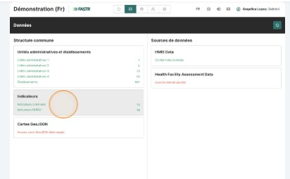
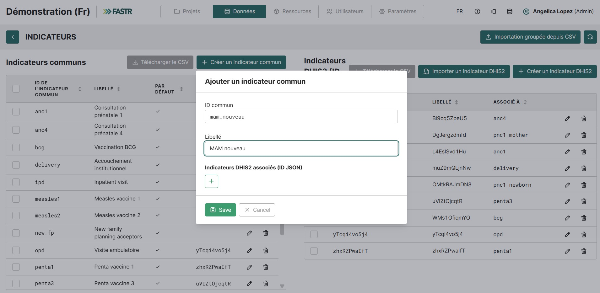
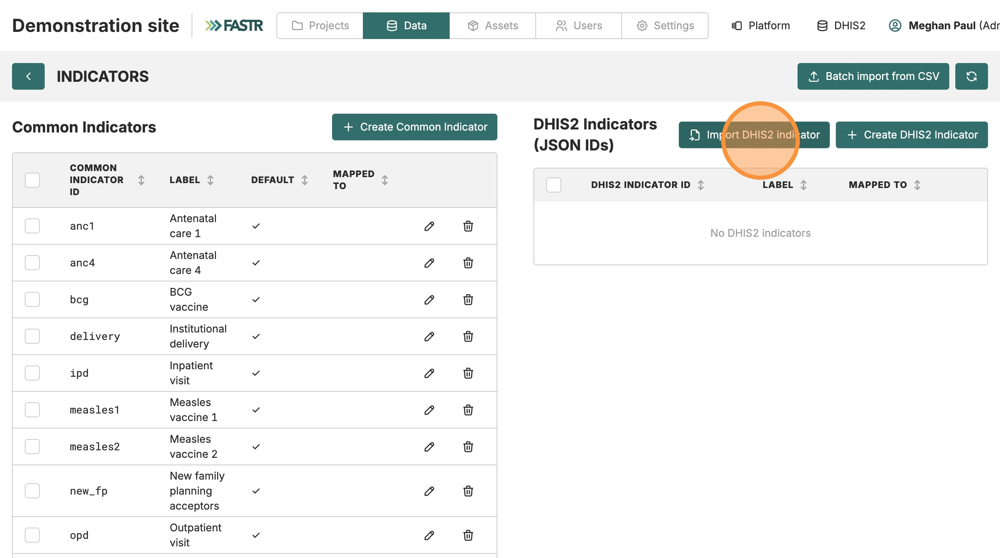
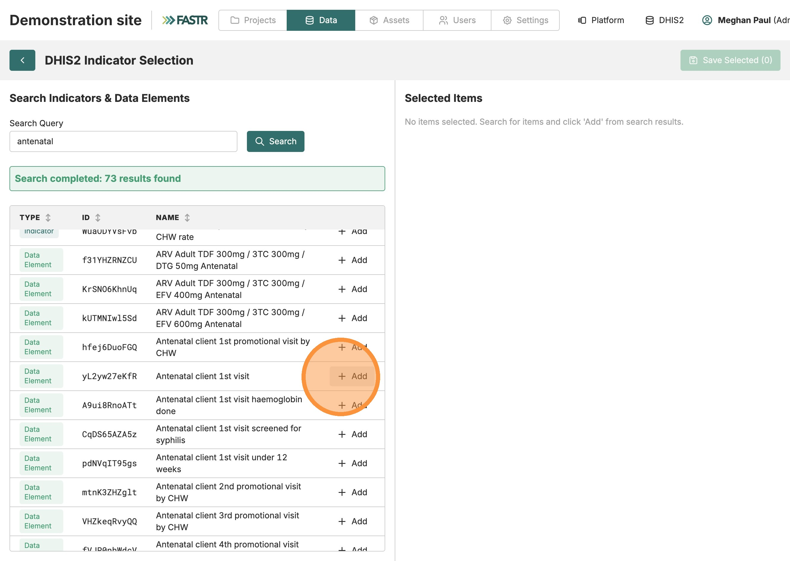
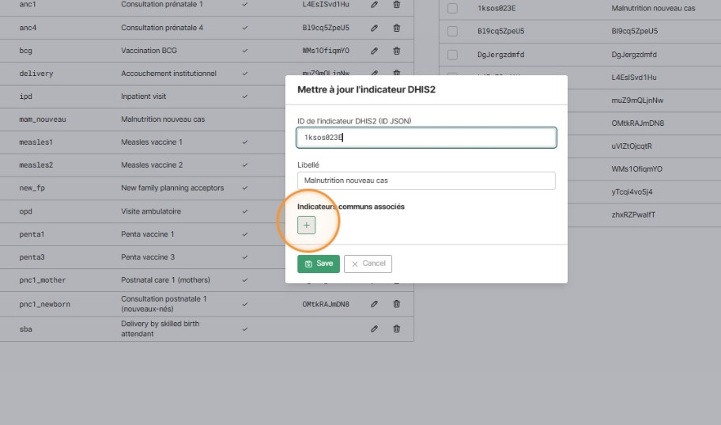
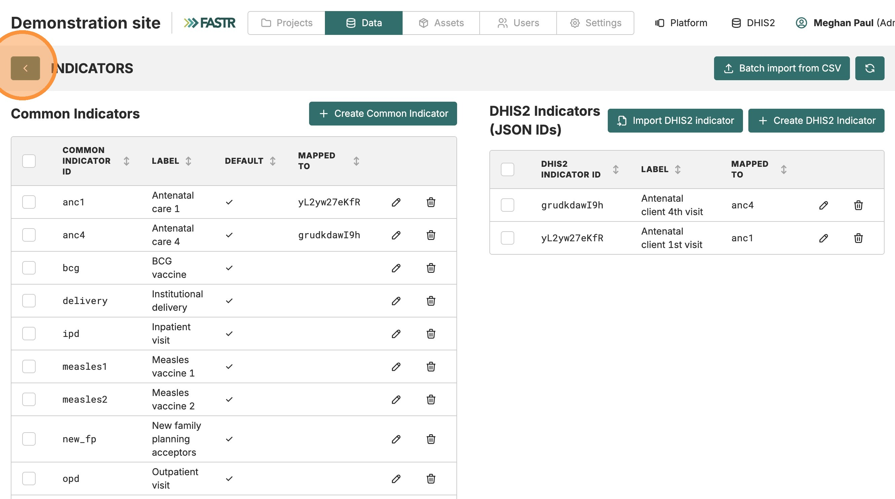

Établissements → Indicateurs → Données → Vérifier

# Importer et mapper les indicateurs

<strong>Configuration de l'instance</strong> · <strong>~30 min</strong>

<aside class="p1-sidebar">

Avant de commencer

- ☐ Vous avez complété **Se connecter à la plateforme** et **Importer la structure des établissements**
- ☐ Votre **Liste de vérification pour la préparation des données FASTR** est ouverte à l'onglet *Modèle de cartographie* — vous utiliserez la colonne **C — INDICATEUR D'INTÉRÊT** (p. ex. ANC1, ANC4) et la colonne **G — NOM OFFICIEL DE L'INDICATEUR DANS DHIS2**

Pourquoi c'est important

Sans mapping, FASTR peut tirer les données mais ne saura pas comment comparer entre pays ou entre analyses.

</aside>

## Ce que vous allez faire

Configurer les indicateurs en trois étapes :

1. **Créer des indicateurs communs** — noms génériques utilisés en interne par FASTR (p. ex. `anc1`, `anc4`)
2. **Importer les indicateurs DHIS2** — les noms spécifiques au pays issus de DHIS2 (p. ex. « Antenatal client 1st visit »)
3. **Mapper** chaque indicateur DHIS2 à son indicateur commun correspondant

---

<h2 class="step-h">1Créer les indicateurs communs</h2>

1. Dans la section **Données** (panneau de gauche), cliquez sur **Indicateurs**.

   

2. Consultez la **liste des indicateurs par défaut** — si vos indicateurs y sont déjà, passez à l'étape 2. Vous pouvez renommer un indicateur par défaut via l'icône crayon si nécessaire.
3. Pour ajouter un nouvel indicateur, cliquez sur **Créer un indicateur commun** (en haut à gauche).
4. Dans le formulaire, remplissez :
   - **ID commun** — le nom de la variable. **Pas d'accents, pas d'espaces**. Tirets bas (_) acceptés (p. ex. `mam_nouveau`).
   - **Libellé** — le nom affiché (accents et espaces autorisés ; utilisez la colonne **C — INDICATEUR D'INTÉRÊT** de votre *Modèle de cartographie*).

   

5. **Répétez pour chaque indicateur** de votre *Modèle de cartographie*.

---

<h2 class="step-h">2Importer les noms d'indicateurs DHIS2</h2>

1. Cliquez sur **Import DHIS2 indicator**.

   

> Si vous n'avez pas encore sauvegardé vos identifiants DHIS2 dans cette session, le formulaire de connexion apparaît ici — mêmes champs que dans *Importer la structure des établissements*. Cochez **Save credentials for this session**.

2. Dans le champ de recherche, tapez un terme issu de la colonne **G — NOM OFFICIEL DE L'INDICATEUR DANS DHIS2** de votre *Modèle de cartographie* (p. ex. `antenatal` pour les soins prénatals).
3. Cliquez sur **Search**. Les résultats apparaissent dans la liste.
4. Cliquez sur l'icône **Ajouter** à côté de chaque indicateur souhaité. La colonne de droite (« Selected ») se remplit.

   

5. Répétez pour chaque indicateur (changez de terme de recherche selon les besoins). Une fois terminé, cliquez sur **Save Selected (N)** en haut à droite.

> **Astuce :** Cherchez des termes larges (p. ex. `vaccine`, `delivery`) pour voir tous les indicateurs DHIS2 liés d'un coup — plus rapide qu'un par un.

---

<h2 class="step-h">3Mapper les indicateurs DHIS2 aux indicateurs communs</h2>

Pour chaque indicateur DHIS2 importé, liez-le à son correspondant commun :

1. Cliquez sur l'**icône crayon (modifier)** à côté de l'indicateur DHIS2.
2. Dans le panneau qui s'ouvre, cliquez sur l'**icône +** sous *Indicateurs communs associés*.

   

3. Sélectionnez l'indicateur commun correspondant dans le menu déroulant.
4. Cliquez sur **Save**.
5. **Répétez pour chaque indicateur DHIS2.**

## Vérification

De retour sur la page des indicateurs, vous devez voir chaque indicateur DHIS2 avec son indicateur commun mappé à côté.

---

## Que faire si ça ne marche pas

- **« ID commun rejeté »** — l'ID contient un espace, un accent ou un caractère spécial. Limitez-vous aux lettres minuscules et tirets bas.
- **La recherche DHIS2 ne retourne rien** — essayez un autre terme, ou vérifiez que votre utilisateur DHIS2 a accès aux métadonnées d'indicateurs.
- **Pas d'indicateur commun dans le menu déroulant** — retournez à l'étape 1 et créez-le d'abord.
- **Même indicateur DHIS2 mappé à deux indicateurs communs** — en général une erreur. Chaque indicateur DHIS2 doit pointer vers exactement un indicateur commun.

## Étape suivante

Avec les établissements et les indicateurs en place, vous êtes prêt à récupérer les vraies valeurs de données. Passez à **Importer les données HMIS**.
