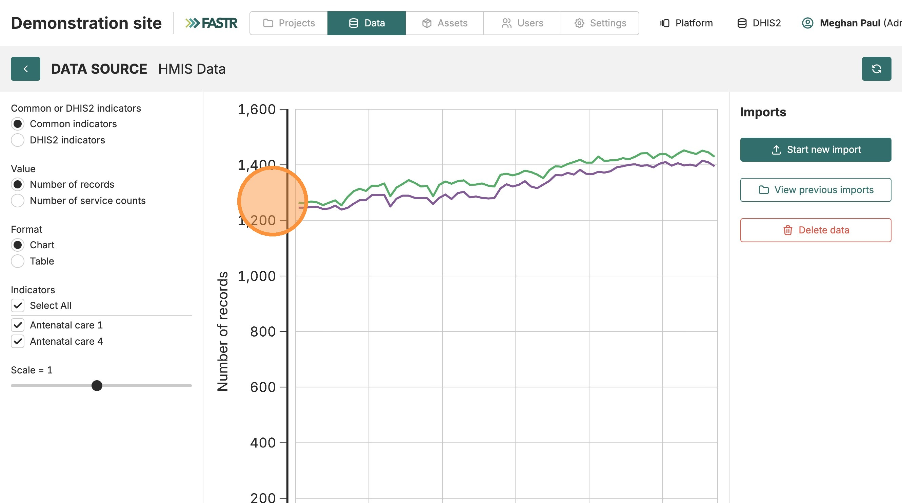
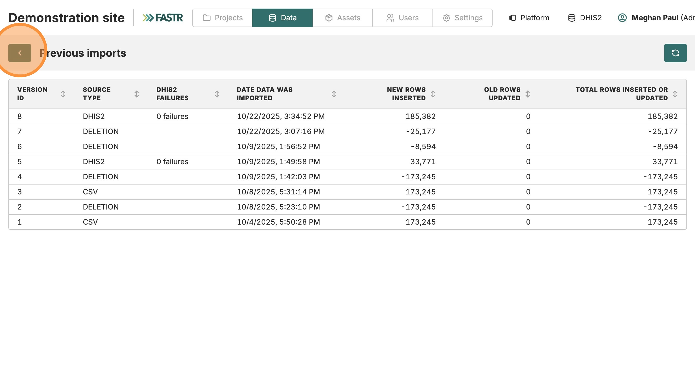

Avant de commencer → 1. Établissements → 2. Indicateurs → 3. Données → 4. Vérifier

# Vérifier et explorer votre installation

<strong>Configuration de l'instance</strong> · <strong>~10 min</strong>

## Avant de commencer

- ☐ Vous avez complété les quatre documents précédents (connexion / établissements / indicateurs / données)

## Ce que vous allez faire

Faire un contrôle ponctuel de vos données importées, apprendre à naviguer dans l'explorateur de graphiques, et confirmer que tout est prêt pour les modules d'analyse.

---

## Vérifications

### 1. Voir les données importées sous forme de graphique

Sur la page **HMIS Data**, vos indicateurs apparaissent en séries temporelles. Le panneau de gauche liste chaque indicateur importé.

### 2. Activer/désactiver des indicateurs sur le graphique

Dans le panneau de gauche, **cochez/décochez** les indicateurs pour les afficher ou les masquer. Utile pour comparer deux ou trois indicateurs à la fois sans encombrement.

### 3. Ajuster l'échelle de l'axe Y

Utilisez le curseur **Scale** en bas pour passer entre une échelle linéaire et un axe Y plus large quand un indicateur domine les autres.

---

### 4. Contrôle ponctuel d'une valeur connue

Choisissez une période (p. ex. le mois dernier) et un établissement que vous connaissez bien. Comparez mentalement la valeur reportée par FASTR à ce que vous attendriez de vos tableaux de bord DHIS2.

> Si elles correspondent → tout va bien. Si elles divergent fortement → vérifiez votre mapping d'indicateurs (cause la plus fréquente) avant de lancer une analyse.

### 5. Consulter l'historique d'importation

Cliquez sur **View previous imports** pour voir toutes les importations passées — date, source, nombre de lignes insérées/mises à jour. Utile pour suivre ce qui est chargé et quand.

## Vérification

De retour sur la page **Données**, vous devriez avoir :

- ✓ Unités administratives et établissements (vert)
- ✓ Indicateurs (mappés)
- ✓ Données HMIS (chargées avec valeurs qui défilent dans le temps)

Vous êtes prêt à lancer les modules d'analyse — qualité des données, utilisation des services, estimation de la couverture, etc.

---

## Que faire si ça ne marche pas

- **Toutes les valeurs apparaissent plates / à zéro** — la plage temporelle ne recoupe peut-être pas la période où DHIS2 a des données. Vérifiez votre plage et ré-importez.
- **Certains indicateurs apparaissent, d'autres non** — le mapping est incomplet. Retournez à la page des indicateurs et vérifiez que chaque indicateur DHIS2 a un lien d'indicateur commun.
- **Le graphique ne charge pas** — essayez un autre navigateur ; les graphiques FASTR utilisent des fonctionnalités web modernes que certains anciens navigateurs ne supportent pas.

> 🔎 **Vérifiez dans votre interface actuelle** : contrôles de graphique et disposition peuvent différer des captures ; le flux reste le même.

---

## Étape suivante

Installation terminée. Passez à **Premiers pas** (M9b) pour apprendre l'interface en profondeur, ou lancez directement votre premier module d'analyse.
