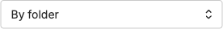
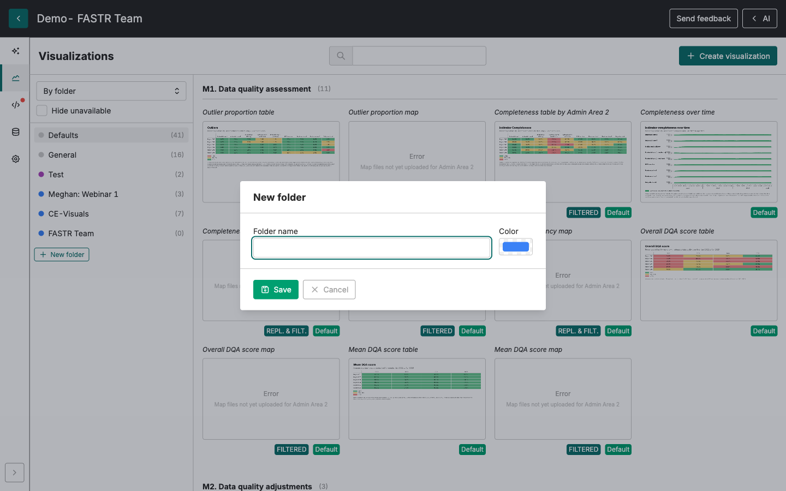
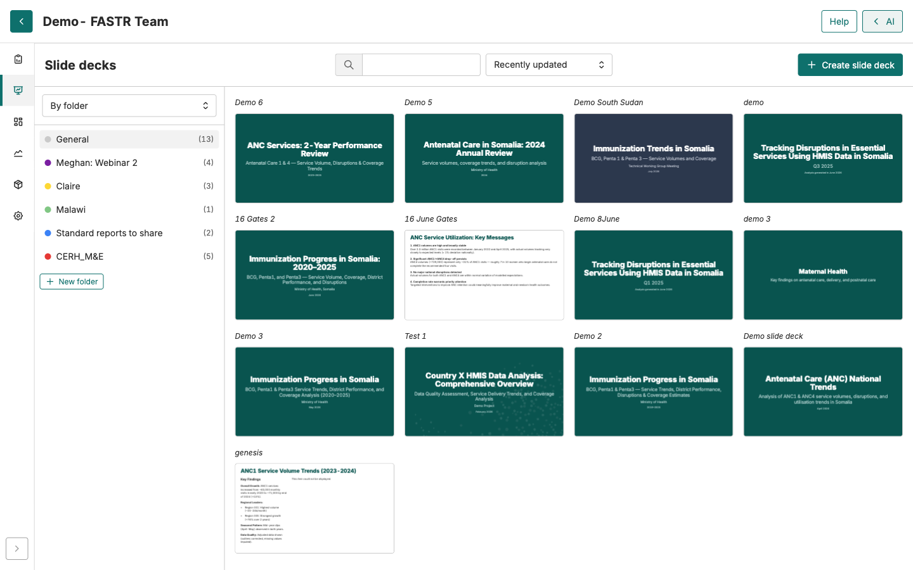

Connexion → Votre dossier

# Créer votre dossier personnel

<strong>Activité</strong> · <strong>Premiers pas</strong> · <strong>~5 min</strong>

<aside class="p1-sidebar">

Avant de commencer

- ☐ Vous avez complété **Connexion à la plateforme** (vous voyez les onglets de navigation principaux)
- ☐ Vous êtes dans le projet de votre pays

Pourquoi c'est important

Le projet pays se remplit vite. Une dizaine de personnes qui sauvegardent graphiques et présentations dans un espace partagé sans système signifie que personne ne retrouve rien plus tard. **Un dossier par personne** est la règle la plus simple qui fonctionne.

</aside>

## Ce que vous allez faire

Créer deux dossiers personnels — un dans **Présentations**, un dans **Visualisations** — pour garder votre travail organisé. Tout ce que vous y enregistrerez sera étiqueté avec votre nom pour que l'équipe voie qui a fait quoi.

---

<h2 class="step-h">1Dossier dans l'onglet Présentations</h2>

1. Cliquez sur l'onglet **Présentations** dans la navigation en haut.
2. Basculez l'affichage sur **Par dossier** (la bascule en haut — l'autre option est *Liste simple*). **Nouveau dossier** n'apparaît qu'en vue *Par dossier*.

3. Cliquez sur **Nouveau dossier**.
4. Tapez votre nom (p. ex. `Aïcha N.` ou `Jean S.`).
5. Cliquez sur **Enregistrer**.

Vous devriez voir votre nouveau dossier apparaître dans la liste. Cliquez dessus pour l'ouvrir — il est vide pour le moment, mais tout ce que vous créerez par la suite pourra y être enregistré.

---

<h2 class="step-h">2Dossier dans l'onglet Visualisations</h2>

Même idée, onglet différent — et la bascule d'affichage a quatre options ici :

1. Cliquez sur l'onglet **Visualisations**.
2. Basculez l'affichage sur **Par dossier** (la bascule propose *Par module*, *Par dossier*, *Par métrique* et *Liste plate*). **Nouveau dossier** n'est visible qu'en *Par dossier*.
3. Cliquez sur **Nouveau dossier**.
4. Tapez votre nom (utilisez le **même nom** que dans l'étape 1 pour que votre travail soit facile à retrouver entre onglets).
5. Cliquez sur **Enregistrer**.

## Vérification

Vous devriez maintenant avoir :

- Un dossier à votre nom dans **Présentations**
- Un dossier au **même nom** dans **Visualisations**

Les deux dossiers sont vides. C'est normal — les prochaines activités les rempliront.

## Conventions de nommage

> **Utilisez le même nom dans les deux onglets.** Des noms différents (p. ex. « Aïcha » dans l'un, « A. Niang » dans l'autre) rendent difficile pour l'équipe de retrouver vos affaires plus tard.

- Évitez les noms génériques comme « mon dossier » ou « test » — vos collègues de l'équipe pays créeront aussi des dossiers, et « test » entrera en conflit avec celui des autres.
- Les accents et espaces sont autorisés dans les noms de dossier.

## Que faire si ça ne marche pas

- **Le bouton « Nouveau dossier » n'apparaît pas** — vous êtes probablement dans la mauvaise vue. Basculez l'affichage sur **Par dossier** (et non *Liste plate* / *Par module* / *Par métrique*). S'il n'apparaît toujours pas, vous n'avez peut-être pas la permission — demandez à votre facilitateur de vérifier votre rôle.
- **Le dossier ne s'enregistre pas** — le réseau a peut-être coupé. Rafraîchissez la page et réessayez. Si le dossier existe déjà à votre nom, il s'affichera dans la liste.
- **Vous voyez les dossiers d'autres personnes** — c'est attendu. Toute l'équipe pays travaille dans le même projet, donc les dossiers personnels de chacun sont visibles. Le vôtre n'est qu'une ligne dans cette liste.

> 🔎 **Vérifiez dans votre interface actuelle** : les noms d'onglets et l'emplacement du bouton « Nouveau dossier » peuvent différer des anciennes captures. Le flux reste le même.

## Étape suivante

Configuration terminée. À partir d'ici, vous commencerez à lancer de vraies analyses — le prochain module couvre **Créer des visualisations**.
