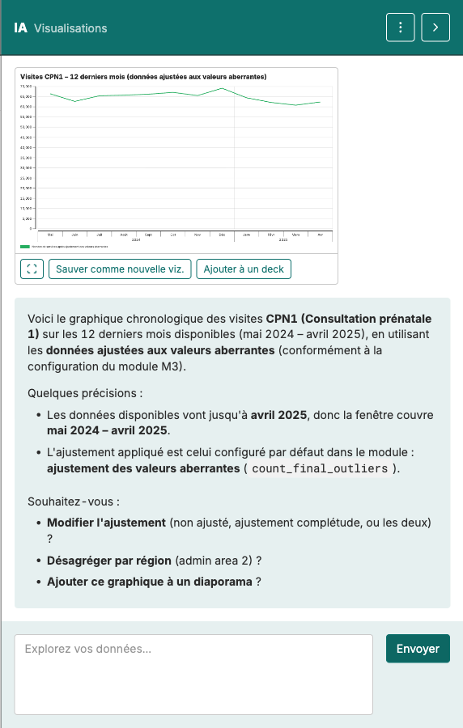

Lire une viz → Construire manuellement → Construire avec l'IA → Écrire l'interprétation → Interprétation IA → Repérer une perturbation

# Construire une visualisation avec l'Assistant IA

<strong>Activité</strong> · <strong>Visualisations et interprétation</strong> · <strong>~15 min</strong>

<aside class="p1-sidebar">

Avant de commencer

- ☐ Vous avez construit au moins un graphique manuellement (document précédent)
- ☐ Vous êtes connecté et votre dossier est ouvert
- ☐ Vous savez quel indicateur vous voulez visualiser (CPN1, Penta3, …)

</aside>

## Ce que vous allez faire

Demander à l'Assistant IA de créer le même type de graphique que vous venez de construire manuellement — mais en tapant une requête en langage courant. Même résultat final, autre chemin.

<h2 class="step-h">1Ouvrir l'Assistant IA</h2>

Le panneau de chat IA est à droite de l'onglet **Visualisations**. Tapez une requête courte comme :

> *« Montre-moi un graphique chronologique des visites CPN1 sur les 12 derniers mois, en utilisant les données ajustées aux valeurs aberrantes. »*

L'IA renvoie un graphique dans le panneau avec trois boutons en dessous — **plein écran**, **Sauver comme nouvelle viz.**, **Ajouter à un deck** — et un court texte qui explique ce qu'elle a construit et ce qu'elle pourrait modifier ensuite.

---

> **Soyez précis sur l'ajustement.** *« Données ajustées »* tout seul est ambigu — la métrique expose quatre versions : sans ajustement, valeurs aberrantes seules, complétude seule, ou les deux. Dites laquelle dans le prompt, sinon l'IA choisira pour vous (en général les valeurs aberrantes seules).

<h2 class="step-h">2Examiner ce que l'IA propose</h2>

Le graphique apparaît en haut du panneau ; le texte en dessous précise l'indicateur, la période et l'ajustement utilisé. **Vérifiez par rapport à ce que vous avez demandé :**

- Bon indicateur ? Bonne période ?
- Graphique en ligne pour une tendance, ou autre chose ? Le choix a-t-il du sens ?
- Quel ajustement a-t-elle utilisé ? Le texte le nomme explicitement (p. ex. *ajusté aux valeurs aberrantes*).

Si quelque chose ne va pas, dites-le en langage simple dans la même conversation — *« Utilise les données brutes »*, *« Passe en graphique en barres »*, *« Couvre seulement les 6 derniers mois »*.

<h2 class="step-h">3Itérer</h2>

La première réponse cadre rarement le graphique exact que vous voulez. Affinez par courts allers-retours :

- *« Désagrège par région. »*
- *« Ajoute Penta3 sur le même axe. »*
- *« Montre seulement les 6 derniers mois. »*

Chaque instruction est un petit pas. L'IA propose aussi des actions suivantes à la fin de chaque réponse — utilisez-les ou ignorez-les.

<h2 class="step-h">4Sauvegarder</h2>

Quand vous êtes satisfait, cliquez sur **Sauver comme nouvelle viz.** sous le graphique et placez-le dans votre dossier. Le bouton voisin **Ajouter à un deck** fait les deux d'un coup si vous avez déjà une présentation ouverte.

---

## Essayez avec trois indicateurs

Refaites le même flux avec trois indicateurs différents — choisissez dans différents programmes (CPN, vaccination, accouchement). Vous comprendrez vite comment l'IA interprète les requêtes courtes.

## Manuel vs IA — quand utiliser lequel

- **Manuel** quand vous savez exactement ce que vous voulez et que cliquer est plus rapide que taper.
- **IA** quand vous voulez explorer — *« montre-moi quelque chose d'utile sur X »* — ou quand vous ne vous souvenez pas des noms exacts des filtres.

> L'IA est un accélérateur, pas un remplacement. C'est toujours vous qui décidez si le graphique répond à votre question.

## Étape suivante

Le document suivant porte sur **l'écriture de l'interprétation** — le texte qui accompagne votre graphique sur une diapositive. Utilisez le cadre en six étapes du document *Lire une viz*.

